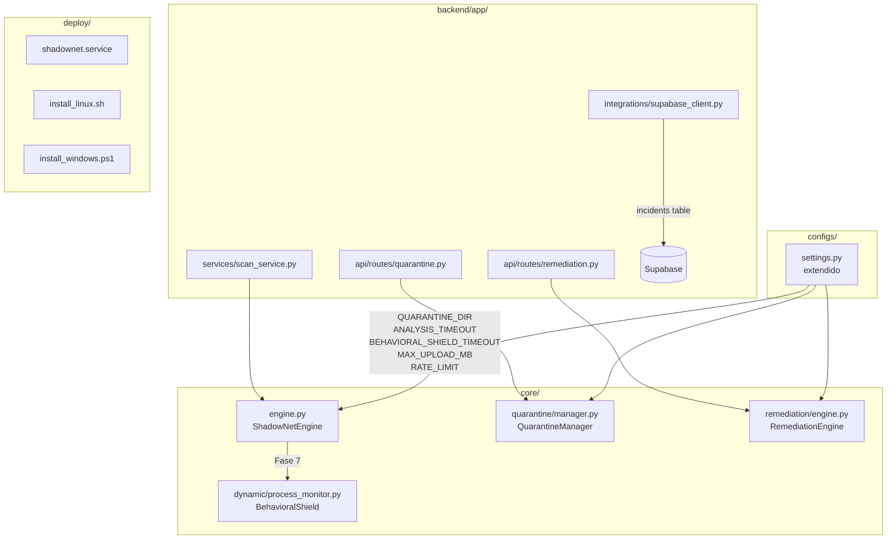

# Diseño Técnico — ShadowNet Defender: Mejoras de Auditoría

## Overview

Este documento describe el diseño técnico para implementar los 12 requisitos de la auditoría de ShadowNet Defender. El objetivo es elevar el sistema desde prototipo funcional a **Pilot Ready**, integrando el BehavioralShield al pipeline, añadiendo módulos de cuarentena y remediación, extendiendo la persistencia en Supabase, robusteciendo el pipeline contra fallos inducidos y completando la suite de tests y despliegue.

El sistema existente ya implementa un pipeline híbrido de 6 fases (YARA → UPX → ML/ONNX → Overlay → DotNet → IL). Estas mejoras añaden una **Fase 7** (BehavioralShield), dos módulos nuevos (`core/quarantine/` y `core/remediation/`), y endurecen los puntos débiles identificados en la auditoría.


## Architecture

### Pipeline Actualizado (7 Fases)

```mermaid
flowchart TD
    A[scan_file(file_path)] --> B[Fase 1: YARA]
    B -->|match| RY[MALWARE - score=1.0]
    B -->|no match| C[Fase 2: UPX Unpack]
    C --> D[Fase 3: ML/ONNX - 2381 features]
    D -->|NonPEFileError + .exe/.dll/.sys| SUSP1[SUSPICIOUS - not NOT_PE]
    D -->|ONNX error| UNK[UNKNOWN - score=-1.0 - SUSPICIOUS]
    D -->|score| E[Fase 4: Overlay + Heurística]
    E --> F[Fase 5: DotNet/CLR]
    F -->|is_dotnet| G[Fase 6: IL Behavioral]
    F -->|not dotnet| H[Fase 7: BehavioralShield]
    G --> H
    H -->|process active + risk_score| I{Elevación de Status}
    I -->|risk >= 0.5 + CLEAN/SUSPICIOUS| DANG[DANGEROUS]
    I -->|risk >= 0.3 + CLEAN| SUSP2[SUSPICIOUS]
    I -->|not active / psutil unavail| PASS[sin cambio]
    DANG --> J[ScanResult + behavioral_analysis]
    SUSP2 --> J
    PASS --> J
    UNK --> K[Scan_Service: UNKNOWN/score=-1 → suspicious/medium]
    J --> K
    K --> L[save_scan() → Supabase + incidents si DANGEROUS]
    L --> M{n8n trigger?}
    M -->|DANGEROUS o malicious| N[send_alert() con payload extendido]
    M -->|neither| O[skip]
```

### Diagrama de Módulos Nuevos




## Components and Interfaces

### Req 1 — BehavioralShield en el Pipeline

**Archivo modificado:** `core/engine.py`

La clase `ShadowNetEngine` recibe un nuevo atributo `_behavioral_shield` inicializado en `__init__` y una nueva fase `_run_behavioral_phase()` llamada al final de `scan_file()`, después de la Fase 6 (IL).

```python
# core/engine.py — cambios en ShadowNetEngine.__init__
from core.dynamic.process_monitor import BehavioralShield

# Módulo 9: BehavioralShield (Fase 7)
self._behavioral_shield = BehavioralShield()

# core/engine.py — cambios en ShadowNetEngine.scan_file()
# después de _run_il_phase():
self._run_behavioral_phase(file_path, result)
```

**Método nuevo:** `ShadowNetEngine._run_behavioral_phase(file_path, result)`

```python
def _run_behavioral_phase(self, file_path: Path, result: Dict[str, Any]) -> None:
    """
    Fase 7 — BehavioralShield: análisis de comportamiento dinámico.
    Timeout: BEHAVIORAL_SHIELD_TIMEOUT_SECONDS (default 2s).
    """
    import concurrent.futures
    from configs.settings import BEHAVIORAL_SHIELD_TIMEOUT_SECONDS

    result["behavioral_analysis"] = None
    if result.get("label") == "NOT_PE":
        return

    pid = self._resolve_pid(file_path)
    if pid is None:
        return

    result["detection_phases"].append("BEHAVIORAL")
    try:
        with concurrent.futures.ThreadPoolExecutor(max_workers=1) as executor:
            future = executor.submit(self._behavioral_shield.analyze_process, pid)
            report = future.result(timeout=BEHAVIORAL_SHIELD_TIMEOUT_SECONDS)

        result["behavioral_analysis"] = {
            "pid": report.pid,
            "process_name": report.process_name,
            "risk_score": report.risk_score,
            "is_suspicious": report.is_suspicious,
            "suspicious_actions": [
                {"description": a.description, "severity": a.severity, "ioc_type": a.ioc_type}
                for a in report.suspicious_actions
            ],
            "scan_time_ms": report.scan_time_ms,
        }

        current_status = result.get("operational_status", "CLEAN")
        if report.risk_score >= 0.5 and current_status in ("CLEAN", "SUSPICIOUS"):
            result["operational_status"] = "DANGEROUS"
        elif report.risk_score >= 0.3 and current_status == "CLEAN":
            result["operational_status"] = "SUSPICIOUS"

    except concurrent.futures.TimeoutError:
        logger.warning("BehavioralShield timeout (%.1fs) para %s", BEHAVIORAL_SHIELD_TIMEOUT_SECONDS, file_path.name)
    except Exception as exc:
        logger.error("Error en fase Behavioral para %s: %s", file_path.name, exc)
```

**Método nuevo:** `ShadowNetEngine._resolve_pid(file_path) -> Optional[int]`

```python
def _resolve_pid(self, file_path: Path) -> Optional[int]:
    """Busca el PID del proceso activo que ejecuta file_path."""
    try:
        import psutil
        normalized = str(file_path.resolve()).lower()
        for proc in psutil.process_iter(["pid", "exe"]):
            try:
                exe = proc.info.get("exe") or ""
                if exe and str(Path(exe).resolve()).lower() == normalized:
                    return proc.info["pid"]
            except (psutil.AccessDenied, psutil.NoSuchProcess):
                continue
    except Exception:
        pass
    return None
```

**Archivo modificado:** `backend/app/schemas/dto.py`

Agregar campo a `ScanResult`:
```python
behavioral_analysis: Optional[Dict[str, Any]] = Field(
    default=None,
    description="BehaviorReport serializado o null si el proceso no estaba activo",
)
```

---

### Req 2 — Quarantine Manager

**Archivo nuevo:** `core/quarantine/__init__.py` (re-export)
**Archivo nuevo:** `core/quarantine/manager.py`

```
core/quarantine/
├── __init__.py          # from core.quarantine.manager import QuarantineManager
└── manager.py           # QuarantineManager
```

**Interfaz pública de `QuarantineManager`:**

```python
class QuarantineManager:
    def __init__(self, quarantine_dir: Path = None): ...

    def quarantine_file(
        self,
        file_path: Path,
        scan_result: dict,
        *,
        actor: str = "system",
    ) -> QuarantineResult:
        """
        Mueve file_path a QUARANTINE_DIR con nombre {SHA256[:8]}_{ts}.quar.
        Crea {SHA256[:8]}_{ts}.meta.json con metadatos completos.
        Elimina permisos de ejecución.
        Rechaza: symlinks (SYMLINK_REJECTED), path traversal (PATH_TRAVERSAL_REJECTED).
        """

    def restore_file(
        self,
        quarantine_path: Path,
        destination: Path,
    ) -> RestoreResult:
        """
        Restaura un archivo de cuarentena verificando SHA-256.
        """

    def list_quarantined(self) -> List[QuarantineEntry]: ...
```

**DTOs:**
```python
@dataclass
class QuarantineResult:
    success: bool
    quarantine_path: Optional[Path]
    sha256: str
    meta_path: Optional[Path]
    error: Optional[str]  # SYMLINK_REJECTED | PATH_TRAVERSAL_REJECTED | ...

@dataclass
class RestoreResult:
    success: bool
    destination: Optional[Path]
    integrity_ok: bool
    error: Optional[str]
```

**Ruta nueva:** `backend/app/api/routes/quarantine.py`

```python
@router.post("/quarantine/file")
async def quarantine_file(
    body: QuarantineRequest,  # {file_path: str, scan_id: str}
    user: dict = Depends(get_current_user),
) -> JSONResponse:
    ...
```

---

### Req 3 — Remediation Engine

**Archivo nuevo:** `core/remediation/__init__.py`
**Archivo nuevo:** `core/remediation/engine.py`

```
core/remediation/
├── __init__.py          # from core.remediation.engine import RemediationEngine
└── engine.py            # RemediationEngine
```

**Interfaz pública de `RemediationEngine`:**

```python
class RemediationEngine:
    def terminate_process(
        self,
        pid: int,
        reason: str,
        scan_id: str,
        *,
        expected_exe: Optional[Path] = None,
    ) -> TerminationResult:
        """
        1. Verifica PID contra expected_exe si se provee.
        2. Rechaza PID < 10 (Linux) o PID en sesión 0 (Windows).
        3. SIGTERM / TerminateProcess con timeout 3s.
        4. Escala a SIGKILL / forced TerminateProcess si falla.
        5. Captura PermissionError y psutil.AccessDenied sin propagar.
        """

@dataclass
class TerminationResult:
    success: bool
    pid: int
    method: str       # "SIGTERM" | "SIGKILL" | "TerminateProcess"
    error: Optional[str]  # PROTECTED_PROCESS_REJECTED | EXE_MISMATCH | ...
```

**Ruta nueva:** `backend/app/api/routes/remediation.py`

```python
@router.post("/remediation/terminate")
async def terminate_process(
    body: TerminateRequest,  # {pid: int, scan_id: str}
    user: dict = Depends(get_current_user),  # JWT obligatorio
) -> JSONResponse:
    ...
```


### Req 4 — Supabase Extendido

**Archivo modificado:** `backend/app/integrations/supabase_client.py`

Cambios en `save_scan()`:
- El `record` dict se amplía con todos los campos nuevos (ver Data Models).
- Tras insertar en `scan_results`, si `operational_status == "DANGEROUS"`, insertar en tabla `incidents`.
- Idempotencia: consultar por `sha256` + `created_at > now() - 60s` antes de insertar.
- Serialización JSON segura: función `_safe_json(obj)` que convierte NaN/Inf a None.

```python
def _safe_json(obj: Any) -> Any:
    """Reemplaza NaN/Inf por None recursivamente para serialización segura."""
    import math
    if isinstance(obj, float) and not math.isfinite(obj):
        return None
    if isinstance(obj, dict):
        return {k: _safe_json(v) for k, v in obj.items()}
    if isinstance(obj, list):
        return [_safe_json(v) for v in obj]
    return obj
```

Nueva función pública:
```python
def save_incident(scan_id: str, file_name: str, timestamp: str) -> None:
    """Inserta un registro en la tabla incidents con severity='critical'."""
```

---

### Req 5 — N8N con DANGEROUS y Payload Extendido

**Archivo modificado:** `core/integrations/n8n_client.py`

Cambios en `send_scan_result()`:
- Condición de disparo: `result == "malicious"` **OR** `operational_status == "DANGEROUS"`.
- Payload extendido con campos adicionales.
- Retry con backoff exponencial: 1s, 2s (2 reintentos máx.) cuando HTTP >= 500.

```python
def send_scan_result(scan_result: Dict[str, Any]) -> bool:
    result_val = str(scan_result.get("result", "")).lower()
    op_status = str(scan_result.get("operational_status", "")).upper()
    should_alert = (result_val == "malicious") or (op_status == "DANGEROUS")
    if not should_alert:
        return False
    # ... construir payload extendido + retry logic
```

Cambios en el payload:
```python
payload.update({
    "operational_status": op_status,
    "risk_score": _safe_float(scan_result.get("risk_score")),
    "risk_level": str(scan_result.get("risk_level", "")),
    "detection_phases": scan_result.get("detection_phases", []),
    "top_family": scan_result.get("top_family"),
    "injection_detected": bool(scan_result.get("injection_detected", False)),
    "persistence_detected": bool(scan_result.get("persistence_detected", False)),
})
```

---

### Req 6 — Realtime Monitor Mejorado

**Archivo modificado:** `backend/app/services/realtime_service.py`

Cambios en `get_processes()`:
- Después de construir la lista, ordenar por CPU y tomar top-20 para análisis behavioral.
- Para cada proceso del top-20: llamar `BehavioralShield.analyze_process(pid)` con timeout.
- Añadir `behavioral_risk_score`, `behavioral_is_suspicious`, `suspicious_actions` y `risk_reason` al dict del proceso.
- Timeout global de 10s con `concurrent.futures.ThreadPoolExecutor`.
- Procesos con `AccessDenied` incluidos con `risk_level = "unknown"` y `access_denied = True`.

```python
def _enrich_with_behavioral(proc_dict: dict, shield: BehavioralShield) -> dict:
    try:
        report = shield.analyze_process(proc_dict["pid"])
        proc_dict["behavioral_risk_score"] = report.risk_score
        proc_dict["behavioral_is_suspicious"] = report.is_suspicious
        proc_dict["suspicious_actions"] = [...]
        # Determinar risk_reason
        perf_suspicious = proc_dict["cpu"] > 80 or proc_dict["memory"] > 80
        if report.is_suspicious:
            proc_dict["risk_reason"] = "behavioral"
            proc_dict["risk_level"] = "suspicious"
        elif perf_suspicious:
            proc_dict["risk_reason"] = "performance"
        else:
            proc_dict["risk_reason"] = None
    except Exception:
        proc_dict["behavioral_risk_score"] = 0.0
        proc_dict["behavioral_is_suspicious"] = False
        proc_dict["suspicious_actions"] = []
        proc_dict["risk_reason"] = None
    return proc_dict
```

---

### Req 7 — Robustez del Pipeline

**Archivo modificado:** `core/engine.py`

Cambios en `_run_ml_phase()`:
- Bloque `except Exception` captura fallo de ONNX → `label = "UNKNOWN"`, `score = -1.0`, `operational_status = "SUSPICIOUS"`.
- Si `NonPEFileError` y extensión es `.exe/.dll/.sys` → `operational_status = "SUSPICIOUS"` (no `NOT_PE`).
- Si extractor activa `RAW_FALLBACK` → `details.diagnostics.extraction_mode = "RAW_FALLBACK"`, `confidence = "Low"`.

Cambios en `scan_file()`:
- Cada llamada a fase privada envuelta en try/except que agrega `{phase}_error: True` a `details`.
- Watchdog de 60s con `concurrent.futures` o `signal.alarm` (Linux).

Cambios en `backend/app/services/scan_service.py`:
- En `classify_tripartite()`: si `score < 0` → forzar `(SUSPICIOUS, MEDIUM)`.
- En `scan_single_file()`: verificar `raw_result.get("label") in ("UNKNOWN",)` → `ScanResultLabel.SUSPICIOUS`.

---

### Req 8 — Seguridad del Backend

**Archivo modificado:** `backend/app/api/routes/scan.py`

Nuevas funciones de validación:
```python
DOUBLE_EXT_PATTERN = re.compile(
    r'\.(pdf|doc|docx|xls|xlsx|jpg|jpeg|png|gif|zip|rar)\.(exe|dll|sys|bat|ps1|vbs)$',
    re.IGNORECASE
)

def _has_double_extension(filename: str) -> bool:
    return bool(DOUBLE_EXT_PATTERN.search(filename))

def _has_control_chars(filename: str) -> bool:
    return any(ord(c) < 0x20 or c in '\u202e\u202d\u200f\u200e' for c in filename)

async def _read_streaming(file: UploadFile, max_bytes: int) -> bytes:
    """Lee en chunks; lanza FileTooLargeError si supera max_bytes."""
```

Rate limiter: usar un dict en memoria `{user_id: deque[timestamp]}` con sliding window de 60s. Para producción se puede reemplazar por Redis.

```python
_rate_limit_store: Dict[str, deque] = defaultdict(deque)

def _check_rate_limit(user_id: str, *, max_per_minute: int) -> bool:
    now = time.time()
    window = _rate_limit_store[user_id]
    while window and now - window[0] > 60:
        window.popleft()
    if len(window) >= max_per_minute:
        return False
    window.append(now)
    return True
```

---

### Req 10 — Settings Extendido

**Archivo modificado:** `configs/settings.py`

```python
import os
from pathlib import Path

BASE_DIR = Path(__file__).resolve().parent.parent

# Modelo
MODEL_PATH = BASE_DIR / "models" / "best_model.onnx"
SCALER_PATH = BASE_DIR / "models" / "scaler.pkl"
FEATURE_DIMENSION = 2381

# Umbrales ML
MALWARE_THRESHOLD = 0.5
HIGH_CONFIDENCE_THRESHOLD = 0.85

# Nuevas variables de entorno
QUARANTINE_DIR = Path(os.getenv("QUARANTINE_DIR", Path.home() / ".shadownet" / "quarantine"))
ANALYSIS_TIMEOUT_SECONDS = int(os.getenv("ANALYSIS_TIMEOUT_SECONDS", "60"))
BEHAVIORAL_SHIELD_TIMEOUT_SECONDS = int(os.getenv("BEHAVIORAL_SHIELD_TIMEOUT_SECONDS", "2"))
MAX_UPLOAD_MB = max(1, int(os.getenv("MAX_UPLOAD_MB", "50")))
RATE_LIMIT_SCANS_PER_MINUTE = int(os.getenv("RATE_LIMIT_SCANS_PER_MINUTE", "20"))
SUPABASE_INCIDENTS_TABLE = os.getenv("SUPABASE_INCIDENTS_TABLE", "incidents")

# Logging
LOG_DIR = BASE_DIR / "logs"
LOG_FILE = LOG_DIR / "shadownet.log"

def log_config(logger) -> None:
    """Loguea configuración activa enmascarando secretos."""
    masked_keys = {"SUPABASE_KEY", "SUPABASE_JWT_SECRET"}
    for key, value in os.environ.items():
        if key.startswith(("SHADOWNET_", "SUPABASE_", "N8N_", "MAX_", "RATE_", "QUARANTINE_", "ANALYSIS_", "BEHAVIORAL_")):
            display = "***" if key in masked_keys else value
            logger.info("Config: %s = %s", key, display)

def validate_paths(logger) -> None:
    """Valida que MODEL_PATH y SCALER_PATH existan."""
    for p in (MODEL_PATH, SCALER_PATH):
        if not p.exists():
            logger.warning("Archivo requerido no encontrado: %s", p)
```

---

### Req 11 — Health Endpoint Extendido

**Archivo modificado:** `backend/app/api/routes/health.py`

El endpoint `GET /health` pasa a ser público (sin `Depends(get_current_user)`) y retorna estado real de cada componente.

```python
@router.get("/health")
def health():  # sin JWT
    components = _check_components()
    mode = _compute_pipeline_mode(components)
    critical_degraded = (
        components["onnx_model"] == "missing"
        or components["yara_scanner"] == "unavailable"
    )
    status_code = 503 if critical_degraded else 200
    return JSONResponse(
        status_code=status_code,
        content=success_response({
            "status": "degraded" if critical_degraded else "ok",
            "pipeline_mode": mode,
            "components": components,
            "version": "2.0.0",
        })
    )

def _check_components() -> dict:
    return {
        "onnx_model": _check_onnx(),       # "loaded" | "missing"
        "yara_scanner": _check_yara(),     # "available" | "unavailable"
        "supabase": _check_supabase(),     # "connected" | "disconnected" | "not_configured"
        "n8n": _check_n8n(),               # "enabled" | "disabled"
        "psutil": _check_psutil(),         # "available" | "unavailable"
        "offline_queue_size": _check_offline_queue(),  # int
    }

def _compute_pipeline_mode(components: dict) -> str:
    if all(v in ("loaded", "available", "connected", "enabled") or isinstance(v, int)
           for v in components.values()):
        return "full"
    if components["onnx_model"] == "missing" and components["yara_scanner"] == "unavailable":
        return "minimal"
    return "degraded"
```


## Data Models

### Supabase: Esquema Extendido

```sql
-- Modificación de scan_results: agregar columnas de telemetría
ALTER TABLE scan_results ADD COLUMN IF NOT EXISTS sha256 TEXT;
ALTER TABLE scan_results ADD COLUMN IF NOT EXISTS operational_status TEXT DEFAULT 'UNKNOWN';
ALTER TABLE scan_results ADD COLUMN IF NOT EXISTS risk_score INTEGER DEFAULT 0;
ALTER TABLE scan_results ADD COLUMN IF NOT EXISTS overlay_analysis JSONB DEFAULT '{}'::jsonb;
ALTER TABLE scan_results ADD COLUMN IF NOT EXISTS yara_matches JSONB DEFAULT '[]'::jsonb;
ALTER TABLE scan_results ADD COLUMN IF NOT EXISTS il_behavioral JSONB DEFAULT '{}'::jsonb;
ALTER TABLE scan_results ADD COLUMN IF NOT EXISTS dotnet_analysis JSONB DEFAULT '{}'::jsonb;
ALTER TABLE scan_results ADD COLUMN IF NOT EXISTS detection_phases JSONB DEFAULT '[]'::jsonb;
ALTER TABLE scan_results ADD COLUMN IF NOT EXISTS was_unpacked BOOLEAN DEFAULT FALSE;
ALTER TABLE scan_results ADD COLUMN IF NOT EXISTS is_dotnet BOOLEAN DEFAULT FALSE;
ALTER TABLE scan_results ADD COLUMN IF NOT EXISTS obfuscator_detected BOOLEAN DEFAULT FALSE;
ALTER TABLE scan_results ADD COLUMN IF NOT EXISTS obfuscator_name TEXT;
ALTER TABLE scan_results ADD COLUMN IF NOT EXISTS injection_detected BOOLEAN DEFAULT FALSE;
ALTER TABLE scan_results ADD COLUMN IF NOT EXISTS persistence_detected BOOLEAN DEFAULT FALSE;
ALTER TABLE scan_results ADD COLUMN IF NOT EXISTS networking_detected BOOLEAN DEFAULT FALSE;
ALTER TABLE scan_results ADD COLUMN IF NOT EXISTS credential_theft_detected BOOLEAN DEFAULT FALSE;
ALTER TABLE scan_results ADD COLUMN IF NOT EXISTS behavioral_analysis JSONB;

-- Tabla nueva: incidents
CREATE TABLE IF NOT EXISTS incidents (
    id          UUID PRIMARY KEY DEFAULT gen_random_uuid(),
    created_at  TIMESTAMP WITH TIME ZONE DEFAULT NOW(),
    scan_id     UUID REFERENCES scan_results(id),
    user_id     UUID REFERENCES users(id),
    file_name   TEXT NOT NULL,
    severity    TEXT NOT NULL DEFAULT 'critical',
    operational_status TEXT NOT NULL DEFAULT 'DANGEROUS',
    timestamp   TIMESTAMP WITH TIME ZONE NOT NULL
);

CREATE INDEX IF NOT EXISTS idx_incidents_severity ON incidents (severity);
CREATE INDEX IF NOT EXISTS idx_incidents_created  ON incidents (created_at DESC);
CREATE INDEX IF NOT EXISTS idx_scan_results_sha256 ON scan_results (sha256);
CREATE INDEX IF NOT EXISTS idx_scan_results_op_status ON scan_results (operational_status);
```

### QuarantineEntry (meta.json)

```json
{
  "original_path": "/path/to/malware.exe",
  "sha256": "abc12345...",
  "file_size": 102400,
  "quarantine_path": "~/.shadownet/quarantine/abc12345_20240101T120000.quar",
  "quarantine_timestamp": "2024-01-01T12:00:00Z",
  "scan_result": { "result": "malicious", "risk_level": "high", "operational_status": "DANGEROUS" },
  "actor": "user@example.com"
}
```

### Estructura de Archivos Nuevos

```
core/
├── quarantine/
│   ├── __init__.py
│   └── manager.py          # QuarantineManager, QuarantineResult, RestoreResult
├── remediation/
│   ├── __init__.py
│   └── engine.py           # RemediationEngine, TerminationResult

backend/app/api/routes/
├── quarantine.py           # POST /quarantine/file
├── remediation.py          # POST /remediation/terminate

tests/
├── __init__.py
├── unit/
│   ├── test_extractor.py
│   ├── test_engine.py
│   ├── test_quarantine.py
│   ├── test_remediation.py
│   ├── test_scan_result_serde.py
│   └── test_settings.py
├── integration/
│   ├── test_pipeline_e2e.py
│   └── test_supabase_client.py
├── security/
│   └── test_backend_security.py
├── properties/
│   ├── test_pipeline_properties.py
│   ├── test_quarantine_properties.py
│   ├── test_n8n_properties.py
│   └── test_serialization_properties.py
└── conftest.py

deploy/
├── shadownet.service       # systemd unit file
├── install_linux.sh        # script de instalación Linux
└── install_windows.ps1     # script de instalación Windows (NSSM)
```


## Correctness Properties

*A property is a characteristic or behavior that should hold true across all valid executions of a system — essentially, a formal statement about what the system should do. Properties serve as the bridge between human-readable specifications and machine-verifiable correctness guarantees.*

---

### Property 1: Elevación de status por BehavioralShield (DANGEROUS)

*Para cualquier* resultado de escaneo donde `BehaviorReport.risk_score >= 0.5` y `operational_status` es `CLEAN` o `SUSPICIOUS`, después de ejecutar `_run_behavioral_phase()` el `operational_status` debe ser `DANGEROUS`.

**Validates: Requirements 1.2**

---

### Property 2: Elevación de status por BehavioralShield (SUSPICIOUS)

*Para cualquier* resultado de escaneo donde `BehaviorReport.risk_score >= 0.3` y `operational_status` es `CLEAN`, después de ejecutar `_run_behavioral_phase()` el `operational_status` debe ser `SUSPICIOUS`.

**Validates: Requirements 1.3**

---

### Property 3: Resolución de PID por exe path normalizado

*Para cualquier* par `(file_path, exe_path_en_proceso)` donde ambas rutas resuelven al mismo path absoluto (case-insensitive), `_resolve_pid()` debe retornar el PID de ese proceso y no de otro.

**Validates: Requirements 1.5**

---

### Property 4: ScanResult incluye behavioral_analysis cuando proceso activo

*Para cualquier* escaneo de un archivo cuyo proceso está activo, el `ScanResult.behavioral_analysis` no debe ser `null`; para cualquier escaneo donde el proceso no está activo, debe ser `null`.

**Validates: Requirements 1.6**

---

### Property 5: Quarantine round-trip con integridad SHA-256

*Para cualquier* archivo no-symlink, si se ejecuta `quarantine_file()` seguido de `restore_file()`, el contenido del archivo restaurado debe ser bit-a-bit idéntico al original, y el SHA-256 almacenado en el `.meta.json` debe coincidir con el SHA-256 del archivo original.

**Validates: Requirements 2.3, 2.7**

---

### Property 6: Nombre de archivo en cuarentena sigue formato {SHA256[:8]}_{ts}.quar

*Para cualquier* archivo cuarentenado exitosamente, el nombre del archivo `.quar` resultante debe coincidir con el patrón `^[0-9a-f]{8}_\d{8}T\d{6}\.quar$`.

**Validates: Requirements 2.2**

---

### Property 7: Quarantine rechaza symlinks

*Para cualquier* path que sea un symlink (o hardlink donde aplique), `quarantine_file()` debe retornar un `QuarantineResult` con `success=False` y `error="SYMLINK_REJECTED"`, sin modificar el sistema de archivos.

**Validates: Requirements 2.5**

---

### Property 8: Quarantine rechaza path traversal

*Para cualquier* string de ruta que contenga `..` o que resulte en una ruta fuera del scope configurado, `quarantine_file()` debe retornar `error="PATH_TRAVERSAL_REJECTED"` sin modificar el sistema de archivos.

**Validates: Requirements 2.6**

---

### Property 9: Terminación rechaza procesos protegidos del SO

*Para cualquier* PID que sea < 10 en Linux, o que pertenezca a la sesión 0 en Windows, `terminate_process()` debe retornar `TerminationResult` con `success=False` y `error="PROTECTED_PROCESS_REJECTED"` sin invocar ninguna llamada al sistema de terminación.

**Validates: Requirements 3.5**

---

### Property 10: Terminación verifica exe_path antes de actuar

*Para cualquier* PID cuyo `exe_path` real no coincida con el `expected_exe` provisto, `terminate_process()` debe retornar `error="EXE_MISMATCH"` sin terminar el proceso.

**Validates: Requirements 3.2**

---

### Property 11: terminate_process nunca propaga PermissionError

*Para cualquier* invocación de `terminate_process()` donde el SO lanza `PermissionError` o `psutil.AccessDenied`, el caller nunca debe recibir una excepción — solo un `TerminationResult` con `success=False`.

**Validates: Requirements 3.7**

---

### Property 12: Persistencia completa de telemetría incluye sha256

*Para cualquier* `ScanResult` con todos sus campos de telemetría (operational_status, yara_matches, il_behavioral, dotnet_analysis, etc.), el registro insertado en Supabase debe contener todos esos campos no vacíos, incluyendo `sha256` calculado a partir del archivo.

**Validates: Requirements 4.1, 4.5**

---

### Property 13: Inserción en incidents para DANGEROUS

*Para cualquier* resultado con `operational_status == "DANGEROUS"`, después de llamar `save_scan()` debe existir exactamente un registro en la tabla `incidents` con `severity = "critical"` y el mismo `file_name` y `scan_id`.

**Validates: Requirements 4.2**

---

### Property 14: Fallback offline cuando Supabase falla

*Para cualquier* resultado de escaneo, si el cliente Supabase lanza una excepción o timeout, el resultado debe aparecer en la cola offline (`offline_service`) sin que `save_scan_safe()` propague ninguna excepción.

**Validates: Requirements 4.3**

---

### Property 15: Idempotencia de save_scan por sha256

*Para cualquier* par de llamadas a `save_scan()` con el mismo `sha256` dentro de 60 segundos, la segunda llamada debe retornar el registro existente sin insertar un duplicado en la tabla `scan_results`.

**Validates: Requirements 4.4**

---

### Property 16: N8N alerta para DANGEROUS independiente del label ML

*Para cualquier* resultado con `operational_status == "DANGEROUS"` (incluso si `result == "benign"` o `"suspicious"`), `send_scan_result()` debe retornar `True` cuando n8n está habilitado y el webhook responde 2xx.

**Validates: Requirements 5.1**

---

### Property 17: Payload de alerta N8N contiene todos los campos requeridos

*Para cualquier* alerta enviada a n8n (por DANGEROUS o malicious), el payload JSON enviado debe contener los campos: `operational_status`, `risk_score`, `risk_level`, `detection_phases`, `top_family`, `injection_detected`, `persistence_detected`, además de los campos existentes.

**Validates: Requirements 5.2, 5.3**

---

### Property 18: N8N retry en error 5xx

*Para cualquier* webhook que retorna HTTP 5xx las primeras N llamadas (N <= 2), `send_scan_result()` debe realizar hasta 2 reintentos con backoff exponencial antes de retornar `False`. Si la tercera llamada exitosa ocurre, debe retornar `True`.

**Validates: Requirements 5.4**

---

### Property 19: Realtime incluye behavioral en top-20 por CPU

*Para cualquier* lista de procesos de longitud N > 20, exactamente los top-20 por `cpu_percent` deben tener `behavioral_risk_score`, `behavioral_is_suspicious` y `suspicious_actions` en la respuesta.

**Validates: Requirements 6.1, 6.5**

---

### Property 20: risk_reason diferencia behavioral vs performance

*Para cualquier* proceso con `cpu > 80%` pero sin indicadores de comportamiento malicioso, `risk_reason` debe ser `"performance"`. Para cualquier proceso con IoCs detectados por BehavioralShield, `risk_reason` debe ser `"behavioral"`.

**Validates: Requirements 6.2**

---

### Property 21: Procesos con AccessDenied incluidos en respuesta

*Para cualquier* proceso que lanza `psutil.AccessDenied` durante el análisis, el proceso debe aparecer en la respuesta con `risk_level = "unknown"` y `access_denied = True` — nunca omitido.

**Validates: Requirements 6.4**

---

### Property 22: Fallo de ONNX nunca produce resultado CLEAN

*Para cualquier* archivo donde el modelo ONNX lanza una excepción (mock de RuntimeError), el `ScanResult` resultante nunca debe tener `result = "benign"` ni `operational_status = "CLEAN"`. Específicamente: `label` debe ser `"UNKNOWN"`, `score` debe ser `-1.0`, y el `Scan_Service` debe mapear esto a `result = "suspicious"` / `risk_level = "medium"`.

**Validates: Requirements 7.1, 7.6**

---

### Property 23: NonPEFileError en .exe/.dll/.sys → SUSPICIOUS, no NOT_PE

*Para cualquier* archivo con extensión `.exe`, `.dll` o `.sys` donde pefile lanza `NonPEFileError`, el `operational_status` debe ser `"SUSPICIOUS"` — nunca `NOT_PE` ni `CLEAN`.

**Validates: Requirements 7.3**

---

### Property 24: Excepción en una fase no detiene el pipeline

*Para cualquier* archivo donde una fase arbitraria del pipeline (mockeable) lanza una excepción, las fases posteriores deben ejecutarse igualmente y el resultado debe contener `{phase_name}_error: true` en `details`, sin propagar la excepción al caller.

**Validates: Requirements 7.4**

---

### Property 25: Extensiones dobles sospechosas rechazadas con HTTP 400

*Para cualquier* nombre de archivo que coincida con el patrón de extensión doble (`.pdf.exe`, `.jpg.dll`, etc.), el endpoint `/scan/file` debe retornar HTTP 400 antes de escribir ningún byte en disco.

**Validates: Requirements 8.1**

---

### Property 26: Rate limiting por usuario

*Para cualquier* `user_id`, si se realizan más de `RATE_LIMIT_SCANS_PER_MINUTE` requests dentro de una ventana de 60 segundos, la request que excede el límite debe retornar HTTP 429 sin ejecutar el pipeline.

**Validates: Requirements 8.5**

---

### Property 27: Archivo temporal eliminado siempre

*Para cualquier* invocación del endpoint `/scan/file` que termine (con éxito, con excepción, o con timeout), el archivo temporal creado en `shadownet_uploads/` no debe existir en disco una vez que el handler retorna.

**Validates: Requirements 8.6**

---

### Property 28: Sanitización de caracteres de control en nombre de archivo

*Para cualquier* nombre de archivo que contenga caracteres ASCII < 0x20 o caracteres Unicode de dirección (RLO U+202E, LRO U+202D, etc.), el nombre sanitizado resultante no debe contener ninguno de esos caracteres.

**Validates: Requirements 8.7**

---

### Property 29: Extractor produce vector de 2381 dimensiones para PE válido

*Para cualquier* archivo PE válido, `PEFeatureExtractor.extract()` debe retornar un array numpy de exactamente 2381 elementos.

**Validates: Requirements 9.1**

---

### Property 30: ScanResult serialización round-trip

*Para cualquier* `ScanResult` con cualquier combinación de valores válidos, la secuencia `dict1 = result.model_dump()` → `result2 = ScanResult(**dict1)` → `dict2 = result2.model_dump()` debe producir `dict1 == dict2`.

**Validates: Requirements 9.6**

---

### Property 31: Secretos nunca aparecen en logs

*Para cualquier* configuración activa del sistema, los valores de `SUPABASE_KEY` y `SUPABASE_JWT_SECRET` nunca deben aparecer en los mensajes de log generados por `log_config()`.

**Validates: Requirements 10.4**


## Error Handling

### Jerarquía de Errores Nuevos

```python
# core/quarantine/manager.py
class QuarantineError(Exception): pass
class SymlinkRejected(QuarantineError): pass
class PathTraversalRejected(QuarantineError): pass
class QuarantineIntegrityError(QuarantineError): pass

# core/remediation/engine.py
class RemediationError(Exception): pass
class ProtectedProcessRejected(RemediationError): pass
class ExeMismatchRejected(RemediationError): pass
```

Todas las funciones públicas de `QuarantineManager` y `RemediationEngine` capturan estas excepciones internamente y las traducen a campos `error` en los Result dataclasses, nunca propagándolas al caller de la API.

### Política de Fallback por Capa

| Capa | Fallo | Comportamiento |
|------|-------|----------------|
| YARA no disponible | `yara_scanner is None` | Skip Fase 1, continuar |
| UPX no disponible | `_unpacker is None` | Skip Fase 2, continuar |
| ONNX falla | `RuntimeError` | label=UNKNOWN, score=-1.0, status=SUSPICIOUS |
| pefile falla en .exe/.dll/.sys | `NonPEFileError` | status=SUSPICIOUS (no NOT_PE) |
| psutil no disponible | `ImportError` | Skip Fase 7, `behavioral_analysis=null` |
| Proceso no activo | PID not found | Skip Fase 7, `behavioral_analysis=null` |
| BehavioralShield timeout | `TimeoutError` | Log warning, `behavioral_analysis=null` |
| Supabase falla | `Exception` | Encolar en offline_service |
| n8n webhook HTTP 5xx | Error de red | Retry x2 con backoff, luego False |
| Cualquier fase pipeline | `Exception` | `{phase}_error=True` en details, continuar |

### Watchdog de Timeout (60s por archivo)

```python
# core/engine.py — scan_file() con watchdog
import concurrent.futures

def scan_file(self, file_path):
    with concurrent.futures.ThreadPoolExecutor(max_workers=1) as executor:
        future = executor.submit(self._scan_file_internal, file_path)
        try:
            return future.result(timeout=ANALYSIS_TIMEOUT_SECONDS)
        except concurrent.futures.TimeoutError:
            result["operational_status"] = "SUSPICIOUS"
            result["details"]["watchdog"] = {"timeout": True, "reason": "analysis_timeout"}
            return result
```

---

## Testing Strategy

### Stack de Testing

- **Framework principal:** `pytest` con `pytest-cov` para cobertura
- **Property-based testing:** `hypothesis` (mínimo 100 ejemplos por propiedad, configurado en `settings.py` de hypothesis)
- **Mocking:** `pytest-mock` / `unittest.mock`
- **API testing:** `httpx` + `TestClient` de FastAPI

### Configuración de Hypothesis

```python
# tests/conftest.py
from hypothesis import settings, HealthCheck

settings.register_profile("ci", max_examples=100, suppress_health_check=[HealthCheck.too_slow])
settings.register_profile("dev", max_examples=50)
settings.load_profile("ci")
```

### Tests Unitarios (`tests/unit/`)

**`test_extractor.py`**
- `test_pe_vector_dimension`: archivo PE válido → vector de 2381 features
- `test_non_pe_raises`: archivo no-PE → `NonPEFileError`
- `test_empty_raises`: archivo vacío → `NonPEFileError`
- `test_raw_fallback_nonzero`: modo RAW_FALLBACK → vector no-cero para byte histogram

**`test_engine.py`**
- `test_yara_match_returns_malware`: mock YARA con match → `label == "MALWARE"`
- `test_onnx_failure_suspicious`: mock ONNX raising RuntimeError → `operational_status != "CLEAN"`
- `test_non_pe_exe_suspicious`: archivo no-PE con extensión `.exe` → `operational_status == "SUSPICIOUS"`
- `test_behavioral_elevation_dangerous`: mock BehavioralShield risk_score=0.6, status=CLEAN → DANGEROUS
- `test_behavioral_elevation_suspicious`: mock BehavioralShield risk_score=0.4, status=CLEAN → SUSPICIOUS
- `test_phase_failure_continues`: mock fase 4 raising Exception → fases 5, 6, 7 ejecutadas igualmente

**`test_quarantine.py`**
- `test_quarantine_moves_file`
- `test_quarantine_sha256_in_meta`
- `test_quarantine_rejects_symlink`
- `test_quarantine_rejects_traversal`
- `test_restore_integrity`
- `test_creates_dir_700`

**`test_remediation.py`**
- `test_rejects_pid_below_10`
- `test_exe_mismatch_rejected`
- `test_permission_error_not_propagated`

**`test_scan_result_serde.py`**
- `test_round_trip`: Hypothesis-driven serialización round-trip de ScanResult

**`test_settings.py`**
- `test_defaults_present`
- `test_secrets_masked_in_log_config`

### Tests de Integración (`tests/integration/`)

**`test_pipeline_e2e.py`**
- `test_accuracy_on_test_set`: carga `X_test.npy` / `y_test.npy`, ejecuta inferencia, verifica accuracy >= umbral configurado
- `test_full_pipeline_malicious`: archivo real malicioso del test set → resultado `operational_status != "CLEAN"`

**`test_supabase_client.py`** (con mock del cliente Supabase)
- `test_save_scan_full_telemetry`: verificar que todos los campos nuevos se incluyen en el record
- `test_incidents_created_on_dangerous`
- `test_offline_fallback_on_error`
- `test_idempotency_same_sha256`

### Tests de Seguridad (`tests/security/`)

**`test_backend_security.py`** (con `TestClient`)
- `test_path_traversal_sanitized`
- `test_file_too_large_returns_413`
- `test_no_jwt_returns_401`
- `test_expired_jwt_returns_401`
- `test_double_extension_returns_400`
- `test_rate_limit_returns_429`
- `test_temp_file_cleanup_on_exception`

### Tests de Propiedades (`tests/properties/`)

**`test_pipeline_properties.py`** — Feature: shadownet-audit-improvements

Cada test property referencia la propiedad del design doc con el tag:
```python
# Feature: shadownet-audit-improvements, Property 22: Fallo de ONNX nunca produce resultado CLEAN
@given(st.just(make_mock_file()))
@settings(max_examples=100)
def test_onnx_failure_never_clean(tmp_path):
    ...
```

Tests de propiedades:
- Property 1, 2: elevación de status por BehavioralShield
- Property 3: resolución de PID por exe path
- Property 4: behavioral_analysis en ScanResult
- Property 22: ONNX falla → nunca CLEAN
- Property 23: NonPEFileError en .exe → SUSPICIOUS
- Property 24: excepción en fase no detiene pipeline
- Property 25: extensión doble → HTTP 400
- Property 26: rate limiting
- Property 27: cleanup de temporales
- Property 28: sanitización de nombres
- Property 29: vector de 2381 dimensiones

**`test_quarantine_properties.py`**
- Property 5: quarantine round-trip
- Property 6: nombre .quar sigue formato
- Property 7: symlink rechazado
- Property 8: path traversal rechazado

**`test_n8n_properties.py`**
- Property 16: DANGEROUS → alerta enviada
- Property 17: payload completo
- Property 18: retry en 5xx

**`test_serialization_properties.py`**
- Property 30: ScanResult round-trip serialización

### Estructura del Directorio `tests/`

```
tests/
├── conftest.py              # fixtures: tmp_path, mock_engine, test_client, etc.
├── fixtures/
│   └── sample_pe.exe        # PE válido benigno para tests (no malware real)
├── unit/
│   ├── test_extractor.py
│   ├── test_engine.py
│   ├── test_quarantine.py
│   ├── test_remediation.py
│   ├── test_scan_result_serde.py
│   └── test_settings.py
├── integration/
│   ├── test_pipeline_e2e.py
│   └── test_supabase_client.py
├── security/
│   └── test_backend_security.py
└── properties/
    ├── test_pipeline_properties.py
    ├── test_quarantine_properties.py
    ├── test_n8n_properties.py
    └── test_serialization_properties.py
```

### Scripts de Despliegue (`deploy/`)

**`deploy/shadownet.service`** — systemd unit con:
- `Restart=on-failure`, `RestartSec=5s`
- `EnvironmentFile=` apuntando al `.env` del proyecto
- `WorkingDirectory` configurado a la raíz del proyecto
- `ExecStartPre=` para verificar existencia del modelo ONNX
- Usuario `shadownet` (no root)

**`deploy/install_linux.sh`** — pasos:
1. Verifica Python >= 3.10 (falla si no)
2. Verifica que no se ejecuta como root; crea usuario `shadownet` si es root
3. `pip install -r requirements.txt`
4. Copia `shadownet.service` a `/etc/systemd/system/`
5. `systemctl daemon-reload && systemctl enable shadownet && systemctl start shadownet`

**`deploy/install_windows.ps1`** — pasos:
1. Verifica Python >= 3.10
2. `pip install -r requirements.txt`
3. Descarga / verifica presencia de NSSM en `deploy/tools/nssm.exe`
4. `nssm install ShadowNetDefender python <uvicorn cmd>`
5. `nssm set ShadowNetDefender AppDirectory <project_root>`
6. `sc start ShadowNetDefender`

