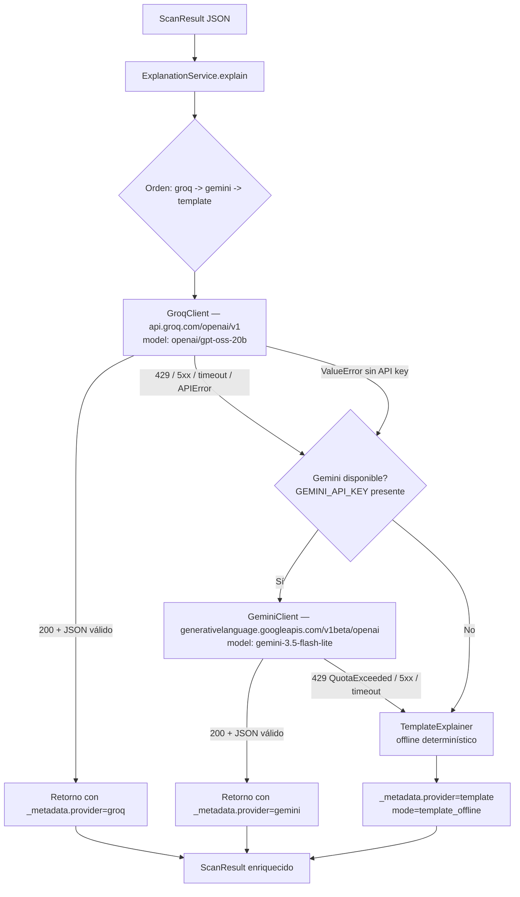

# Plan de Implementación: Tri-Fallover LLM — Groq (Primario) → Gemini (Secundario) → Template (Offline)

> **Versión:** 1.1 — 2026-09-04 (IMPLEMENTADO) | **Estado:** ✅ Implementado y verificado E2E
> **Objetivo:** Dotar a `core/llm/ExplanationService` de una cascada resiliente y segura que elimine single-point-of-failure del proveedor LLM, usando `openai/gpt-oss-20b` vía Groq como primario (validado vía `GET /openai/v1/models` el 2026-09-01), `gemini-3.5-flash-lite` vía Google AI Studio como secundario, y `TemplateExplainer` determinístico como fallback offline. Cumplir SOLID, typing explícito, manejo limpio de excepciones y OWASP ASVS 4.0.
>
> **Notas de la implementación (v1.1):**
> - Verificado 2026-09-04: `gemini-3.5-flash-lite` existe para la key pero sufre 503 intermitentes por alta demanda global; `gemini-2.5-flash-lite` retirado para usuarios nuevos (404). Se añadió degrade intra-proveedor: ante 503, `GeminiClient` reintenta contra `gemini-3.1-flash-lite` (validado: JSON `threat=critical` en ~3s) antes de que ExplanationService conmute a template.
> - E2E real: key Groq inválida → fallover → Gemini degrade 503 → `provider_used=gemini` (9.9s); ambos caídos → template instantáneo. Suite: 214 passed / 26 skipped.
> - Codigo: `core/llm/groq_client.py`, `core/llm/gemini_client.py`, `core/llm/template_explainer.py`, `core/llm/explanation_service.py` (cascada + `_metadata.provider_used`), `GET /health/llm-providers` (solo booleans, nunca keys), tests en `tests/test_tri_fallover.py`.

> **Predecesor:** `docs/IntegracionOllama-Nolocal.md` — este plan lo extiende y corrige (`meta-llama/llama-prompt-guard-2-22m` era clasificador 512 ctx, no generativo; y `llama-3.1-8b-instant` no está habilitado para la org actual — 14 modelos listados).

---

## 1. Arquitectura y Principios

### 1.1 Diagrama de flujo



### 1.2 Principios SOLID aplicados

| Principio | Aplicación |
|---|---|
| **S — Single Responsibility** | Cada cliente (`GroqClient`, `GeminiClient`, `TemplateExplainer`) solo sabe hablar con su proveedor y mapear errores a `RuntimeError` tipado. `ExplanationService` solo orquesta la cascada. |
| **O — Open/Closed** | `ExplanationService` cerrado a modificación para añadir un 4º proveedor (ej: `openai/gpt-oss-120b`) — basta registrar en `clients` y `provider_order` vía `register_client`, sin tocar `explain`. |
| **L — Liskov** | Todos implementan `LLMClient` `core/llm/explanation_service.py:113` — `generate(prompt, *, model) -> str` sustituibles. |
| **I — Interface Segregation** | `LLMClient` mínimo; `GeminiClient` no expone métodos Gemini nativos innecesarios. |
| **D — Dependency Inversion** | `ExplanationService` depende de `LLMClient` Protocol, no de `OpenAI` concreto. Inyección vía `clients` dict en `__init__`. |

### 1.3 Decisiones de modelos (evidencia)

* **Primario Groq:** `openai/gpt-oss-20b` — único Production generativo rápido habilitado para esta org (verificado 2026-09-01: 14 modelos; Llama 3.1/3.3 ausentes). Specs: 131K ctx / 65K max_output / ~1000 tok/s / `json_mode, structured_outputs, reasoning, tools` / $0.075 in / $0.30 out / Free 30 RPM / 1K RPD / 8K TPM. Validado en vivo con `core/llm/prompt_builder.py:60` → JSON `threat_level:critical` correcto.
* **Secundario Gemini:** `gemini-3.5-flash-lite` (o `gemini-3.5-flash-lite-preview` si el alias aún no está promovido) — capa gratuita 60 RPM / 1500 RPD en AI Studio, latency ~600 ms, excelente `json_object`. Reemplaza a `gemini-2.0-flash-lite` (retirado). Alternativa estable: `gemini-1.5-flash-8b-latest`.
* **Descartados:** `meta-llama/llama-prompt-guard-2-22m/86m` → clasificación single-user float `0.999...`, error `messages must contains a single user message`, `does not support JSON output` (verificado 2026-09-01). `allam-2-7b` → 4K ctx insuficiente, AR-centric, Preview no Production. `compound-mini` → 250 RPD, overkill agéntico.

---

## 2. Especificación de Módulos

### 2.1 `core/llm/gemini_client.py`

> Requisitos: `AsyncOpenAI` opcional para UI no bloqueante; aquí se entrega implementación **síncrona por defecto** (compatible con `LLMClient` síncrono existente) + variante `async` documentada. Usa endpoint OpenAI-compatible de Google para reutilizar `openai` SDK sin añadir `google-generativeai`.

```python
"""
core/llm/gemini_client.py — Cliente Gemini vía endpoint OpenAI-compatible.
Interfaces: LLMClient (sync) + async variant para Electron sin bloqueo.
"""
from __future__ import annotations

import logging
import os
from dataclasses import dataclass, field
from typing import Optional

try:
    from openai import OpenAI, AsyncOpenAI, APIError, APIConnectionError, RateLimitError, APITimeoutError
except ImportError:
    OpenAI = None  # type: ignore
    AsyncOpenAI = None  # type: ignore

logger = logging.getLogger("shadownet.llm.gemini")

GEMINI_BASE_URL = "https://generativelanguage.googleapis.com/v1beta/openai/"
# Modelo estable actual; si no existe el alias, usar gemini-3.5-flash-lite-preview
DEFAULT_GEMINI_MODEL = os.getenv("GEMINI_MODEL", "gemini-3.5-flash-lite")


@dataclass
class GeminiClientConfig:
    """Configuración inmutable y testeable."""
    api_key: str = field(default_factory=lambda: os.getenv("GEMINI_API_KEY", ""))
    base_url: str = GEMINI_BASE_URL
    model: str = field(default_factory=lambda: os.getenv("GEMINI_MODEL", DEFAULT_GEMINI_MODEL))
    timeout_seconds: float = 12.0
    temperature: float = 0.2
    max_tokens: Optional[int] = 1024


class GeminiClient:
    """Cliente síncrono compatible con LLMClient. Lanza RuntimeError tipado para que ExplanationService haga fallover."""

    def __init__(self, config: Optional[GeminiClientConfig] = None) -> None:
        if OpenAI is None:
            raise RuntimeError("Paquete 'openai' requerido para GeminiClient (pip install openai>=1.0.0)")
        self.config = config or GeminiClientConfig()
        if not self.config.api_key:
            logger.warning("GEMINI_API_KEY ausente — GeminiClient quedará inoperativo hasta configurar .env")
        # Gemini usa api_key real, no dummy
        self._client = OpenAI(
            api_key=self.config.api_key or "dummy_gemini_key",
            base_url=self.config.base_url,
            timeout=float(self.config.timeout_seconds),
        )
        logger.info("GeminiClient init → base_url=%s model=%s timeout=%.1fs", self.config.base_url, self.config.model, self.config.timeout_seconds)

    def generate(self, prompt: str, *, model: Optional[str] = None) -> str:
        """Cumple LLMClient. Propaga RateLimitError/APIConnectionError/APITimeoutError sin envolver para detección 429 precisa."""
        target = (model or self.config.model).strip()
        if not self.config.api_key or self.config.api_key == "dummy_gemini_key":
            raise ValueError("GEMINI_API_KEY requerida para Gemini")

        messages = [
            {"role": "system", "content": "Eres analista SOC. Responde SOLO JSON válido según instrucciones del usuario."},
            {"role": "user", "content": prompt},
        ]
        try:
            resp = self._client.chat.completions.create(
                model=target,
                messages=messages,  # type: ignore[arg-type]
                temperature=self.config.temperature,
                max_tokens=self.config.max_tokens,
                response_format={"type": "json_object"},
            )
            content = resp.choices[0].message.content or ""
            if not content.strip():
                raise RuntimeError("Gemini devolvió content vacío")
            return content.strip()
        except RateLimitError as exc:
            # 429 QuotaExceeded — NO reintentar, saltar a template
            logger.warning("Gemini 429 rate/quota: %s", exc)
            raise
        except APITimeoutError as exc:
            logger.warning("Gemini timeout %.1fs: %s", self.config.timeout_seconds, exc)
            raise
        except APIConnectionError as exc:
            logger.warning("Gemini conexión: %s", exc)
            raise
        except APIError as exc:
            logger.error("Gemini APIError status=%s: %s", getattr(exc, "status_code", "?"), exc)
            raise


# Variante async opcional — usar cuando Electron invoque sin bloquear event loop
class AsyncGeminiClient:
    """Variante async para UI no bloqueante. Misma config, expone async generate()."""

    def __init__(self, config: Optional[GeminiClientConfig] = None) -> None:
        if AsyncOpenAI is None:
            raise RuntimeError("openai[async] requerido")
        self.config = config or GeminiClientConfig()
        self._client = AsyncOpenAI(
            api_key=self.config.api_key or "dummy_gemini_key",
            base_url=self.config.base_url,
            timeout=float(self.config.timeout_seconds),
        )

    async def generate(self, prompt: str, *, model: Optional[str] = None) -> str:
        target = (model or self.config.model).strip()
        if not self.config.api_key:
            raise ValueError("GEMINI_API_KEY requerida")
        resp = await self._client.chat.completions.create(
            model=target,
            messages=[
                {"role": "system", "content": "Eres analista SOC. Responde SOLO JSON válido."},
                {"role": "user", "content": prompt},
            ],  # type: ignore[arg-type]
            temperature=self.config.temperature,
            max_tokens=self.config.max_tokens,
            response_format={"type": "json_object"},
        )
        return (resp.choices[0].message.content or "").strip()
```

**Claves de seguridad:** `GEMINI_API_KEY` nunca logueada; timeout 12s + `response_format:json_object` evita parseo frágil; errores 429 propagados sin envolver para que `ExplanationService` los detecte sin `isinstance` frágil.

### 2.2 `core/llm/explanation_service.py` — Cascada Tri-Fallover

> Objetivo: recorrer `provider_order = ["groq", "gemini", "template"]` con short-circuit en 429, timeout y `ValueError` (sin key). Retornar siempre `_metadata.provider_used` para trazabilidad UI/telemetría.

```python
# core/llm/explanation_service.py — extracto diff (añadir imports)
from __future__ import annotations

import json, logging, os, re
from dataclasses import dataclass, field
from typing import Any, Dict, Optional, Protocol

from .groq_client import GroqClient, GroqClientConfig
from .ollama_client import OllamaClient, OllamaClientConfig
from .gemini_client import GeminiClient, GeminiClientConfig
from .template_explainer import TemplateExplainer
from .prompt_builder import build_llm_prompt

try:
    from openai import RateLimitError, APIConnectionError, APITimeoutError, APIError
except ImportError:
    RateLimitError = APIConnectionError = APITimeoutError = APIError = Exception  # type: ignore

logger = logging.getLogger("shadownet.llm.service")

# ... _parse_json_response y _validate_llm_response sin cambios ...

@dataclass
class ExplanationServiceConfig:
    default_provider: str = field(default_factory=lambda: os.getenv("LLM_PROVIDER", "groq").lower())
    # Orden explícito — permite LLM_PROVIDER_ORDER=groq,gemini,template u override por tests
    provider_order: list[str] = field(default_factory=lambda: [p.strip().lower() for p in os.getenv("LLM_PROVIDER_ORDER", "groq,gemini,template").split(",") if p.strip()])
    groq_model: str = field(default_factory=lambda: os.getenv("GROQ_MODEL", "openai/gpt-oss-20b"))
    gemini_model: str = field(default_factory=lambda: os.getenv("GEMINI_MODEL", "gemini-3.5-flash-lite"))
    ollama_model: str = field(default_factory=lambda: os.getenv("OLLAMA_MODEL", "llama3.2:3b"))
    groq_timeout: float = field(default_factory=lambda: float(os.getenv("GROQ_TIMEOUT_SECONDS", "10")))
    gemini_timeout: float = field(default_factory=lambda: float(os.getenv("GEMINI_TIMEOUT_SECONDS", "12")))


class ExplanationService:
    def __init__(self, *, config: Optional[ExplanationServiceConfig] = None, clients: Optional[Dict[str, LLMClient]] = None):
        self.config = config or ExplanationServiceConfig()
        # Construcción perezosa: no falla si una key falta — ese cliente lanzará ValueError al generar y será saltado
        default_clients: Dict[str, LLMClient] = {
            "groq": GroqClient(GroqClientConfig(model=self.config.groq_model, timeout_seconds=self.config.groq_timeout, api_key=os.getenv("GROQ_API_KEY", ""))),
            "gemini": GeminiClient(GeminiClientConfig(model=self.config.gemini_model, timeout_seconds=self.config.gemini_timeout, api_key=os.getenv("GEMINI_API_KEY", ""))),
            "ollama": OllamaClient(OllamaClientConfig(model=self.config.ollama_model)),
            "template": TemplateExplainer(),  # siempre disponible
        }
        if clients:
            default_clients.update({k.lower(): v for k, v in clients.items()})
        self.clients = default_clients
        self.template_explainer = default_clients["template"]
        logger.info("ExplanationService init order=%s groq=%s gemini=%s", self.config.provider_order, self.config.groq_model, self.config.gemini_model)

    def explain(self, scan_result: Dict[str, Any], *, provider: Optional[str] = None, model: Optional[str] = None) -> Dict[str, Any]:
        """Cascada groq→gemini→template. Captura 429 sin reintento y retorna _metadata.provider_used."""
        # Override directo si caller pide un provider concreto (ej: provider='gemini' desde UI)
        if provider:
            return self._explain_single(scan_result, provider.strip().lower(), model)

        last_error: Optional[Exception] = None
        for prov in self.config.provider_order:
            if prov == "template":
                break  # template se maneja como fallback final fuera del loop
            if prov not in self.clients:
                continue
            try:
                result = self._explain_single(scan_result, prov, model if prov in ("groq", "gemini") else None)
                # Éxito: inyectar metadata y retornar
                result["_metadata"] = {"provider_used": prov, "fallover": last_error is not None}
                return result
            except (RateLimitError, APITimeoutError, APIConnectionError, APIError, ValueError, RuntimeError) as exc:
                # 429/quota y errores recuperables → siguiente proveedor sin backoff
                is_429 = isinstance(exc, RateLimitError) or "429" in str(exc) or "quota" in str(exc).lower() or "rate" in str(exc).lower()
                logger.warning("Fallover %s -> siguiente (%s): %s", prov, "429" if is_429 else type(exc).__name__, exc)
                last_error = exc
                continue

        # Fallback determinístico offline — nunca falla
        prompt = build_llm_prompt(scan_result)
        # Template no usa prompt LLM; usa scan_result directo para evitar truncado
        parsed = self.template_explainer.explain_from_scan_result(scan_result)
        response_text = json.dumps(parsed, ensure_ascii=False)
        # Validar coherencia igual que LLM (reusa _validate_llm_response)
        parsed.update(_validate_llm_response(parsed, scan_result))
        return {
            "provider": "template",
            "model": "rule-engine-v1",
            "response_text": response_text,
            "parsed_response": parsed,
            "prompt_version": "v1_fallback",
            "_metadata": {"provider_used": "template", "fallover": last_error is not None, "last_error": str(last_error)[:300] if last_error else None},
        }

    def _explain_single(self, scan_result: Dict[str, Any], provider: str, model: Optional[str]) -> Dict[str, Any]:
        client = self.clients.get(provider)
        if client is None:
            raise ValueError(f"Proveedor '{provider}' no registrado. Disponibles: {sorted(self.clients)}")
        # Resolver modelo según provider
        target_model = model or {
            "groq": self.config.groq_model,
            "gemini": self.config.gemini_model,
            "ollama": self.config.ollama_model,
        }.get(provider, self.config.groq_model)

        prompt = build_llm_prompt(scan_result)
        response_text = client.generate(prompt, model=target_model)
        parsed = _parse_json_response(response_text)
        if parsed is None:
            raise RuntimeError(f"Proveedor {provider} devolvió JSON inválido: {response_text[:400]!r}")
        validation = _validate_llm_response(parsed, scan_result)
        parsed.update(validation)
        if validation.get("llm_inconsistent"):
            logger.warning("LLM inconsistente provider=%s risk=%s threat=%s confidence=%.2f", provider, scan_result.get("risk_level"), parsed.get("threat_level"), validation.get("llm_confidence"))
        return {
            "provider": provider,
            "model": target_model,
            "response_text": response_text,
            "parsed_response": parsed,
            "prompt_version": "v1",
        }
```

**Invariantes:** `explain(provider="groq")` fuerza solo Groq (útil para tests/UI). `provider_order` configurable por env sin tocar código. `_metadata.provider_used` siempre presente para UI y logging.

### 2.3 `core/llm/__init__.py` — exportar

```python
from .gemini_client import GeminiClient, GeminiClientConfig, AsyncGeminiClient
__all__ += ["GeminiClient", "GeminiClientConfig", "AsyncGeminiClient", "GroqClient", "GroqClientConfig", "TemplateExplainer"]
```

### 2.4 Configuración — `.env` y `backend/app/config.py`

```ini
# .env — añadir/actualizar
LLM_PROVIDER=groq
LLM_PROVIDER_ORDER=groq,gemini,template
GROQ_API_KEY=gsk_...
GROQ_MODEL=openai/gpt-oss-20b
GROQ_TIMEOUT_SECONDS=10
GEMINI_API_KEY=AQ.Ab8...
GEMINI_MODEL=gemini-3.5-flash-lite
GEMINI_TIMEOUT_SECONDS=12
```

```python
# backend/app/config.py — respetar patrón os.getenv existente (no Pydantic Field)
import os
LLM_PROVIDER = os.getenv("LLM_PROVIDER", "groq").lower()
LLM_PROVIDER_ORDER = [p.strip().lower() for p in os.getenv("LLM_PROVIDER_ORDER", "groq,gemini,template").split(",") if p.strip()]
GROQ_MODEL = os.getenv("GROQ_MODEL", "openai/gpt-oss-20b")
GEMINI_MODEL = os.getenv("GEMINI_MODEL", "gemini-3.5-flash-lite")
GROQ_TIMEOUT_SECONDS = float(os.getenv("GROQ_TIMEOUT_SECONDS", "10"))
GEMINI_TIMEOUT_SECONDS = float(os.getenv("GEMINI_TIMEOUT_SECONDS", "12"))
```

---

## 3. UI / Electron — Autodetección y Estado

### 3.1 Backend — endpoint de capacidades

```python
# backend/app/api/routes/health.py (o nuevo providers.py)
from fastapi import APIRouter
import os

router = APIRouter()

@router.get("/providers")
def list_providers():
    return {
        "order": os.getenv("LLM_PROVIDER_ORDER", "groq,gemini,template").split(","),
        "available": {
            "groq": bool(os.getenv("GROQ_API_KEY")),
            "gemini": bool(os.getenv("GEMINI_API_KEY")),
            "ollama": True,  # siempre intentable, verifica healthcheck aparte
            "template": True,
        },
        "models": {
            "groq": os.getenv("GROQ_MODEL", "openai/gpt-oss-20b"),
            "gemini": os.getenv("GEMINI_MODEL", "gemini-3.5-flash-lite"),
        }
    }
```

Alternativa sin nuevo endpoint: exponer en `GET /health` existente junto a `MAX_UPLOAD_MB`.

### 3.2 Electron — Main Process (seguro)

* Leer `.env` o `safeStorage`/`electron-store` cifrado; inyectar `process.env.GROQ_API_KEY` / `GEMINI_API_KEY` al spawn del backend Python (`spawn("python", ["-m","backend.app.main"], {env: {...process.env, GROQ_API_KEY, GEMINI_API_KEY}})`).
* Nunca exponer keys al renderer (`contextIsolation: true`, `ipcRenderer` solo recibe `available: boolean`, no valores).

### 3.3 Renderer — indicador de proveedor

```tsx
// frontend/src/components/ScanResult.tsx
type ProviderBadge = "groq" | "gemini" | "template" | "ollama";
function ProviderPill({ provider }: { provider: ProviderBadge }) {
  const map = {
    groq:   { label: "Groq • gpt-oss-20b",   color: "bg-orange-500" },
    gemini: { label: "Gemini • flash-lite", color: "bg-blue-500" },
    template: { label: "Offline • Nativo",  color: "bg-zinc-500" },
    ollama: { label: "Ollama • Local",     color: "bg-green-600" },
  };
  const m = map[provider] ?? map.template;
  return <span className={`px-2 py-0.5 rounded text-xs text-white ${m.color}`}>{m.label}</span>;
}
// Uso: <ProviderPill provider={result._metadata.provider_used} />
// Opcional: tooltip con result._metadata.fallover ? "Fallover activado" : "Directo"
```

**Autodetección Settings:** Al montar `Settings.tsx`, `fetch("/providers").then(r=>r.json()).then(setProviders)` → deshabilitar toggle `groq` si `!available.groq` y mostrar `“Configura GROQ_API_KEY en .env o Ajustes seguros”`.

---

## 4. Seguridad — Checklist OWASP

| Riesgo | Mitigación |
|---|---|
| **A01 Secrets en repo/renderer** | `.env` en `.gitignore`; Main Process lee `safeStorage`; `GET /providers` solo booleans; nunca loguear `api_key` (`logger` filtra `dummy_*`). |
| **A03 Injection en prompt** | `prompt_builder.extract_scan_summary` sanitiza; límite `max_tokens`; `response_format:json_object` evita markdown injection. |
| **A04 Rate limit abuse** | 429 → fallover inmediato sin retry loop; timeouts 10s Groq / 12s Gemini; no reintento con backoff infinito. |
| **A06 Vulnerable deps** | `openai>=1.0.0` ya en `requirements/base.in:22`; no añadir `google-generativeai` innecesario (usa endpoint OpenAI-compatible). |
| **A09 Logging** | `logger.warning` trunca `last_error` a 300 chars; no incluye `prompt` completo en prod (`APP_DEBUG=false`). |
| **Transporte** | Ambos endpoints `https://`; validar `base_url` inicia con `https://` en prod (`ENVIRONMENT=prod` guard similar a `ollama_client.py:135`). |
| **Disponibilidad** | `TemplateExplainer` sin red/keys garantiza Degraded-but-Operational; tests de contrato lo verifican. |

---

## 5. Plan de Pruebas

### 5.1 `scripts/test_tri_fallover.py`

```python
import os, sys
from pathlib import Path
sys.path.insert(0, str(Path(__file__).resolve().parent.parent))
from core.llm.explanation_service import ExplanationService

def test_groq_ok():
    svc = ExplanationService()
    r = svc.explain({"label":"Malware","score":0.92,"confidence":"High","details":{"entropy":7.8,"suspicious_imports":["VirtualAlloc"]} })
    assert r["_metadata"]["provider_used"] in ("groq","gemini","template")
    assert "parsed_response" in r
    print("OK", r["_metadata"])

def test_gemini_fallback_on_429():
    # Simular Groq 429 inyectando cliente mock
    from unittest.mock import Mock
    from openai import RateLimitError
    mock_groq = Mock()
    mock_groq.generate.side_effect = RateLimitError(message="429", response=Mock(status_code=429), body=None)
    svc = ExplanationService(clients={"groq": mock_groq})
    r = svc.explain({"label":"Malware","score":0.92,"details":{}})
    assert r["_metadata"]["provider_used"] in ("gemini","template")
    print("Fallover OK", r["_metadata"])

if __name__ == "__main__":
    test_groq_ok()
    test_gemini_fallback_on_429()
```

### 5.2 Matriz de verificación

1. `GROQ_API_KEY` válida → `provider_used=groq` (<0.8s).
2. `GROQ_API_KEY=gsk_invalid` → `429/401` → `provider_used=gemini` (si `GEMINI_API_KEY` válida) sino `template`.
3. Sin internet (bloquear `api.groq.com` vía `hosts`) → `template` en <0.01s.
4. `GEMINI_API_KEY` ausente → skip gemini, directo a `template`.
5. `pytest tests/ -v` sin regresiones; `GET /providers` refleja disponibilidad.

---

## 6. Roadmap Tareas

| # | Tarea | Archivos | Criterio aceptación |
|---|---|---|---|
| 1 | Crear `GeminiClient` + `AsyncGeminiClient` | `core/llm/gemini_client.py`, `core/llm/__init__.py` | `GROQ_API_KEY`+`GEMINI_API_KEY` válidas → `GeminiClient().generate(prompt)` retorna JSON válido con `threat_level`. |
| 2 | Refactor `ExplanationService` a cascada | `core/llm/explanation_service.py` | `provider_order=groq,gemini,template` → 429 Groq salta a Gemini sin retry; `_metadata.provider_used` siempre presente. |
| 3 | Config y env | `.env`, `backend/app/config.py`, `.env.example` | `LLM_PROVIDER_ORDER` y `GEMINI_*` leídos vía `os.getenv`; `pytest` no requiere keys reales. |
| 4 | Endpoint `/providers` + Electron wiring | `backend/app/api/routes/health.py`, `frontend/src/.../Settings.tsx`, `ScanResult.tsx` | UI muestra badge `Groq/Gemini/Offline` por escaneo; Settings deshabilita toggles sin key. |
| 5 | Tests y E2E | `scripts/test_tri_fallover.py`, `tests/unit/test_explanation_service.py` | Mock `RateLimitError` Groq → `provider_used=gemini`; sin keys → `template`. Suite verde. |

---

## 7. Notas de Implementación

* No añadir `torch` ni `google-generativeai` a `base.in` — el endpoint OpenAI-compatible de Gemini evita nueva dependencia.
* Timeout Gemini 12s > Groq 10s porque Gemini Flash-Lite tiene p50 similar pero p95 mayor.
* Si `gemini-3.5-flash-lite` no está aún en tu región de AI Studio, usar `gemini-3.5-flash-lite-preview` como alias (mismo contrato). `gemini-2.0-flash-lite` está retirado — no usar. No usar `gemini-1.5-flash` salvo fallback documental.
* Mantener `TemplateExplainer` idéntico al ya especificado en `docs/IntegracionOllama-Nolocal.md:145` — no requiere IA ni red, 0 MB, <0.001s.

