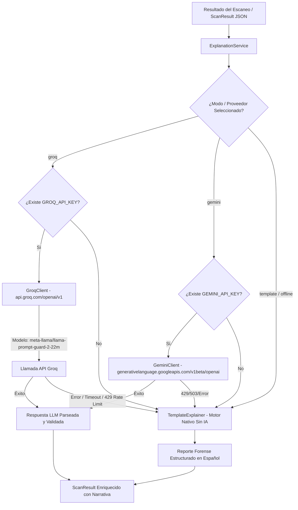

# Plan de Implementación: Integración de Groq API (LLM Cloud) y Fallback Nativo en ShadowNet Defender

> **Objetivo (histórico):** Reemplazar la dependencia obligatoria de Ollama local en la aplicación de escritorio (Electron), permitiendo generar explicaciones forenses vía API cloud con fallback offline. **Estado actual:** Ollama fue eliminado por completo — solo nube. La implementación real es la **cascada Tri-Fallover Groq (`openai/gpt-oss-20b`) → Gemini (`gemini-3.5-flash-lite`, degrade a `3.1` en 503) → `TemplateExplainer` offline** vía SDK `openai` (ver [`docs/TriFallover_Groq_Gemini_Template.md`](../TriFallover_Groq_Gemini_Template.md)). Este documento se conserva como histórico del plan inicial; la arquitectura vigente es la de TriFallover.

---

## 1. 🏗️ Arquitectura de Integración LLM

El subsistema de explicabilidad en `core/llm/` utiliza una arquitectura desacoplada basada en la interfaz `LLMClient` (protocolo genérico sobre el SDK de OpenAI). La integración de Groq API y del motor offline se incorporará manteniendo este desacoplamiento.

### 1.1 Diagrama de Flujo y Estrategia Tri-Modo



### 1.2 Estrategia de Selección de Proveedor y Fallback

1. **Groq (`openai/gpt-oss-20b`) — Primario**: si existe `GROQ_API_KEY`, genera en < 0.5 s vía `api.groq.com/openai/v1`.
2. **Gemini (`gemini-3.5-flash-lite`, degrade a `3.1` en 503) — Secundario**: si Groq falla (429/5xx/timeout) y existe `GEMINI_API_KEY`, vía `generativelanguage.googleapis.com/v1beta/openai`.
3. **Template (`TemplateExplainer`) — Fallback offline**: si no hay keys o ambas nubes fallan, narrativa determinística sin latencia. Antes: Ollama local, ahora eliminado (solo nube). Ver [`docs/TriFallover_Groq_Gemini_Template.md`](../TriFallover_Groq_Gemini_Template.md).

### 1.3 Especificación del Modelo Groq
* **Modelo Groq vigente**: `openai/gpt-oss-20b` (reemplaza a `meta-llama/llama-prompt-guard-2-22m` — clasificador no generativo, no habilitado).
* **Modelo Gemini vigente**: `gemini-3.5-flash-lite` (degrade a `gemini-3.1-flash-lite` en 503).
* **Endpoints**: `https://api.groq.com/openai/v1` · `https://generativelanguage.googleapis.com/v1beta/openai/`
* **SDK**: `openai` (ver [`docs/TriFallover_Groq_Gemini_Template.md`](../TriFallover_Groq_Gemini_Template.md))

---

## 2. 💻 Cambios en el Código y Nuevos Módulos

### 2.1 Crear `core/llm/groq_client.py`
Este módulo implementa el cliente Groq utilizando el SDK oficial de OpenAI apuntando a la URL base de Groq.

```python
"""
core/llm/groq_client.py — Cliente para Groq API usando el SDK de OpenAI.
"""
from __future__ import annotations

import logging
import os
from dataclasses import dataclass, field
from typing import Optional

try:
    from openai import OpenAI, APIError, APIConnectionError, RateLimitError
except ImportError:
    OpenAI = None  # type: ignore

logger = logging.getLogger("shadownet.llm.groq")


@dataclass
class GroqClientConfig:
    """Configuración para el cliente de Groq API."""
    api_key: str = field(default_factory=lambda: os.getenv("GROQ_API_KEY", ""))
    base_url: str = "https://api.groq.com/openai/v1"
    model: str = "meta-llama/llama-prompt-guard-2-22m"
    timeout_seconds: float = 10.0


class GroqClient:
    """Cliente para la API de Groq que cumple con la interfaz LLMClient."""

    def __init__(self, config: Optional[GroqClientConfig] = None):
        if OpenAI is None:
            raise RuntimeError("El paquete 'openai' es requerido para GroqClient.")

        self.config = config or GroqClientConfig()
        
        if not self.config.api_key:
            logger.warning("GROQ_API_KEY no encontrada en las variables de entorno.")

        self.client = OpenAI(
            api_key=self.config.api_key or "dummy_key",
            base_url=self.config.base_url,
            timeout=self.config.timeout_seconds,
        )
        logger.info(
            "GroqClient inicializado → base_url=%s, model=%s",
            self.config.base_url,
            self.config.model,
        )

    def generate(self, prompt: str, *, model: Optional[str] = None) -> str:
        """Envía el prompt a Groq API y devuelve la respuesta del modelo."""
        target_model = model or self.config.model

        if not self.config.api_key or self.config.api_key == "dummy_key":
            raise ValueError("GROQ_API_KEY es requerida para generar explicaciones con Groq.")

        try:
            response = self.client.chat.completions.create(
                model=target_model,
                messages=[
                    {
                        "role": "system",
                        "content": (
                            "Eres el motor de análisis forense de malware de ShadowNet Defender. "
                            "Responde ÚNICAMENTE en formato JSON válido según las instrucciones."
                        ),
                    },
                    {"role": "user", "content": prompt},
                ],
                temperature=0.2,
                response_format={"type": "json_object"},
            )

            content = response.choices[0].message.content or ""
            return content

        except RateLimitError as exc:
            logger.error("Rate limit excedido en Groq API (HTTP 429): %s", exc)
            raise RuntimeError("Rate limit excedido en Groq API") from exc
        except APIConnectionError as exc:
            logger.error("Error de conexión con Groq API: %s", exc)
            raise RuntimeError("Error de red al conectar con Groq API") from exc
        except APIError as exc:
            logger.error("Error de Groq API: %s", exc)
            raise RuntimeError(f"Error de Groq API: {exc}") from exc
```

---

### 2.2 Crear `core/llm/template_explainer.py`
Este módulo es el motor determinístico sin IA que actúa como respaldo offline seguro.

```python
"""
core/llm/template_explainer.py — Generador nativo de explicaciones forenses sin IA (Offline Fallback).
"""
from __future__ import annotations

import json
import logging
from typing import Dict, Any

logger = logging.getLogger("shadownet.llm.template")


class TemplateExplainer:
    """Generador determinístico de narrativas forenses basado en reglas e indicadores del escaneo."""

    def generate(self, prompt: str, *, model: str | None = None) -> str:
        """Método compatible con la interfaz LLMClient.

        Extrae los datos embebidos en el prompt o genera una narrativa estándar basada en reglas.
        """
        # Extraer el JSON del scan result si está en el prompt, o generar una respuesta genérica.
        return json.dumps(self.explain_from_scan_result({}), ensure_ascii=False)

    def explain_from_scan_result(self, scan_result: Dict[str, Any]) -> Dict[str, Any]:
        """Construye un objeto JSON de explicación forense estructurada en español."""
        operational_status = scan_result.get("operational_status", "UNKNOWN").upper()
        risk_level = scan_result.get("risk_level", "LOW").upper()
        score = scan_result.get("score", 0.0)
        file_name = scan_result.get("file_name", "archivo_analizado.exe")
        
        indicators = []
        recommended_actions = []

        # Evaluación de indicadores
        overlay = scan_result.get("overlay_analysis", {})
        if overlay.get("overlay_detected"):
            ratio = overlay.get("overlay_ratio", 0) * 100
            indicators.append(f"Se detectó un overlay que representa el {ratio:.1f}% del tamaño total del archivo.")

        yara_matches = scan_result.get("yara_matches", [])
        if yara_matches:
            rules = ", ".join([y.get("rule_name", "") for y in yara_matches if isinstance(y, dict)])
            indicators.append(f"Coincidencia con reglas YARA de amenazas: {rules}.")

        if scan_result.get("obfuscator_detected"):
            name = scan_result.get("obfuscator_name", "desconocido")
            indicators.append(f"Empaquetador/Ofuscador detectado: {name}.")

        if scan_result.get("injection_detected"):
            indicators.append("Indicadores de inyección de código en procesos activos.")

        # Determinación del veredicto y acciones
        if operational_status in ("DANGEROUS", "CRITICAL") or risk_level in ("HIGH", "CRITICAL"):
            threat_level = "high"
            summary = (
                f"El archivo '{file_name}' presenta múltiples indicadores de alta peligrosidad "
                f"con una puntuación de riesgo de {score:.2f}. Se recomienda aislamiento inmediato."
            )
            recommended_actions = [
                "Mover el archivo a cuarentena de inmediato.",
                "Bloquear la ejecución del proceso en el sistema.",
                "Revisar conexiones de red recientes generadas por este binario."
            ]
        elif operational_status == "SUSPICIOUS" or risk_level == "MEDIUM":
            threat_level = "medium"
            summary = (
                f"El archivo '{file_name}' muestra comportamientos anómalos o estructuras inusuales. "
                "Requiere supervisión."
            )
            recommended_actions = [
                "Evitar la ejecución con privilegios de administrador.",
                "Realizar un análisis dinámico en entorno aislado (Sandbox)."
            ]
        else:
            threat_level = "none"
            summary = f"El archivo '{file_name}' no presenta indicadores maliciosos conocidos."
            recommended_actions = ["No se requieren acciones reactivas."]

        analysis = (
            f"Análisis Forense Nativo (Offline):\n"
            f"- Archivo: {file_name}\n"
            f"- Estado Operativo: {operational_status}\n"
            f"- Puntuación ML/Riesgo: {score:.4f}\n"
            f"- Hallazgos principales: " + (" ".join(indicators) if indicators else "Sin anomalías estructurales.")
        )

        return {
            "analysis": analysis,
            "threat_level": threat_level,
            "behavior_summary": summary,
            "recommended_actions": recommended_actions,
            "llm_inconsistent": False,
            "llm_confidence": 1.0,
            "mode": "template_offline"
        }
```

---

### 2.3 Modificar `core/llm/explanation_service.py`
Actualizar el servicio de explicación para registrar `GroqClient` y `TemplateExplainer`, habilitando el mecanismo de conmutación automática.

```python
# Extracto de modificaciones en core/llm/explanation_service.py

from .groq_client import GroqClient, GroqClientConfig
from .template_explainer import TemplateExplainer

@dataclass
class ExplanationServiceConfig:
    """Configuración del servicio de explicación."""
    default_provider: str = field(
        default_factory=lambda: os.getenv("LLM_PROVIDER", "groq").lower()
    )
    default_model: str = field(
        default_factory=lambda: os.getenv("GROQ_MODEL", "meta-llama/llama-prompt-guard-2-22m")
    )


class ExplanationService:
    def __init__(
        self,
        *,
        config: Optional[ExplanationServiceConfig] = None,
        clients: Optional[Dict[str, LLMClient]] = None,
    ):
        self.config = config or ExplanationServiceConfig()
        
        # Registrar proveedores soportados por defecto
        default_clients: Dict[str, LLMClient] = {
            "groq": GroqClient(GroqClientConfig(model=self.config.default_model)),
            "ollama": OllamaClient(OllamaClientConfig(model=os.getenv("OLLAMA_MODEL", "llama3.2:3b"))),
            "template": TemplateExplainer(),
        }
        
        if clients:
            default_clients.update(clients)
            
        self.clients = default_clients
        self.template_explainer = TemplateExplainer()

    def explain(
        self,
        scan_result: Dict,
        *,
        provider: Optional[str] = None,
        model: Optional[str] = None,
    ) -> Dict:
        """Genera la explicación forense con fallback automático a TemplateExplainer."""
        target_provider = (provider or self.config.default_provider).strip().lower()
        target_model = model or (
            self.config.default_model if target_provider == "groq" else os.getenv("OLLAMA_MODEL", "llama3.2:3b")
        )

        # 1. Intentar el proveedor solicitado (ej: groq)
        if target_provider in self.clients:
            try:
                client = self.clients[target_provider]
                prompt = build_llm_prompt(scan_result)
                response_text = client.generate(prompt, model=target_model)
                parsed_response = _parse_json_response(response_text)

                if parsed_response is not None:
                    validation = _validate_llm_response(parsed_response, scan_result)
                    parsed_response.update(validation)
                    return {
                        "provider": target_provider,
                        "model": target_model,
                        "response_text": response_text,
                        "parsed_response": parsed_response,
                        "prompt_version": "v1",
                    }
            except Exception as exc:
                logger.warning(
                    "Fallo en proveedor LLM '%s' (%s). Ejecutando fallback a TemplateExplainer...",
                    target_provider, exc
                )

        # 2. Fallback a TemplateExplainer (Nativo Offline)
        parsed_template = self.template_explainer.explain_from_scan_result(scan_result)
        return {
            "provider": "template",
            "model": "rule-engine-v1",
            "response_text": json.dumps(parsed_template, ensure_ascii=False),
            "parsed_response": parsed_template,
            "prompt_version": "v1_fallback",
        }
```

---

### 2.4 Modificar `backend/app/config.py` y `.env`
Añadir las variables de entorno necesarias para la configuración de Groq:

#### **Archivo `.env` (Raíz del proyecto)**
```bash
# Configuración del LLM
LLM_PROVIDER=groq
GROQ_API_KEY=gsk_tu_clave_groq_aqui
GROQ_MODEL=meta-llama/llama-prompt-guard-2-22m
GROQ_TIMEOUT_SECONDS=10.0
```

#### **Archivo `backend/app/config.py`**
```python
# Añadir al esquema de Settings:
LLM_PROVIDER: str = Field(default="groq", env="LLM_PROVIDER")
GROQ_API_KEY: str = Field(default="", env="GROQ_API_KEY")
GROQ_MODEL: str = Field(default="meta-llama/llama-prompt-guard-2-22m", env="GROQ_MODEL")
```

---

## 3. ⚙️ Configuración, Entorno y UI en Electron

### 3.1 Gestión de API Keys en Desarrollo vs Producción
* **Desarrollo**: Carga automática desde `.env` en la raíz del backend Python usando `python-dotenv`.
* **Producción (App Electron empaquetada)**:
  * El proceso principal de Electron (Main Process) no debe hardcodear la API Key en el código fuente distribuido.
  * Se almacena la clave de forma cifrada en la configuración de la app del usuario usando `electron-store` o `safeStorage` de Electron.
  * La clave se envía al backend FastAPI en la cabecera HTTP `X-Groq-API-Key` o mediante variable de entorno inyectada durante el arranque del binario backend.

### 3.2 Interfaz de Ajustes en Electron (UI)
En la vista de **Ajustes / Configuración** de la aplicación Electron, se incluye un panel para gestionar el motor de IA:

```html
<!-- Ejemplo conceptual de formulario en Electron / React -->
<div class="settings-card">
  <h3>Motor de Explicación Forense (IA)</h3>
  
  <label for="provider-select">Proveedor:</label>
  <select id="provider-select">
    <option value="groq" selected>Groq Cloud API (Gratuito, Ultra Rápido)</option>
    <option value="template">Nativo / Offline (Sin API Key, Sin IA)</option>
    <option value="ollama">Ollama Local (Usuarios Avanzados)</option>
  </select>

  <div id="groq-config-group">
    <label for="groq-key-input">Groq API Key:</label>
    <input type="password" id="groq-key-input" placeholder="gsk_..." />
    <small>Obtén una clave gratuita en <a href="https://console.groq.com">console.groq.com</a></small>
  </div>
</div>
```

---

## 4. 🧪 Plan de Pruebas y Validación

### 4.1 Script de Verificación Rápida: `scripts/test_groq.py`
Crear un script para verificar la conectividad directa con Groq API y la generación con el modelo `meta-llama/llama-prompt-guard-2-22m`.

```python
"""
scripts/test_groq.py — Verificación de llamada a Groq API con meta-llama/llama-prompt-guard-2-22m.
"""
import os
import sys
from pathlib import Path

# Inyectar raíz al path
sys.path.insert(0, str(Path(__file__).resolve().parent.parent))

from core.llm.groq_client import GroqClient, GroqClientConfig
from core.llm.explanation_service import ExplanationService

def test_groq_direct():
    print("=== 1. Prueba de Conexión Directa a Groq API ===")
    api_key = os.getenv("GROQ_API_KEY")
    if not api_key:
        print("❌ GROQ_API_KEY no configurada en el entorno.")
        return False

    client = GroqClient(GroqClientConfig(
        api_key=api_key,
        model="meta-llama/llama-prompt-guard-2-22m"
    ))
    
    prompt = "Responde en JSON: {\"status\": \"ok\", \"message\": \"Groq funcionando\"}"
    try:
        response = client.generate(prompt)
        print("✅ Respuesta recibida de Groq:")
        print(response)
        return True
    except Exception as e:
        print(f"❌ Error al llamar a Groq API: {e}")
        return False

def test_fallback_mechanism():
    print("\n=== 2. Prueba de Fallback a TemplateExplainer ===")
    service = ExplanationService()
    
    sample_scan = {
        "file_name": "malware_test.exe",
        "operational_status": "DANGEROUS",
        "risk_level": "HIGH",
        "score": 0.98,
        "overlay_analysis": {"overlay_detected": True, "overlay_ratio": 0.85},
        "yara_matches": [{"rule_name": "Ransomware_LockBit"}]
    }
    
    # Forzar proveedor inexistente para probar fallback
    result = service.explain(sample_scan, provider="invalid_provider")
    print(f"✅ Provider retornado: {result['provider']}")
    print(f"✅ Veredicto: {result['parsed_response']['threat_level']}")
    assert result['provider'] == "template"

if __name__ == "__main__":
    success = test_groq_direct()
    test_fallback_mechanism()
    sys.exit(0 if success else 1)
```

### 4.2 Pasos para la Verificación
1. **Verificar Groq API**: Ejecutar `python scripts/test_groq.py` y confirmar que devuelve código `0` y respuestas JSON válidas.
2. **Verificar Fallback por API Key Inválida**: Modificar temporalmente `GROQ_API_KEY=gsk_invalid` y comprobar que el escaneo no falla, sino que retorna la respuesta generada por `TemplateExplainer` (`provider="template"`).
3. **Verificar Test Suite General**: Ejecutar `.venv/bin/pytest tests/ -v` para garantizar que no hay regresiones.

---

## 5. 🛡️ Seguridad y Buenas Prácticas

1. **Protección de API Keys**:
   * **Nunca expuesta en el proceso Renderer**: La clave sólo debe manejarse en el Backend (Python) o en el proceso Main de Electron.
   * **Cero exposición en Git**: `.env` está registrado en `.gitignore`.
2. **Manejo de Rate Limits (HTTP 429)**:
   * Si Groq alcanza la cuota máxima (30 req/min), el cliente captura `RateLimitError` e inmediatamente conmuta a `TemplateExplainer` sin interrumpir la experiencia del usuario final.
3. **Timeouts Defensivos**:
   * Se establece un límite estricto de **10 segundos** para respuestas de la API. Si la conexión tarda más, se aborta y se ejecuta el fallback.

---

## 6. 🗺️ Roadmap / Tareas Numeradas (Tasks)

### Task 1: Crear el Cliente de Groq (`GroqClient`)
* **Objetivo**: Implementar `core/llm/groq_client.py` con el SDK de OpenAI apuntando a `https://api.groq.com/openai/v1` y usando el modelo `meta-llama/llama-prompt-guard-2-22m`.
* **Archivos involucrados**: `core/llm/groq_client.py`, `core/llm/__init__.py`.
* **Criterio de aceptación**: El test unitario instancie `GroqClient` y reciba respuesta JSON de Groq API.

### Task 2: Implementar el Motor Offline (`TemplateExplainer`)
* **Objetivo**: Crear `core/llm/template_explainer.py` para generar explicaciones estructuradas en español sin requerir conexión ni modelos de IA.
* **Archivos involucrados**: `core/llm/template_explainer.py`, `core/llm/__init__.py`.
* **Criterio de aceptación**: Método `explain_from_scan_result()` retorne un diccionario formateado con `threat_level`, `behavior_summary` y `recommended_actions`.

### Task 3: Integrar los Proveedores en `ExplanationService`
* **Objetivo**: Registrar `GroqClient` y `TemplateExplainer` en `ExplanationService` y configurar la lógica de fallback automático ante fallos de red o de API Key.
* **Archivos involucrados**: `core/llm/explanation_service.py`.
* **Criterio de aceptación**: Al invocar `.explain()` sin API key o con un proveedor erróneo, la función devuelva exitosamente un resultado firmado por `provider="template"`.

### Task 4: Actualizar Configuraciones y Entorno
* **Objetivo**: Añadir variables `LLM_PROVIDER`, `GROQ_API_KEY` y `GROQ_MODEL` en `backend/app/config.py` y `.env`.
* **Archivos involucrados**: `.env`, `backend/app/config.py`, `.env.example`.
* **Criterio de aceptación**: `ExplanationService` lea `groq` como proveedor predeterminado desde la configuración del entorno.

### Task 5: Script de Prueba e Integración E2E
* **Objetivo**: Crear `scripts/test_groq.py` y actualizar los tests de integración en `tests/`.
* **Archivos involucrados**: `scripts/test_groq.py`, `tests/unit/test_explanation_service.py`.
* **Criterio de aceptación**: `.venv/bin/pytest` ejecute la suite completa sin errores de importación ni fallos de assertions.
