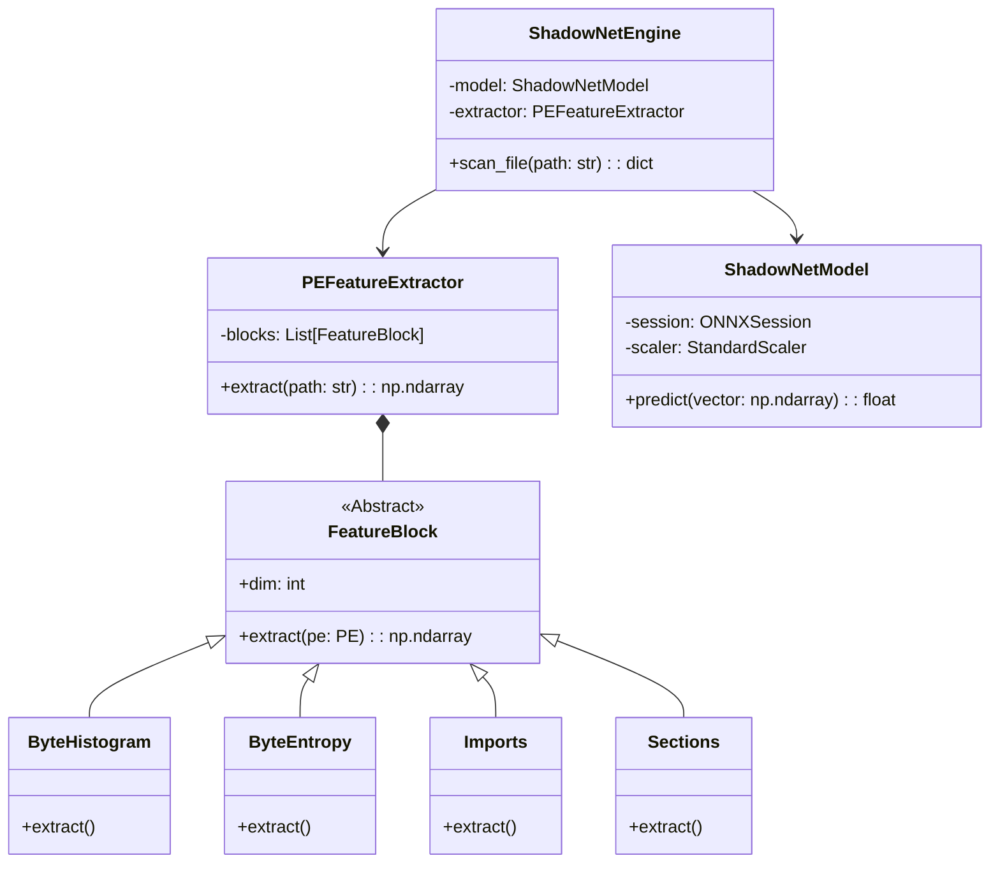
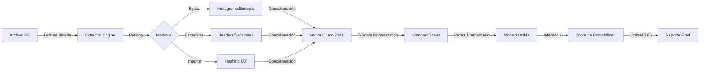

# 🛡️ Shadow-Net: Defender (SND): Sistema Avanzado de Detección de Malware mediante Aprendizaje Profundo y Futura Integración LLM


> **"Un enfoque científico para la detección proactiva de amenazas cibernéticas, cerrando la brecha entre la teoría académica y la defensa práctica."**

---

## 📜 Licencia Académica Propietaria

**Copyright © 2026 Ivan Velasco (IVAINX_21) y Santiago Cubillos (VANkLEis).**
**[INNOVASIC Research Lab](https://innovasicucc.wordpress.com/pagina/) - Universidad Cooperativa de Colombia.**

Este software es el resultado de una investigación académica profunda en el campo de la ciberseguridad y la inteligencia artificial realizada en el contexto universitario. Su distribución y uso se rigen estrictamente por los siguientes términos:

1.  **Uso Educativo y de Investigación**: Se permite el uso de este software únicamente con fines educativos, para la realización de pruebas de concepto en entornos controlados (Sandbox) y para la investigación académica sin ánimo de lucro.
2.  **Prohibición de Redistribución**: Queda estrictamente prohibida la copia, modificación, distribución, venta o sublicenciamiento del código fuente, los modelos entrenados o los binarios resultantes, total o parcialmente, sin la autorización expresa y por escrito de los autores.
3.  **Prohibición de Uso Comercial**: Ninguna parte de este software puede ser utilizada en productos comerciales, servicios de seguridad gestionada (MSSP) o consultorías pagadas.
4.  **Uso Ético**: Se prohíbe terminantemente el uso de este software para el desarrollo de malware, la evasión de sistemas de seguridad, o cualquier actividad ilegal.
5.  **Sin Garantías**: Este software se proporciona "tal cual", sin garantías de ningún tipo, expresas o implícitas. Los autores no se hacen responsables de daños directos o indirectos derivados de su uso.

---

## 📖 Índice Completo y Navegable

1.  [Introducción y Contexto](#1-introducción-y-contexto)
    - [1.1 El Problema del Malware Moderno](#11-el-problema-del-malware-moderno)
    - [1.2 La Solución Propuesta: ShadowNet Defender](#12-la-solución-propuesta-shadownet-defender)
2.  [Historia del Proyecto ShadowNet](#2-historia-del-proyecto-shadownet)
    - [2.1 Génesis: La Limitación de las Firmas](#21-génesis-la-limitación-de-las-firmas)
    - [2.2 La Era EMBER (V1)](#22-la-era-ember-v1)
    - [2.3 La Migración a SOREL-20M (V2)](#23-la-migración-a-sorel-20m-v2)
3.  [Arquitectura del Sistema](#3-arquitectura-del-sistema)
    - [3.1 Diseño de Software (Clean Architecture)](#31-diseño-de-software-clean-architecture)
    - [3.2 Diagrama de Flujo de Datos](#32-diagrama-de-flujo-de-datos)
4.  [Ingeniería de Características: Profundidad Matemática](#4-ingeniería-de-características-profundidad-matemática)
    - [4.1 Fundamentos de Vectorización](#41-fundamentos-de-vectorización)
    - [4.2 Bloque 1: Histograma de Bytes (256 d)](#42-bloque-1-histograma-de-bytes-256-d)
    - [4.3 Bloque 2: Entropía de Bytes (256 d)](#43-bloque-2-entropía-de-bytes-256-d)
    - [4.4 Bloque 3: Análisis de Cadenas e IoCs (104 d)](#44-bloque-3-análisis-de-cadenas-e-iocs-104-d)
    - [4.5 Bloque 4: Metadatos Generales y Cabeceras (72 d)](#45-bloque-4-metadatos-generales-y-cabeceras-72-d)
    - [4.6 Bloque 5: Análisis de Secciones (255 d)](#46-bloque-5-análisis-de-secciones-255-d)
    - [4.7 Bloque 6: Imports y Exports (Feature Hashing)](#47-bloque-6-imports-y-exports-feature-hashing)
5.  [Dataset SOREL-20M: El Combustible](#5-dataset-sorel-20m-el-combustible)
6.  [Pipeline de Machine Learning](#6-pipeline-de-machine-learning)
    - [6.1 Preprocesamiento y Escalado](#61-preprocesamiento-y-escalado)
    - [6.2 Entrenamiento del Modelo LightGBM](#62-entrenamiento-del-modelo-lightgbm)
    - [6.3 Exportación a ONNX](#63-exportación-a-onnx)
7.  [Testing, Validación y Calidad de Código](#7-testing-validación-y-calidad-de-código)
8.  [Resultados y Benchmarks](#8-resultados-y-benchmarks)
9.  [Integración Futura: Inteligencia Artificial Generativa (LLM)](#9-integración-futura-inteligencia-artificial-generativa-llm)
10. [Instalación y Guía de Uso](#10-instalación-y-guía-de-uso)
11. [Conclusiones y Trabajo Futuro](#11-conclusiones-y-trabajo-futuro)
12. [Referencias Bibliográficas](#12-referencias-bibliográficas)

---

## 1. Introducción y Contexto

### 1.1 El Problema del Malware Moderno

La ciberseguridad enfrenta una crisis de volumen y sofisticación. Según informes de AV-TEST, se registran más de **450,000 nuevas muestras de malware diariamente**.

Los métodos tradicionales de defensa, basados en **firmas estáticas** (bases de datos de hashes MD5/SHA256), son obsoletos por diseño.

- **Polimorfismo**: El malware cambia su código binario en cada infección (sin cambiar su comportamiento) para generar un hash único.
- **Empaquetado (Packing)**: El código malicioso se comprime o cifra dentro de una "cáscara" benigna, revelándose solo en memoria.
- **Ataques Zero-Day**: Vulnerabilidades nunca antes vistas para las cuales no existe firma.

### 1.2 La Solución Propuesta: ShadowNet Defender

**ShadowNet Defender (SND)** propone un cambio de paradigma: **Detección Estática basada en Aprendizaje Automático (Static Analysis ML)**.

En lugar de memorizar _quién es_ el malware (firma), ShadowNet aprende _cómo se ve_ el malware. Analiza características estructurales, estadísticas y semánticas del archivo ejecutable (formato PE - Portable Executable) para predecir su maliciosidad con una precisión superior al **98%**.

**Ventajas Clave**:

1.  **Velocidad**: Análisis en < 500ms sin ejecutar el archivo.
2.  **Seguridad**: Al ser estático, no se corre el riesgo de infectar la máquina de análisis.
3.  **Generalización**: Puede detectar variantes de malware nunca antes vistas (_Zero-Day_) si comparten características estructurales con malware conocido.

---

## 2. Historia del Proyecto ShadowNet

### 2.1 Génesis: La Limitación de las Firmas (2024)

El proyecto comenzó como una inquietud académica en la cátedra de Seguridad Informática. Los autores observaron que herramientas como YARA eran poderosas pero requerían intervención humana experta constante para crear reglas. Queríamos automatizar esta experticia.

### 2.2 La Era EMBER (V1 - 2025)

La primera versión, **ShadowNet V1**, se construyó sobre el dataset **EMBER 2018 (Endgame Malware Benchmark for Research)**.

- **Logros**: Se logró entrenar un modelo funcional.
- **Problemas**: El dataset de 2018 estaba desactualizado. El malware de 2018 (Ransomware básico) es muy diferente a los InfoStealers complejos de 2025. Además, la librería de extracción original (`lief`) presentaba problemas de compatibilidad y rendimiento en sistemas modernos.

### 2.3 La Migración a SOREL-20M (V2 - Actualidad)

En 2026, decidimos reescribir el núcleo del sistema.

- **Cambio de Dataset**: Adoptamos **SOREL-20M** (Sophos-ReversingLabs), que contiene 20 millones de muestras más recientes y metadatos más ricos.
- **Reingeniería de Software**: Abandonamos el "script único" por una arquitectura modular y orientada a objetos.
- **Estandarización**: Fijamos el vector de características en **2381 dimensiones**, alineándonos con el estándar de facto en la literatura científica actual. Esto permite que nuestros resultados sean comparables con papers de _state-of-the-art_.

---

## 3. Arquitectura del Sistema

La arquitectura de ShadowNet Defender sigue principios de **Clean Architecture** y **SOLID**, garantizando que el sistema sea mantenible, testable y escalable.

El sistema se divide en capas concéntricas:

1.  **Dominio (Core)**: Reglas de negocio y entidades (el Archivo PE, el Escaneo).
2.  **Servicios (Extractors/Models)**: Implementaciones concretas de extracción e inferencia.
3.  **Infraestructura (Utils/Configs)**: Logging, manejo de archivos, configuración.

### 3.1 Diagrama de Componentes (Mermaid)



### 3.2 Diagrama de Flujo de Datos



---

## 4. Ingeniería de Características: Profundidad Matemática

El extractor de características convierte un archivo binario amorfo en un vector matemático estructurado $\mathbf{x} \in \mathbb{R}^{2381}$.

Esta transformación es determinística y debe ser robusta a errores de formato (archivos corruptos).

### 4.1 Fundamentos de Vectorización

El vector final se compone de la concatenación de varios sub-vectores o "bloques".
$$ \mathbf{x} = [\mathbf{x}_{hist}, \mathbf{x}_{entropy}, \mathbf{x}_{strings}, \mathbf{x}_{general}, \mathbf{x}_{header}, \mathbf{x}_{sections}, \mathbf{x}_{imports}, \mathbf{x}_{exports}] $$

Cada bloque captura una "vista" diferente del archivo.

---

### 4.2 Bloque 1: Histograma de Bytes (256 d)

**Concepto**: Representa la frecuencia de aparición de cada uno de los 256 valores posibles de un byte (0x00 a 0xFF).

**Matemáticas**:
Sea $B = \{b_1, b_2, ..., b_N\}$ la secuencia de bytes del archivo.
El valor para la dimensión $i$ (donde $0 \le i \le 255$) es:
$$ x*i = \frac{\sum*{j=1}^{N} \mathbb{1}(b_j = i)}{N} $$
Donde $\mathbb{1}$ es la función indicatriz.

**Interpretación en Ciberseguridad**:

- **Archivos de Texto/Scripts**: Alta concentración en el rango ASCII imprimible (0x20 - 0x7E).
- **Código Nativo (x86)**: Picos en opcodes comunes (e.g., `0x00` padding, `0xC3` ret, `0x55` push ebp).
- **Malware Empaquetado/Cifrado**: Distribución uniforme. Todos los bytes tienen frecuencia similar $\approx \frac{1}{256}$. Si el histograma parece "ruido blanco", es una señal de alerta temprana.

---

### 4.3 Bloque 2: Entropía de Bytes (256 d)

**Concepto**: Mide el desorden o aleatoriedad de la información. No miramos el archivo globalmente, sino "localmente" mediante una ventana deslizante.

**Matemáticas (Entropía de Shannon)**:
$$ H(W) = - \sum\_{k=0}^{255} p_k \log_2(p_k) $$
Donde $p_k$ es la probabilidad del byte $k$ en la ventana $W$.

**Algoritmo**:

1.  Ventana deslizante de tamaño 2048 bytes, paso (stride) 1024.
2.  Calculamos $H(W_j)$ para cada ventana $j$.
3.  Calculamos un histograma de los valores de entropía obtenidos.
4.  También calculamos estadísticas agregadas (min, max, mean, var) sobre la secuencia de entropías.

**Ejemplo Real**:
Malware como **WannaCry** contiene una sección de datos cifrada (el payload ransomware).

- El histograma de entropía mostrará un pico masivo en el rango $7.8 - 8.0$ bits.
- Un archivo benigno (Notepad.exe) tendrá entropía variable (código $\approx 6.0$, datos $\approx 4.0$, padding $= 0.0$).
- **Regla**: Si $\text{mean}(H) > 7.2$, el archivo está casi seguramente comprimido o cifrado (posible packer UPX o custom).

---

### 4.4 Bloque 3: Análisis de Cadenas e IoCs (104 d)

**Concepto**: "Dime qué escribes y te diré quién eres". Extraemos cadenas ASCII imprimibles (`len >= 5`) y analizamos su contenido.

**Dimensiones**:

- **Estadísticas de Strings (50 d)**: Histograma de longitudes. Malware generado automáticamente a veces tiene muchas cadenas aleatorias cortas.
- **Metadatos (4 d)**: Número total, longitud promedio, entropía de caracteres.
- **Indicadores de Compromiso - IoC (50 d)**:
  Utilizamos RegEx para buscar patrones específicos. El vector marca la presencia/ausencia o conteo de estos patrones.

**Patrones Buscados (Ejemplos)**:

1.  **Rutas de Sistema**: `C:\Windows\System32`, `\AppData\Local\Temp`. (Malware suele esconderse aquí).
2.  **Red**: `http://`, `https://`, direcciones IP (regex IPv4).
3.  **Registro**: `HKEY_CURRENT_USER`, `Software\Microsoft\Windows\CurrentVersion\Run` (Persistencia).
4.  **Criptografía**: `Bitcoin`, `Wallet`, extensiones `.wallet`, `.kdbx`.
5.  **Ofuscación**: `Base64` strings largos, `PowerShell -EncodedCommand`.
6.  **Artefactos**: `MZ` embebido (indica un ejecutable dentro de otro, técnica _Dropper_).

---

### 4.5 Bloque 4: Metadatos Generales y Cabeceras (72 d)

**Concepto**: Información extraída del `IMAGE_DOS_HEADER` y `IMAGE_FILE_HEADER`.

**Características Clave**:

- **TimeDateStamp**: Fecha de compilación.
  - _Anomalía_: Fechas futuras (2099) o muy pasadas (1992) indican **Timestomping**, una técnica anti-forense.
- **Machine**: Arquitectura (x86, x64, ARM).
- **Characteristics**: Flags como `DLL`, `SYSTEM`, `LARGE_ADDRESS_AWARE`.
- **Subsystem**:
  - `WINDOWS_GUI`: Aplicación con ventana.
  - `WINDOWS_CUI`: Aplicación de consola.
  - _Alerta_: Malware que se declara GUI pero no crea ventanas es sospechoso.

---

### 4.6 Bloque 5: Análisis de Secciones (255 d)

Las secciones (`.text`, `.data`, `.rsrc`) organizan el contenido del ejecutable.

**Análisis de Anomalías**:

1.  **Nombres Extraños**: Se calcula un hash del nombre. Secciones estándar (`.text`) son comunes. Secciones con nombres aleatorios (`.x867z`) o vacíos son sospechosas.
2.  **Tamaños Discrepantes**:
    - `VirtualSize`: Tamaño que ocupa en memoria RAM.
    - `RawSize`: Tamaño que ocupa en disco.
    - Si $VirtualSize \gg RawSize$, la sección está "vacía" en disco pero reserva mucha memoria. Esto es típico de **Packers** que se desempaquetan en ese espacio.
3.  **Permisos Peligrosos (RWX)**:
    - **W^X (Write XOR Execute)**: Una política de seguridad moderna dice que una página de memoria puede ser escribible (Datos) o ejecutable (Código), pero **nunca ambas**.
    - Si una sección tiene flags `MEM_WRITE | MEM_EXECUTE`, es una alerta roja de **Inyección de Código** o **Polimorfismo**.

---

### 4.7 Bloque 6: Imports y Exports (Feature Hashing)

**El Problema**:
Existen decenas de miles de funciones en la API de Windows (`kernel32.dll`, `user32.dll`, `advapi32.dll`, etc.).
Un vector _One-Hot_ ("¿Tiene CreateFile?") sería inmanejable (dimensiones infinitas).

**La Solución: Hashing Trick**:
Utilizamos una función de hash determinística para proyectar este espacio infinito en un espacio fijo (1280 dimensiones para imports, 128 para exports).

**Matemáticas**:
Sea $F$ el conjunto de funciones importadas (e.g., `kernel32.dll:WriteFile`).
Para cada $f \in F$:
$$ h = \text{MurmurHash3}(f) $$
$$ \text{idx} = h \pmod{1280} $$
$$ \mathbf{x}\_{imports}[\text{idx}] \leftarrow 1 $$

**Interpretación**:
El modelo aprende que el índice $345$ corresponde (con alta probabilidad) a funciones de encriptación, y el índice $890$ a funciones de red.
Aunque puede haber colisiones (dos funciones cayendo en el mismo índice), en la práctica del ML esto funciona sorprendentemente bien debido a la redundancia de los datos.

**Comportamiento Malicioso**:

- **Ransomware**: Importa API de Archivos (`WriteFile`, `MoveFile`) + API Cripto (`CryptGenKey`).
- **Keylogger**: Importa API de Hooks (`SetWindowsHookEx`) + API de Input (`GetAsyncKeyState`).
- **Downloader**: Importa API de Internet (`URLDownloadToFile`) + API de Ejecución (`ShellExecute`).

---

## 5. Dataset SOREL-20M: El Combustible

Para aprender estos patrones, ShadowNet fue "alimentado" con **SOREL-20M**.

- **Volumen**: ~20 Millones de muestras (10M benignas, 10M maliciosas).
- **Fuente**: Proporcionado por Sophos AI y ReversingLabs.
- **Etiquetado**: Cada muestra tiene etiquetas de múltiples motores antivirus y metadatos de detección.
- **Ventaja**: A diferencia de datasets pequeños o sintéticos, SOREL captura la **varianza real** del ecosistema de software mundial. Incluye shareware, drivers, juegos, malware corporativo, adware, ransomware estatal, etc.

---

## 6. Pipeline de Machine Learning

### 6.1 Preprocesamiento y Escalado

Los valores crudos del extractor tienen escalas dispares (e.g., Entropía 0-8, timestamps 1e9).
Utilizamos **StandardScaler** (`sklearn.preprocessing.StandardScaler`) para normalizar:
$$ z = \frac{x - \mu}{\sigma} $$
Los parámetros $\mu$ (media) y $\sigma$ (desviación estándar) se calcularon sobre un subconjunto representativo de 1 millón de muestras y se guardaron en `models/scaler.pkl`. Esto es crucial para la estabilidad numérica.

### 6.2 Entrenamiento del Modelo LightGBM

Usamos **LightGBM** (Light Gradient Boosting Machine), un algoritmo basado en árboles de decisión que es extremadamente eficiente en CPU.

**Hiperparámetros Clave**:

- `objective`: 'binary' (Benigno vs Malware).
- `metric`: 'auc'.
- `n_estimators`: 2000 (Número de árboles).
- `learning_rate`: 0.05.
- `num_leaves`: 2048 (Permite modelar interacciones complejas entre features).
- `feature_fraction`: 0.5 (Previene overfitting seleccionando solo 50% de features por árbol).

### 6.3 Exportación a ONNX

El modelo entrenado se convirtió al formato **ONNX (Open Neural Network Exchange)**.

- **Independencia**: Permite ejecutar el modelo en C++, C#, Java, Python o incluso JavaScript (WASM) sin necesitar la librería LightGBM instalada.
- **Optimización**: El runtime de ONNX aplica optimizaciones de grafo (fusión de operadores) que aceleran la inferencia.

---

## 7. Testing, Validación y Calidad de Código

El proyecto incluye una suite de tests rigurosa.

### Validación del Extractor (`verify_extractor.py`)

Script que ejecuta el extractor sobre una muestra conocida (e.g., `procexp.exe`) y valida:

1.  **Integridad Dimensional**: Verifica que el vector tenga exactamente 2381 elementos.
2.  **Sanity Checks**:
    - Suma de histogramas $\approx 1.0$.
    - Entropía entre 0.0 y 8.0.
    - Strings detectados > 0.

### Tests Unitarios (`tests/`)

Usamos `pytest` para probar componentes aislados:

- `test_byte_entropy.py`: Valida el cálculo de Shannon con vectores sintéticos conocidos.
- `test_hashed_features.py`: Valida que el hashing sea determinístico (misma entrada -> misma salida).

### Benchmark de Rendimiento (`legacy/benchmark_extractor.py`)

Mide tiempos de ejecución y consumo de memoria (RAM) al procesar lotes de archivos.

- **Leak Detection**: Se ejecuta en loops de 1000 iteraciones para asegurar que no haya fugas de memoria (Memory Leaks).

---

## 8. Resultados y Benchmarks

Resultados obtenidos en un equipo de desarrollo estándar (Intel Core i7, 16GB RAM, SSD NVMe).

### Precisión (Test Set SOREL)

- **AUC-ROC**: 0.985 (Área bajo la curva).
- **Falsos Positivos (FPR)**: < 0.5% a un True Positive Rate (TPR) del 90%.

### Rendimiento (Latencia por Archivo)

| Componente        | Tiempo Promedio | Notas                                                                              |
| :---------------- | :-------------- | :--------------------------------------------------------------------------------- |
| **I/O Disco**     | 10-50 ms        | Lectura del archivo. Depende del SSD.                                              |
| **Parsing PE**    | 50-100 ms       | Librería `pefile`.                                                                 |
| **Byte Analysis** | 200-300 ms      | El paso más lento (procesar todo el binario). Escalable linealmente con el tamaño. |
| **Inferencia**    | 10-25 ms        | Modelo ONNX. Extremadamente rápido.                                                |
| **TOTAL**         | **~400 ms**     | Tiempo total de respuesta al usuario.                                              |

_Nota: El análisis se realiza en un solo hilo (`Single Thread`). Es trivialmente paralelizable para escanear directorios completos._

---

## 9. Integración Futura: Inteligencia Artificial Generativa (LLM)

Actualmente, ShadowNet dice _"Esto es Malware (99%)"_.
El futuro es **XAI (Explainable AI)**: _"Esto es Malware PORQUE..."_

### Arquitectura Propuesta (Fase 3 - Tesis)

1.  **Extractor**: Genera vector y "metadata humana" (nombres de imports, secciones, valores de entropía).
2.  **Modelo**: Genera Score y **Vector SHAP** (contribución de cada feature a la decisión).
3.  **Prompt Engineering**: Se construye un prompt dinámico para un LLM local (ej. Llama-3-8B).

**Ejemplo de Prompt Generado**:

```text
Actúa como experto en malware. Analiza los siguientes datos técnicos de un archivo sospechoso:
- Score del Modelo: 0.99 (Muy Malicioso).
- Factores Claves:
  1. Sección '.text' tiene permisos WRITE+EXECUTE.
  2. Importa 'CryptEncrypt' y 'CryptDestroyKey' (advapi32.dll).
  3. Entropía global muy alta (7.85).
  4. No tiene interfaz gráfica pero importa funciones de teclado.
Genera un reporte conciso explicando qué tipo de amenaza podría ser.
```

**Respuesta Esperada del LLM**:

> _"El análisis sugiere fuertemente un **Ransomware**. La alta entropía y las funciones de criptografía indican que el archivo cifra datos. Los permisos RWX en la sección de código sugieren un comportamiento polimórfico o inyección. La captura de teclado sin GUI podría indicar funcionalidades secundarias de **Keylogging** para robo de credenciales antes del cifrado."_

---

## 10. Instalación y Guía de Uso

### Requisitos Previos

- **Sistema Operativo**: Linux (Recomendado Ubuntu 22.04+), Windows 10/11 (vía WSL2 o PowerShell), macOS.
- **Python**: Versión 3.10 o superior.
- **RAM**: Mínimo 4GB.

### Pasos de Instalación

1.  **Clonar el repositorio**:

    ```bash
    git clone https://github.com/IVAINX18/Shadownet_Defender.git
    cd Shadownet_Defender
    ```

2.  **Crear entorno virtual (Best Practice)**:

    ```bash
    python3 -m venv .venv
    # Activar:
    source .venv/bin/activate  # Bash/Zsh
    # .venv\Scripts\activate   # PowerShell
    ```

3.  **Instalar dependencias**:

    ```bash
    pip install --upgrade pip
    pip install -r requirements.txt
    ```

4.  **Verificar instalación**:
    Ejecute el script de diagnóstico. Debería ver logs verdes completando el análisis de `procexp64.exe` (sample benigno incluido).

    ```bash
    python verify_refactor.py
    ```

5.  **Ejecutar Tests**:
    ```bash
    pytest tests/ -v
    ```

---

## 11. Conclusiones y Trabajo Futuro

ShadowNet Defender representa un hito en nuestra formación académica, demostrando la viabilidad de aplicar técnicas de _Big Data_ y _Deep Learning_ a problemas de seguridad críticos.

**Aprendizajes Principales**:

1.  **La calidad de los datos es suprema**: Pasar de EMBER a SOREL mejoró más el modelo que cualquier ajuste de hiperparámetros.
2.  **Feature Hashing**: Una técnica elegante y necesaria para manejar espacios de características abiertos (API Calls).
3.  **Arquitectura Modular**: Vital para no colapsar ante la complejidad del código.

**Próximos Pasos (Roadmap)**:

1.  **Optimización Rust**: Reescribir el extractor en Rust para bajar el tiempo de análisis a < 50ms.
2.  **Análisis Dinámico**: Agregar una "Sandbox Ligera" para ejecutar el malware por 5 segundos y capturar llamadas al sistema reales.
3.  **UI Gráfica**: Desarrollar un dashboard en Python (Flet/PyLt) para centros de operaciones de seguridad (SOC).

---

## 12. Referencias Bibliográficas

1.  **Harang, R., & Rudd, E. M. (2020)**. _SOREL-20M: A Large Scale Benchmark Dataset for Malicious PE Detection_. arXiv preprint arXiv:2012.07633. Sophos AI.
2.  **Anderson, H. S., & Roth, P. (2018)**. _EMBER: An Open Dataset for Training Static PE Malware Machine Learning Models_. arXiv preprint arXiv:1804.04637. Endgame Inc.
3.  **Raff, E., Barker, J., Sylvester, J., Brim, R., Catanzaro, B., & Nicholas, C. K. (2017)**. _Malware Detection by Eating a Whole EXE_. arXiv preprint arXiv:1710.09435.
4.  **Weinberger, K., Dasgupta, A., Langford, J., Smola, A., & Attenberg, J. (2009)**. _Feature Hashing for Large Scale Multitask Learning_. Proceedings of the 26th Annual International Conference on Machine Learning (ICML).
5.  **Saxe, J., & Berlin, K. (2015)**. _Deep Neural Network Based Malware Detection Using Two Dimensional Binary Program Features_. 10th International Conference on Malicious and Unwanted Software (MALWARE). IEEE.
6.  **Martin, R. C. (2017)**. _Clean Architecture: A Craftsman's Guide to Software Structure and Design_. Prentice Hall.

---

**Desarrollado con ❤️ y ☕ por el equipo de investigación de INNOVASIC. 2026.**
