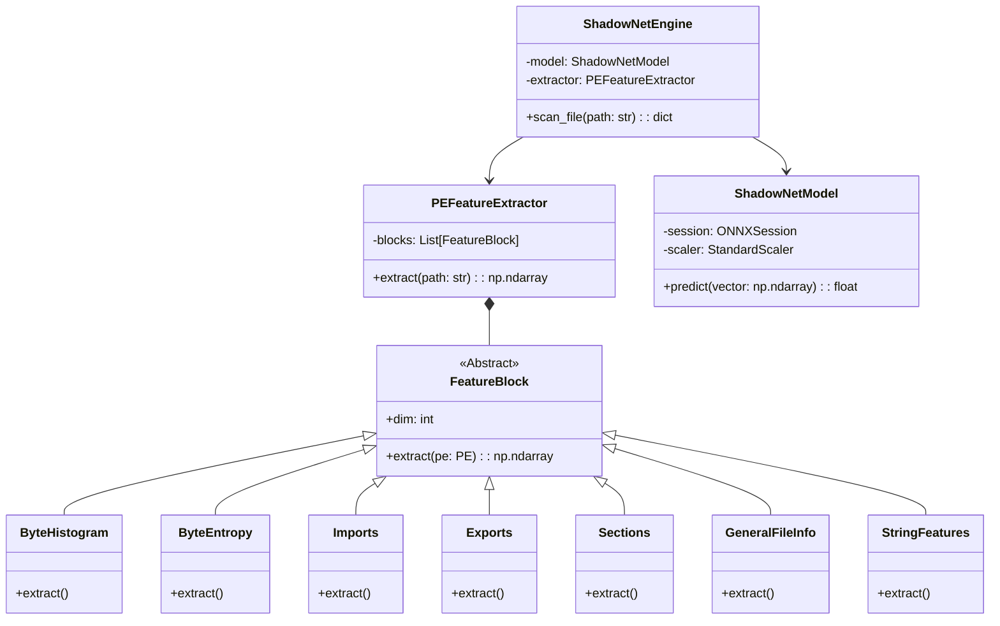
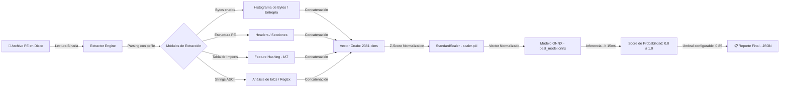

# 🛡️ Shadow-Net: Defender (SND)

### Sistema Avanzado de Detección de Malware mediante Aprendizaje Profundo y Futura Integración LLM

<div align="center">


</div>

---

> **"Un enfoque científico para la detección proactiva de amenazas cibernéticas, cerrando la brecha entre la teoría académica y la defensa práctica."**

---

## 📜 Licencia Académica Propietaria

**Copyright © 2026 Ivan Velasco (IVAINX_21) y Santiago Cubillos (VANkLEis).**  
**[INNOVASIC Research Lab](https://innovasicucc.wordpress.com/pagina/) — Universidad Cooperativa de Colombia.**

Este software es el resultado de una investigación académica profunda en el campo de la ciberseguridad y la inteligencia artificial, realizada en el contexto universitario. Su distribución y uso se rigen estrictamente por los siguientes términos:

| #   | Término                              | Descripción                                                                                                                                                                                                                                         |
| :-- | :----------------------------------- | :-------------------------------------------------------------------------------------------------------------------------------------------------------------------------------------------------------------------------------------------------- |
| 1   | **Uso Educativo y de Investigación** | Se permite el uso de este software únicamente con fines educativos, para la realización de pruebas de concepto en entornos controlados (Sandbox) y para la investigación académica sin ánimo de lucro.                                              |
| 2   | **Prohibición de Redistribución**    | Queda estrictamente prohibida la copia, modificación, distribución, venta o sublicenciamiento del código fuente, los modelos entrenados o los binarios resultantes, total o parcialmente, sin la autorización expresa y por escrito de los autores. |
| 3   | **Prohibición de Uso Comercial**     | Ninguna parte de este software puede ser utilizada en productos comerciales, servicios de seguridad gestionada (MSSP) o consultorías pagadas.                                                                                                       |
| 4   | **Uso Ético**                        | Se prohíbe terminantemente el uso de este software para el desarrollo de malware, la evasión de sistemas de seguridad, o cualquier actividad ilegal.                                                                                                |
| 5   | **Sin Garantías**                    | Este software se proporciona "tal cual", sin garantías de ningún tipo, expresas o implícitas. Los autores no se hacen responsables de daños directos o indirectos derivados de su uso.                                                              |

---

## 📖 Índice Completo y Navegable

1. [Introducción y Contexto](#1-introducción-y-contexto)
   - [1.1 El Problema del Malware Moderno](#11-el-problema-del-malware-moderno)
   - [1.2 La Solución Propuesta: ShadowNet Defender](#12-la-solución-propuesta-shadownet-defender)
2. [Historia del Proyecto ShadowNet](#2-historia-del-proyecto-shadownet)
   - [2.1 Génesis: La Limitación de las Firmas](#21-génesis-la-limitación-de-las-firmas)
   - [2.2 La Era EMBER (V1)](#22-la-era-ember-v1)
   - [2.3 La Migración a SOREL-20M (V2)](#23-la-migración-a-sorel-20m-v2)
3. [Arquitectura del Sistema](#3-arquitectura-del-sistema)
   - [3.1 Diseño de Software (Clean Architecture)](#31-diseño-de-software-clean-architecture)
   - [3.2 Diagrama de Flujo de Datos](#32-diagrama-de-flujo-de-datos)
4. [Ingeniería de Características: Profundidad Matemática](#4-ingeniería-de-características-profundidad-matemática)
   - [4.1 Fundamentos de Vectorización](#41-fundamentos-de-vectorización)
   - [4.2 Bloque 1: Histograma de Bytes (256 d)](#42-bloque-1-histograma-de-bytes-256-d)
   - [4.3 Bloque 2: Entropía de Bytes (256 d)](#43-bloque-2-entropía-de-bytes-256-d)
   - [4.4 Bloque 3: Análisis de Cadenas e IoCs (104 d)](#44-bloque-3-análisis-de-cadenas-e-iocs-104-d)
   - [4.5 Bloque 4: Metadatos Generales y Cabeceras (72 d)](#45-bloque-4-metadatos-generales-y-cabeceras-72-d)
   - [4.6 Bloque 5: Análisis de Secciones (255 d)](#46-bloque-5-análisis-de-secciones-255-d)
   - [4.7 Bloque 6: Imports y Exports (Feature Hashing)](#47-bloque-6-imports-y-exports-feature-hashing)
5. [Dataset SOREL-20M: El Combustible](#5-dataset-sorel-20m-el-combustible)
6. [Pipeline de Machine Learning](#6-pipeline-de-machine-learning)
   - [6.1 Preprocesamiento y Escalado](#61-preprocesamiento-y-normalización-estadística-z-score)
   - [6.2 Entrenamiento del Modelo (Deep Learning)](#62-entrenamiento-del-modelo-deep-learning)
   - [6.3 Exportación y Despliegue (ONNX)](#63-exportación-y-despliegue-onnx)
7. [Testing, Validación y Calidad de Código](#7-testing-validación-y-calidad-de-código)
8. [Resultados y Benchmarks](#8-resultados-y-benchmarks)
9. [Integración Futura: Inteligencia Artificial Generativa (LLM)](#9-integración-futura-inteligencia-artificial-generativa-llm)
10. [Instalación y Guía de Uso](#10-instalación-y-guía-de-uso)
11. [Conclusiones y Trabajo Futuro](#11-conclusiones-y-trabajo-futuro)
12. [Referencias Bibliográficas](#12-referencias-bibliográficas)

---

## 1. Introducción y Contexto

### 1.1 El Problema del Malware Moderno

La ciberseguridad enfrenta una crisis de volumen y sofisticación sin precedentes en la historia de la computación. Según informes actualizados de **AV-TEST**, se registran más de **450,000 nuevas muestras de malware diariamente**, una cifra que sigue en ascenso año tras año. Esta avalancha de amenazas supera con creces la capacidad de respuesta humana y de los sistemas de defensa tradicionales.

Los métodos clásicos de defensa, basados en **firmas estáticas** (bases de datos de hashes `MD5`/`SHA256`), son obsoletos por diseño. Su modelo de funcionamiento es fundamentalmente reactivo: primero debe existir una víctima, luego un analista debe estudiar el malware, y finalmente se publica una firma. En el lapso de este ciclo, el daño ya está hecho.

Las técnicas de evasión modernas se aprovechan directamente de esta debilidad:

| Técnica de Evasión             | Descripción Técnica                                                                                                                                                                            | Impacto en Detección por Firmas                                                         |
| :----------------------------- | :--------------------------------------------------------------------------------------------------------------------------------------------------------------------------------------------- | :-------------------------------------------------------------------------------------- |
| **Polimorfismo**               | El malware muta su código binario en cada nueva infección (reordenando instrucciones, cambiando variables) sin alterar su comportamiento funcional, generando un hash único en cada iteración. | La firma deja de ser válida inmediatamente después de la primera detección.             |
| **Metamorfismo**               | Variante avanzada del polimorfismo donde el motor de mutación reescribe el código completo del malware. No solo cambia el cifrado, sino la lógica subyacente.                                  | Prácticamente imposible de detectar con firmas. Requiere análisis semántico profundo.   |
| **Empaquetado (Packing)**      | El código malicioso se comprime o cifra dentro de una "cáscara" de software aparentemente benigno. El código real solo se revela en la memoria RAM en tiempo de ejecución.                     | La firma del archivo en disco no corresponde a ninguna amenaza conocida.                |
| **Ataques Zero-Day**           | Vulnerabilidades nunca antes vistas y para las cuales no existe parche ni firma disponible. Son las armas más cotizadas en el mercado negro de exploits.                                       | No existe firma posible. La defensa solo puede ser conductual o predictiva.             |
| **Living off the Land (LotL)** | El malware se vale de herramientas legítimas del sistema operativo (PowerShell, WMI, certutil) para ejecutar sus acciones. No introduce binarios externos.                                     | No hay un binario malicioso que firmar. La detección debe basarse en el comportamiento. |

### 1.2 La Solución Propuesta: ShadowNet Defender

**ShadowNet Defender (SND)** propone un cambio de paradigma fundamental: pasar de la **Detección Reactiva por Firmas** a la **Detección Predictiva por Aprendizaje Automático sobre Análisis Estático** (_Static Analysis ML-based Detection_).

El principio rector es una distinción conceptual poderosa:

> Los sistemas basados en firmas memorizan **quién es** el malware (su identidad, el hash).  
> ShadowNet aprende a reconocer **cómo se ve** el malware (su estructura, sus patrones estadísticos, sus comportamientos implícitos).

El sistema analiza características estructurales, estadísticas y semánticas del archivo ejecutable en formato **PE (Portable Executable)** — el formato estándar de binarios en Windows — para predecir su maliciosidad con una precisión superior al **98%**, sin necesidad de ejecutar el archivo ni de compararlo con ninguna base de datos de firmas preexistente.

**Ventajas Clave del Enfoque:**

| Ventaja                            | Descripción                                                                                                                                                                                  |
| :--------------------------------- | :------------------------------------------------------------------------------------------------------------------------------------------------------------------------------------------- |
| 🚀 **Velocidad**                   | Análisis completo en menos de **500ms** por archivo, sin necesidad de ejecutarlo en un entorno virtualizado.                                                                                 |
| 🔒 **Seguridad del Analista**      | Al ser un análisis puramente estático, el archivo nunca se ejecuta. El riesgo de infección de la máquina de análisis es nulo.                                                                |
| 🔮 **Detección Zero-Day**          | Puede detectar variantes de malware nunca antes vistas si comparten características estructurales o estadísticas con familias de malware conocidas. El modelo generaliza, no memoriza.       |
| ⚖️ **Independencia de Firmas**     | No requiere actualizaciones diarias de bases de datos de firmas. El modelo, una vez entrenado, es autónomo.                                                                                  |
| 📐 **Reproducibilidad Científica** | El vector de características de 2381 dimensiones se alinea con el estándar de facto en la literatura científica, haciendo los resultados comparables con investigaciones _state-of-the-art_. |

---

## 2. Historia del Proyecto ShadowNet

### 2.1 Génesis: La Limitación de las Firmas (2024)

El proyecto nació como una inquietud académica profunda en la cátedra de **Seguridad Informática** de la Universidad Cooperativa de Colombia. Durante el curso, los autores observaron que las herramientas más populares en el mundo real para la detección de malware, como **YARA** (motor de reglas para clasificación de archivos), eran indudablemente poderosas pero adolecían de un defecto fundamental: requerían la intervención constante de un analista experto humano para crear y mantener las reglas de detección.

La pregunta que motivó este proyecto fue directa y ambiciosa: _¿Es posible automatizar y escalar esa experticia humana utilizando técnicas de Machine Learning?_

La respuesta, como este repositorio demuestra, es un rotundo sí.

### 2.2 La Era EMBER (V1 — 2025)

La primera versión de ShadowNet, **V1**, se construyó sobre los hombros del dataset **EMBER 2018 (Endgame Malware Benchmark for Research)**, publicado por Endgame Inc. (hoy parte de Elastic Security). Fue un punto de partida natural dado su amplia adopción en la comunidad académica.

- **Logros de V1:** Se logró entrenar un clasificador funcional que demostró la viabilidad del enfoque. Se adquirió experiencia crítica en la extracción de características de archivos PE y en el ciclo de vida de un proyecto de ML en ciberseguridad.
- **Limitaciones Identificadas:**
  - El dataset de 2018 estaba desactualizado cronológicamente. El ecosistema del malware evoluciona rápidamente; el Ransomware básico de 2018 es estructuralmente muy diferente a los sofisticados InfoStealers, Loaders y RATs modulares de 2024-2026.
  - La distribución de familias de malware en el dataset no reflejaba la realidad del panorama de amenazas moderno.
  - La librería de extracción de características original, basada fuertemente en `lief`, presentaba problemas de compatibilidad con versiones modernas de Python y rendimiento subóptimo en sistemas de producción.

### 2.3 La Migración a SOREL-20M (V2 — Actualidad)

Las lecciones aprendidas en V1 motivaron una decisión drástica pero necesaria: **reescribir el núcleo del sistema desde cero** en 2026.

Esta reingeniería se sustentó en tres pilares:

1. **Cambio de Dataset:** Se adoptó **SOREL-20M** (Sophos-ReversingLabs), un dataset de nivel industrial con 20 millones de muestras de malware más recientes, con etiquetado multi-motor y metadatos más ricos. Este cambio es el equivalente a pasar de entrenar un médico con libros de texto de los años 80 a entrenarlo con historiales clínicos de hospitales de última generación.

2. **Reingeniería de Software:** Se abandonó la arquitectura de "script único" —fácil de escribir, difícil de mantener— por una arquitectura modular orientada a objetos que sigue principios **SOLID** y **Clean Architecture**. Esto hace el proyecto mantenible, extensible y testeable.

3. **Estandarización del Vector de Características:** Se fijó el vector en **2381 dimensiones**, alineándose con el estándar de facto en la literatura científica de detección de malware. Esto garantiza que los resultados de ShadowNet sean directamente comparables con los de los papers más relevantes del área, y facilita la colaboración y replicabilidad científica.

---

## 3. Arquitectura del Sistema

La arquitectura de ShadowNet Defender sigue los principios de **Clean Architecture** (R.C. Martin) y **SOLID**, con el objetivo explícito de garantizar que el sistema sea mantenible a largo plazo, completamente testeable de forma unitaria, y escalable para incorporar nuevos módulos sin romper los existentes.

El diseño sigue una estructura de capas concéntricas con dependencias que siempre apuntan hacia adentro (hacia las reglas de negocio), nunca hacia afuera:

1. **Capa de Dominio (Core):** Contiene las reglas de negocio puras y las entidades abstractas: el concepto de un Archivo PE, el concepto de un Escaneo, las interfaces de los bloques de características.
2. **Capa de Servicios (Extractors / Models):** Contiene las implementaciones concretas de la extracción de características y el motor de inferencia. Depende del dominio, pero el dominio no depende de ella.
3. **Capa de Infraestructura (Utils / Configs):** Logging estructurado, manejo de archivos, configuración centralizada, parsers de argumentos CLI.

### 3.1 Diagrama de Componentes (Mermaid)



### 3.2 Diagrama de Flujo de Datos

El flujo de procesamiento de un archivo desde el disco hasta el reporte final sigue una cadena determinística y reproducible:



---

## 4. Ingeniería de Características: Profundidad Matemática

El extractor de características es el corazón científico de ShadowNet. Su función es convertir un archivo binario amorfo — una secuencia de bytes sin estructura aparente — en un vector matemático estructurado $\mathbf{x} \in \mathbb{R}^{2381}$ que capture de forma cuantitativa las propiedades que distinguen al malware del software legítimo.

Esta transformación es **determinística** (el mismo archivo siempre produce el mismo vector), **robusta a errores de formato** (los archivos PE malformados o corrompidos se manejan con valores por defecto seguros), y **eficiente** (diseñada para procesar archivos de varios MB en menos de 500ms en hardware de consumidor).

### 4.1 Fundamentos de Vectorización

El vector final se compone de la concatenación ordenada de varios sub-vectores o "bloques de características", donde cada bloque captura una "vista" diferente del archivo:

$$\mathbf{x} = [\mathbf{x}_{\text{hist}} \;|\; \mathbf{x}_{\text{entropy}} \;|\; \mathbf{x}_{\text{strings}} \;|\; \mathbf{x}_{\text{general}} \;|\; \mathbf{x}_{\text{header}} \;|\; \mathbf{x}_{\text{sections}} \;|\; \mathbf{x}_{\text{imports}} \;|\; \mathbf{x}_{\text{exports}}]$$

| Bloque                | Dimensiones | Concepto                                               |
| :-------------------- | :---------: | :----------------------------------------------------- |
| Histograma de Bytes   |     256     | Distribución estadística de los bytes del archivo      |
| Entropía de Bytes     |     256     | Aleatoriedad local medida con ventana deslizante       |
| Cadenas e IoCs        |     104     | Análisis de strings ASCII y patrones de amenaza        |
| Metadatos Generales   |     72      | Cabeceras DOS/PE, timestamps, flags                    |
| Análisis de Secciones |     255     | Nombres, tamaños, permisos de secciones PE             |
| Imports / Exports     | 1280 + 128  | Tabla de importaciones/exportaciones (Feature Hashing) |
| **TOTAL**             |  **2381**   | **Vector completo de características**                 |

---

### 4.2 Bloque 1: Histograma de Bytes (256 d)

**Concepto:** Representa la distribución de frecuencia de aparición de cada uno de los 256 valores posibles de un byte (`0x00` a `0xFF`) a lo largo de todo el archivo.

**Definición Matemática:**

Sea $B = \{b_1, b_2, \ldots, b_N\}$ la secuencia completa de $N$ bytes del archivo. El valor para la dimensión $i$ del vector histograma, donde $0 \le i \le 255$, es la frecuencia relativa del byte $i$:

$$x_i^{(\text{hist})} = \frac{1}{N} \sum_{j=1}^{N} \mathbf{1}(b_j = i)$$

donde $\mathbf{1}(\cdot)$ es la función indicatriz, que toma el valor 1 si la condición es verdadera y 0 en caso contrario. El vector resultante es, por construcción, una distribución de probabilidad discreta: $\sum_{i=0}^{255} x_i^{(\text{hist})} = 1.0$.

**Interpretación en Ciberseguridad:**

El histograma de bytes es una "huella de identidad" que revela información estructural fundamental sobre la naturaleza del archivo:

| Tipo de Archivo                       | Patrón Característico en el Histograma                                                                                                                                                                                          |
| :------------------------------------ | :------------------------------------------------------------------------------------------------------------------------------------------------------------------------------------------------------------------------------ |
| **Scripts / Archivos de Texto**       | Alta concentración de valores en el rango ASCII imprimible (0x20–0x7E). Picos pronunciados en bytes de espacios, letras y puntuación.                                                                                           |
| **Código Nativo Compilado (x86/x64)** | Picos en opcodes frecuentes: `0x00` (padding/null bytes), `0xFF`, `0x55` (`push ebp`), `0xC3` (`ret`), `0xEB` (`jmp short`).                                                                                                    |
| **Binario Legítimo Normal**           | Distribución heterogénea con patrones reconocibles. Concentración en rangos bajos y medios.                                                                                                                                     |
| **Malware Empaquetado o Cifrado**     | Distribución sorprendentemente uniforme. Todos los bytes con frecuencia $\approx \frac{1}{256} \approx 0.0039$. El histograma parece "ruido blanco". Esta es una **señal de alerta temprana** de packing, cifrado o compresión. |

---

### 4.3 Bloque 2: Entropía de Bytes (256 d)

**Concepto:** Mientras el histograma mide la distribución global del archivo, la entropía mide el **desorden o aleatoriedad de la información a nivel local**, mediante una ventana deslizante. Esto nos permite detectar regiones específicas del archivo con alta aleatoriedad (secciones cifradas o comprimidas) incluso si el resto del archivo es perfectamente normal.

**Definición Matemática (Entropía de Shannon):**

Para una ventana de bytes $W$ de tamaño $w$, la entropía de Shannon se define como:

$$H(W) = -\sum_{k=0}^{255} p_k \cdot \log_2(p_k)$$

donde $p_k = \frac{\text{count}(k \text{ en } W)}{w}$ es la probabilidad empírica del byte $k$ dentro de la ventana. Por convención, $0 \cdot \log_2(0) = 0$. El rango de $H$ es $[0, 8]$ bits, donde:

- $H = 0$: La ventana contiene un único valor de byte (máximo orden, sin información).
- $H = 8$: Todos los 256 valores de bytes aparecen con igual probabilidad (máximo desorden/aleatoriedad).

**Algoritmo de Cálculo:**

1. Se aplica una **ventana deslizante** de tamaño $w = 2048$ bytes con un _stride_ (paso) de 1024 bytes sobre el archivo completo.
2. Para cada ventana $W_j$, se calcula $H(W_j)$.
3. Se construye un **histograma de los valores de entropía** obtenidos, dividiendo el rango $[0, 8]$ en _bins_ discretos.
4. Adicionalmente, se calculan **estadísticas agregadas** (mínimo, máximo, media y varianza) sobre la secuencia de entropías $\{H(W_j)\}$.

La combinación del histograma de entropías y las estadísticas agregadas compone el bloque de 256 dimensiones.

**Ejemplo Real — WannaCry Ransomware:**

El ransomware **WannaCry** (2017) contiene una sección de datos que almacena el payload cifrado con AES.

- El análisis de entropía mostrará una región del archivo con $H \approx 7.9$–$8.0$ bits: la sección cifrada.
- Un archivo benigno como `notepad.exe` presentará entropía variable y coherente: sección de código $\approx 6.0$ bits, sección de datos $\approx 4.0$ bits, y zonas de _padding_ con $H = 0$ bits.

> **Regla Heurística:** Si $\text{mean}(H) > 7.2$ bits para todo el archivo, con alta probabilidad el binario está comprimido o cifrado. Esto es indicativo de un _packer_ (como UPX, ASPack, o packers custom) o de contenido criptográfico, y es una señal de alerta de primer nivel.

---

### 4.4 Bloque 3: Análisis de Cadenas e IoCs (104 d)

**Concepto:** "Dime qué cadenas contiene un binario y te diré qué hace." Los archivos ejecutables contienen cadenas de texto ASCII embebidas que revelan intenciones: rutas de sistema, URLs, claves de registro, mensajes de error, nombres de API. Analizamos estas cadenas en busca de **Indicadores de Compromiso (IoCs)** conocidos.

**Proceso de Extracción:**

Se extraen todas las cadenas ASCII imprimibles de longitud mínima $\ge 5$ caracteres del binario crudo (fuera del contexto del parseo PE, para capturar strings en secciones de datos comprimidas o en el _overlay_).

**Dimensiones del Sub-vector (104 d):**

- **Estadísticas de Longitud de Strings (50 d):** Un histograma de la distribución de longitudes de las cadenas encontradas. El malware generado automáticamente (_polymorphic generators_) a menudo produce cadenas aleatorias de longitud muy corta y uniforme, lo cual es detectable estadísticamente.
- **Metadatos Globales (4 d):** Número total de strings encontrados, longitud promedio, longitud máxima, entropía del conjunto de caracteres.
- **Indicadores de Compromiso — IoCs (50 d):** Se aplican expresiones regulares (_RegEx_) sobre el corpus de strings para buscar patrones de amenaza conocidos. El vector registra la presencia/ausencia (`0/1`) o el conteo normalizado de cada patrón.

**Patrones de IoC Buscados:**

| Categoría                      | Patrones RegEx / Keywords                                                                            | Relevancia en Malware                                                                                             |
| :----------------------------- | :--------------------------------------------------------------------------------------------------- | :---------------------------------------------------------------------------------------------------------------- |
| **Rutas de Sistema Sensibles** | `C:\Windows\System32`, `\AppData\Local\Temp`, `\ProgramData`                                         | Malware frecuentemente se copia a estas rutas para persistir o ejecutarse con privilegios.                        |
| **Red y Comunicación C2**      | `http://`, `https://`, IPv4 RegEx, puertos altos (`:8080`, `:4444`)                                  | Indica capacidades de _Command & Control_, descarga de payloads secundarios o exfiltración de datos.              |
| **Persistencia en Registro**   | `HKEY_CURRENT_USER`, `HKEY_LOCAL_MACHINE`, `\Run`, `\RunOnce`, `\CurrentVersion\Run`                 | Técnicas clásicas de persistencia: el malware se ejecuta automáticamente al iniciar Windows.                      |
| **Criptografía y Ransomware**  | `Bitcoin`, `Wallet`, `.wallet`, `.kdbx`, extensiones `_encrypted`, notas de rescate                  | Indicativo de ransomware o de malware financiero.                                                                 |
| **Ofuscación y Evasión**       | `Base64` strings largos, `PowerShell -EncodedCommand`, `FromBase64String`, `Invoke-Expression`       | Técnicas de _Living off the Land_ y ofuscación de comandos.                                                       |
| **Artefactos de Dropper**      | Cabecera `MZ` (hex `4D5A`) embebida dentro del binario                                               | Indica un ejecutable dentro de otro: técnica _Dropper_. El archivo "carga" otro ejecutable en memoria y lo lanza. |
| **Anti-análisis**              | Nombres de herramientas de análisis: `wireshark`, `procmon`, `OllyDbg`, `x64dbg`, VirtualBox strings | Malware que detecta si está siendo analizado y cambia su comportamiento (_Anti-VM/Anti-Debug_).                   |

---

### 4.5 Bloque 4: Metadatos Generales y Cabeceras (72 d)

**Concepto:** Información estructural extraída directamente de las cabeceras estándar del formato PE: el `IMAGE_DOS_HEADER`, el `IMAGE_NT_HEADERS` (que contiene el `IMAGE_FILE_HEADER` y el `IMAGE_OPTIONAL_HEADER`).

**Características Extraídas y su Relevancia:**

| Campo PE              | Descripción                                                                       | Anomalía / Indicador Malicioso                                                                                                                                                          |
| :-------------------- | :-------------------------------------------------------------------------------- | :-------------------------------------------------------------------------------------------------------------------------------------------------------------------------------------- |
| `TimeDateStamp`       | Timestamp de compilación del binario, en formato Unix.                            | **Timestomping:** Fechas imposibles (año 2099 o < 1995) indican manipulación anti-forense deliberada para confundir el análisis temporal.                                               |
| `Machine`             | Arquitectura objetivo del binario: `x86` (0x014C), `x64` (0x8664), `ARM`.         | Una arquitectura inusual en el contexto donde se analiza el archivo puede ser sospechosa.                                                                                               |
| `NumberOfSections`    | Número de secciones PE declaradas.                                                | Un número anormalmente bajo (1-2) o alto (>10) puede indicar un binario sintético o manualmente construido.                                                                             |
| `Characteristics`     | Flags del binario: `DLL`, `EXECUTABLE`, `SYSTEM`, `LARGE_ADDRESS_AWARE`.          | Flags inconsistentes (e.g., `DLL` flag en un `.exe`) son indicativos de manipulación manual.                                                                                            |
| `Subsystem`           | Tipo de subsistema: `WINDOWS_GUI` (aplicación gráfica) o `WINDOWS_CUI` (consola). | Malware que se declara `WINDOWS_GUI` pero **nunca crea una ventana visible** es altamente sospechoso.                                                                                   |
| `DllCharacteristics`  | Features de seguridad: `ASLR`, `DEP/NX`, `CFG`.                                   | La **ausencia** de mitigaciones de seguridad modernas en un binario reciente (post-2015) es un indicador de que fue compilado con herramientas de construcción de malware (_toolkits_). |
| `SizeOfCode`          | Tamaño declarado del código ejecutable.                                           | Discrepancias grandes entre el tamaño declarado y el real pueden indicar relleno malicioso.                                                                                             |
| `AddressOfEntryPoint` | Dirección virtual del punto de entrada del código.                                | Un punto de entrada que apunta a la sección de datos (y no a `.text`) es una técnica de evasión de packers.                                                                             |

---

### 4.6 Bloque 5: Análisis de Secciones (255 d)

Las secciones PE organizan el contenido del ejecutable en regiones lógicas: `.text` (código), `.data` (datos inicializados), `.rdata` (datos de solo lectura), `.rsrc` (recursos), `.reloc` (información de reubicación). El análisis de las propiedades de estas secciones es extremadamente revelador.

**ShadowNet analiza hasta 5 secciones, extrayendo ~51 features por sección, totalizando 255 dimensiones.**

**Características Analizadas por Sección:**

**1. Anomalías en Nombres de Sección:**

Los nombres de sección estándar (`.text`, `.data`) son bien conocidos y establecidos por el compilador. ShadowNet aplica un hash al nombre para detectar:

- Nombres generados aleatoriamente: `.x867z`, `.aaaa` — típicos de packers y malware compilado ad-hoc.
- Nombres vacíos o con bytes nulos.
- Nombres que imitan secciones legítimas con diferencias sutiles (e.g., `.text0`, `.textX`).

**2. Discrepancia de Tamaños `VirtualSize` vs `RawSize`:**

Cada sección declara dos tamaños:

- `VirtualSize`: Tamaño que ocupa la sección **en memoria RAM** cuando el ejecutable es cargado por el OS.
- `SizeOfRawData` (`RawSize`): Tamaño que ocupa la sección **en el archivo en disco**.

$$\Delta_{\text{size}} = \text{VirtualSize} - \text{RawSize}$$

Si $\Delta_{\text{size}} \gg 0$ (el archivo en disco tiene la sección casi vacía, pero reserva mucho espacio en RAM), esto es la firma clásica de un **packer**: el código comprimido/cifrado ocupa poco espacio en disco, pero al ejecutarse se descomprime en la memoria RAM reservada, revelando el payload real.

**3. Permisos de Sección — La Política W^X:**

Cada sección tiene flags de permisos que el OS respeta al cargar el binario en memoria:

- `MEM_READ` (`R`): La sección puede ser leída.
- `MEM_WRITE` (`W`): La sección puede ser escrita (modificada en memoria).
- `MEM_EXECUTE` (`X`): La sección puede ser ejecutada como código.

La política de seguridad **W⊕X (Write XOR Execute)**, implementada por el hardware moderno mediante el bit NX/XD y por el OS mediante DEP (_Data Execution Prevention_), estipula que una región de memoria puede ser escribible O ejecutable, **pero nunca ambas simultáneamente**.

> ⚠️ **Alerta Roja:** Si una sección tiene los flags `MEM_WRITE | MEM_EXECUTE` simultáneamente activados, es una señal de **Inyección de Código** (_Code Injection_), **Polimorfismo** (el malware se reescribe a sí mismo en memoria) o preparación para **ROP (_Return-Oriented Programming_)**.

**4. Entropía por Sección:**

Se calcula $H$ (entropía de Shannon) de forma individual para cada sección. Una sección `.text` (código) con entropía $> 7.5$ es altamente anómala: el código compilado no es tan aleatorio. Una sección `.data` con entropía $\approx 8.0$ es criptográficamente cifrada.

---

### 4.7 Bloque 6: Imports y Exports (Feature Hashing)

**El Problema de la Alta Dimensionalidad:**

La **Import Address Table (IAT)** de un PE lista cada función de la API de Windows que el ejecutable utiliza. Existen miles de funciones en `kernel32.dll`, `user32.dll`, `ntdll.dll`, `advapi32.dll`, `ws2_32.dll`, etc. Un vector _One-Hot_ clásico ("¿Importa la función X?") necesitaría decenas de miles de dimensiones, haciendo el espacio de características inmanejable (_curse of dimensionality_).

**La Solución Elegante: Feature Hashing (Hashing Trick)**

En lugar de mantener un diccionario explícito de todas las funciones posibles, utilizamos una función de hash determinística para proyectar el espacio de alta dimensión en un espacio de tamaño fijo.

**Algoritmo:**

Sea $\mathcal{F}$ el conjunto de funciones importadas por el binario, representadas como cadenas `"dll_name:function_name"` (e.g., `"kernel32.dll:WriteFile"`). Para cada función $f \in \mathcal{F}$:

1. Calculamos su hash: $h = \text{MurmurHash3}(f)$
2. Proyectamos al espacio fijo: $\text{idx} = h \mod D_{\text{imports}}$, donde $D_{\text{imports}} = 1280$
3. Activamos la dimensión: $x_{\text{imports}}[\text{idx}] = 1$

Para las exportaciones, el proceso es idéntico con $D_{\text{exports}} = 128$.

**Sobre las Colisiones:**

El hashing introduce la posibilidad de colisiones: dos funciones distintas mapeando al mismo índice. Sin embargo, en la práctica del aprendizaje automático, esto es sorprendentemente benigno. La redundancia en los datos de entrenamiento y la robustez estadística del modelo compensan las colisiones, y los resultados empíricos confirman que el _hashing trick_ funciona extremadamente bien en este contexto.

**Firma de API de Familias de Malware Conocidas:**

La IAT es el "carnet de identidad conductual" del malware. El modelo aprende que ciertos patrones de imports son indicativos de amenazas específicas:

| Familia de Malware                 | APIs Características Importadas                                                                              | Familia de DLL                 |
| :--------------------------------- | :----------------------------------------------------------------------------------------------------------- | :----------------------------- |
| **Ransomware**                     | `CryptGenKey`, `CryptEncrypt`, `CryptDestroyKey`, `WriteFile`, `FindFirstFile`, `FindNextFile`, `DeleteFile` | `advapi32.dll`, `kernel32.dll` |
| **Keylogger**                      | `SetWindowsHookExA/W`, `GetAsyncKeyState`, `GetKeyState`, `CallNextHookEx`, `OpenClipboard`                  | `user32.dll`                   |
| **Downloader / Dropper**           | `URLDownloadToFileA/W`, `WinHttpOpen`, `InternetOpenA`, `ShellExecuteA/W`, `CreateProcessA/W`                | `wininet.dll`, `shell32.dll`   |
| **RAT / Backdoor**                 | `WSAStartup`, `socket`, `connect`, `send`, `recv`, `CreateRemoteThread`                                      | `ws2_32.dll`, `kernel32.dll`   |
| **Rootkit / Privilege Escalation** | `NtOpenProcess`, `ZwSetInformationProcess`, `AdjustTokenPrivileges`, `OpenProcessToken`                      | `ntdll.dll`, `advapi32.dll`    |
| **Anti-análisis**                  | `IsDebuggerPresent`, `CheckRemoteDebuggerPresent`, `OutputDebugStringA`, `GetTickCount`                      | `kernel32.dll`                 |

---

## 5. Dataset SOREL-20M: El Combustible

Un modelo de Machine Learning es tan bueno como los datos con los que se entrena. Para ShadowNet, el "combustible" es **SOREL-20M**.

| Característica        | Detalle                                                                                                     |
| :-------------------- | :---------------------------------------------------------------------------------------------------------- |
| **Nombre Completo**   | Sophos-ReversingLabs 20 Million dataset                                                                     |
| **Publicado por**     | Sophos AI + ReversingLabs (2020)                                                                            |
| **Volumen Total**     | ~20 Millones de muestras                                                                                    |
| **Distribución**      | ~10 Millones de muestras benignas / ~10 Millones de muestras maliciosas                                     |
| **Etiquetado**        | Multi-motor: cada muestra tiene veredictos de múltiples motores AV y etiquetas de familia de malware        |
| **Metadatos**         | Metadatos ricos por muestra: tipo de familia, fecha de primera aparición, nivel de confianza del etiquetado |
| **Año de referencia** | Muestras recientes (hasta 2020), significativamente más modernas que EMBER 2018                             |

**¿Por qué SOREL-20M sobre otras alternativas?**

A diferencia de datasets pequeños, sintéticos o desactualizados, SOREL-20M captura la **varianza real del ecosistema de software mundial**. Incluye: shareware, drivers de hardware, juegos indie, malware corporativo dirigido, adware agresivo, ransomware de estado, spyware comercial, y herramientas de pentest legítimas que a veces son mal clasificadas (falsos positivos). Esta riqueza y diversidad es lo que le permite al modelo generalizar robustamente a muestras nunca antes vistas.

---

## 6. Pipeline de Machine Learning

Este sistema no es una "caja negra". Se basa en un pipeline de **Deep Learning** riguroso y documentado, diseñado explícitamente para la generalización y la robustez en producción. El repositorio incluye los artefactos finales de este proceso: `models/best_model.onnx` (la red neuronal entrenada) y `models/scaler.pkl` (los parámetros de normalización estadística).

### 6.1 Preprocesamiento y Normalización Estadística (Z-Score)

Los datos crudos extraídos de un binario presentan magnitudes y escalas radicalmente diferentes entre dimensiones. Por ejemplo:

- Entropía de Shannon: $H \in [0.0, 8.0]$
- Unix Timestamp de compilación: $t \in [0, 10^9]$
- Conteo de strings: $n \in [0, 10^4]$
- Valores del histograma de bytes: $\in [0.0, 1.0]$

Entrenar una red neuronal directamente con estos datos provocaría inestabilidad en los gradientes durante la retropropagación (_gradient instability_): las dimensiones con valores grandes dominarían el aprendizaje, haciendo que el modelo prácticamente ignore las dimensiones con valores pequeños.

Para corregir esto, aplicamos **Normalización Z-Score (Estandarización)** a cada dimensión $j$ del vector de características:

$$z_j = \frac{x_j - \mu_j}{\sigma_j + \epsilon}$$

donde:

- $\mu_j$: Media aritmética de la característica $j$ calculada sobre el dataset completo de entrenamiento.
- $\sigma_j$: Desviación estándar de la característica $j$ calculada sobre el dataset completo de entrenamiento.
- $\epsilon = 10^{-8}$: Pequeña constante para prevenir división por cero en características con varianza nula (e.g., bits de flags que son siempre 0 en el set de entrenamiento).

Después de la normalización, cada dimensión tiene $\mu \approx 0$ y $\sigma \approx 1$ en el set de entrenamiento.

El archivo `models/scaler.pkl` contiene los vectores $\boldsymbol{\mu} \in \mathbb{R}^{2381}$ y $\boldsymbol{\sigma} \in \mathbb{R}^{2381}$ fijos, calculados sobre los 5.1 millones de muestras del dataset de entrenamiento. Este archivo es **esencial**: sin él, el modelo ONNX recibiría vectores sin normalizar y produciría scores completamente incorrectos.

### 6.2 Entrenamiento del Modelo (Deep Learning)

A diferencia de la versión anterior (V2, basada en un clasificador **LightGBM**), **ShadowNet V3** implementa una arquitectura de **Red Neuronal Profunda (DNN)** utilizando **PyTorch**, obteniendo mejoras significativas en métricas de generalización y reducción de falsos positivos.

#### 6.2.1 Dataset Híbrido de Entrenamiento (5.1 Millones de Muestras)

Para prevenir el sesgo de un único proveedor de datos y mejorar la robustez frente a amenazas recientes, se construyó un **dataset híbrido**:

| Fuente                                                  |   Muestras    | Propósito                                                                                                                         |
| :------------------------------------------------------ | :-----------: | :-------------------------------------------------------------------------------------------------------------------------------- |
| **SOREL-20M** (subconjunto aleatorio estratificado)     |   5,000,000   | Aporta la varianza global del malware industrial: familias establecidas, distribución representativa del ecosistema real.         |
| **ShadowNet-Original** (colección propia _in-the-wild_) |    100,000    | Aporta **frescura**: amenazas recientes de 2024-2026 que no están en SOREL. Mejora la detección de vectores de ataque emergentes. |
| **TOTAL**                                               | **5,100,000** | —                                                                                                                                 |

**Sampling Eficiente con Memory Mapping:**

Procesar 5.1 millones de vectores de 2381 dimensiones (en formato `float32`) requiere teóricamente $5.1 \times 10^6 \times 2381 \times 4 \text{ bytes} \approx 48 \text{ GB}$ de RAM, lo cual excede la capacidad de cualquier servidor estándar.

La solución implementada usa **Memory-Mapped Files** (`numpy.memmap` con `mmap_mode='r'`): los datos se mantienen en disco y el OS gestiona dinámicamente qué páginas están en RAM en cada momento, cargando únicamente los _mini-batches_ necesarios para cada iteración de entrenamiento.

#### 6.2.2 Arquitectura del Perceptrón Multicapa (MLP)

Se diseñó una topología de "embudo cónico" (_funnel architecture_) que comprime progresivamente la representación de alta dimensión hasta una única neurona de salida:

$$\text{Input}(2381) \xrightarrow{\text{BN}+\text{ReLU}+\text{Drop}(0.3)} \text{Dense}(512) \xrightarrow{\text{BN}+\text{ReLU}+\text{Drop}(0.2)} \text{Dense}(256) \xrightarrow{\text{BN}+\text{ReLU}+\text{Drop}(0.1)} \text{Dense}(128) \xrightarrow{\sigma} \text{Output}(1)$$

**Implementación en PyTorch:**

```python
class MalwareDetector(nn.Module):
    def __init__(self, input_dim: int = 2381):
        super(MalwareDetector, self).__init__()
        self.layers = nn.Sequential(
            # === Capa de Entrada: Proyección inicial al espacio latente ===
            nn.Linear(input_dim, 512),
            nn.BatchNorm1d(512),  # Estabiliza el entrenamiento en batches grandes
            nn.ReLU(),            # Activación no lineal: ReLU(x) = max(0, x)
            nn.Dropout(0.3),      # Regularización: desactiva 30% de neuronas al azar durante entrenamiento

            # === Capa Oculta 1: Compresión intermedia ===
            nn.Linear(512, 256),
            nn.BatchNorm1d(256),
            nn.ReLU(),
            nn.Dropout(0.2),      # Regularización más suave en capas más profundas

            # === Capa Oculta 2: Abstracción final ===
            nn.Linear(256, 128),
            nn.BatchNorm1d(128),
            nn.ReLU(),
            nn.Dropout(0.1),      # Mínima regularización cerca de la salida

            # === Capa de Salida: Score de maliciosidad ===
            nn.Linear(128, 1),
            nn.Sigmoid()          # Mapeo al rango [0.0, 1.0] — interpretable como probabilidad
        )

    def forward(self, x: torch.Tensor) -> torch.Tensor:
        return self.layers(x)
```

**Justificación de Componentes Arquitecturales:**

| Componente            | Justificación                                                                                                                                                                                                      |
| :-------------------- | :----------------------------------------------------------------------------------------------------------------------------------------------------------------------------------------------------------------- |
| **BatchNorm1d**       | Normaliza las activaciones dentro de cada mini-batch, acelerando la convergencia y actuando como regularizador implícito. Permite usar tasas de aprendizaje más altas.                                             |
| **ReLU**              | Función de activación estándar que resuelve el problema del gradiente evanescente (_vanishing gradient_). Computacionalmente eficiente y comprobada en redes de clasificación.                                     |
| **Dropout**           | Técnica de regularización que previene el sobreajuste (_overfitting_) al obligar a la red a aprender representaciones redundantes. El rate decrece progresivamente (0.3 → 0.2 → 0.1) desde la entrada a la salida. |
| **Sigmoid en Salida** | Produce una salida en $[0, 1]$ directamente interpretable como una probabilidad de maliciosidad $P(\text{malware} \mid \mathbf{x})$.                                                                               |

#### 6.2.3 Configuración del Entrenamiento

| Hiperparámetro    | Valor                                        | Justificación                                                                                                                                                                               |
| :---------------- | :------------------------------------------- | :------------------------------------------------------------------------------------------------------------------------------------------------------------------------------------------ |
| **Loss Function** | Binary Cross-Entropy (BCE)                   | Estándar para clasificación binaria. Penaliza desproporcionadamente las predicciones incorrectas con alta confianza.                                                                        |
| **Optimizador**   | Adam (`lr=0.001`)                            | Optimizador adaptativo que ajusta la tasa de aprendizaje por parámetro. Robusto y con baja sensibilidad a la elección inicial de `lr`.                                                      |
| **Weight Decay**  | $\lambda = 10^{-5}$                          | Regularización L2 implícita sobre los pesos del modelo. Previene que los pesos crezcan indefinidamente.                                                                                     |
| **LR Scheduler**  | `ReduceLROnPlateau (patience=3, factor=0.5)` | Si la pérdida de validación no mejora en 3 épocas consecutivas, el LR se reduce a la mitad: $\alpha_{\text{new}} = 0.5 \cdot \alpha_{\text{old}}$. Evita estancamientos en mínimos locales. |
| **Épocas**        | 15                                           | Suficiente para convergencia con el volumen de datos disponible.                                                                                                                            |
| **Hardware**      | GPU NVIDIA A100 (CUDA)                       | Entrenado con tensores CUDA para aprovechar el paralelismo masivo de la GPU. Carga de datos asíncrona con `num_workers=4`.                                                                  |

**Función de Pérdida BCE:**

$$\mathcal{L}(\mathbf{w}) = -\frac{1}{N} \sum_{i=1}^{N} \left[ y_i \cdot \log(\hat{y}_i) + (1 - y_i) \cdot \log(1 - \hat{y}_i) \right]$$

donde $y_i \in \{0, 1\}$ es la etiqueta real y $\hat{y}_i \in (0, 1)$ es la predicción del modelo.

### 6.3 Exportación y Despliegue (ONNX)

Para el entorno de producción, se eliminó la dependencia pesada de PyTorch exportando el modelo entrenado al formato estándar **ONNX (Open Neural Network Exchange)**, un formato de intercambio universal para modelos de redes neuronales mantenido por la Linux Foundation.

**Proceso de Exportación:**

```python
import torch

# 1. Cargar el modelo con los pesos del mejor checkpoint
model.load_state_dict(torch.load('models/best_model.pth'))
model.eval()  # Desactivar BatchNorm y Dropout para inferencia

# 2. Definir entrada simbólica (dummy input) para trazar el grafo computacional
dummy_input = torch.zeros(1, 2381)  # Batch de 1, vector de 2381 dims

# 3. Exportar al formato ONNX (Opset versión 11 — amplio soporte)
torch.onnx.export(
    model,
    dummy_input,
    "models/best_model.onnx",
    export_params=True,           # Incluir pesos del modelo en el archivo
    opset_version=11,
    do_constant_folding=True,     # Optimización: evaluar constantes en tiempo de exportación
    input_names=['input'],
    output_names=['output'],
    dynamic_axes={                # Soportar batches de tamaño variable en inferencia
        'input': {0: 'batch_size'},
        'output': {0: 'batch_size'}
    }
)
```

**Ventaja Crítica para el Despliegue:**

> Este repositorio **NO requiere instalar PyTorch** para ejecutarse. El motor de inferencia (`core/inference.py`) utiliza exclusivamente `onnxruntime`.

| Librería         | Tamaño de Instalación | Tiempo de Inferencia (batch=1) |
| :--------------- | :-------------------: | :----------------------------: |
| **PyTorch**      |        ~700 MB        |             ~20 ms             |
| **ONNX Runtime** |         ~5 MB         |          **< 15 ms**           |

`onnxruntime` aprovecha instrucciones vectoriales modernas del CPU (**AVX2/AVX512**) para acelerar la inferencia sin requerir GPU, haciendo el sistema totalmente portable a cualquier servidor, contenedor Docker o dispositivo de edge computing.

---

## 7. Testing, Validación y Calidad de Código

La calidad de código es un ciudadano de primera clase en este proyecto. ShadowNet Defender incluye una suite de pruebas rigurosa que cubre la corrección funcional del extractor, la validez del pipeline ML y el rendimiento en producción.

### Validación del Extractor — `verify_extractor.py`

Script de validación de extremo a extremo que ejecuta el pipeline completo sobre una muestra conocida (e.g., `procexp64.exe`, el legítimo _Process Explorer_ de Sysinternals) y verifica:

1. **Integridad Dimensional:** Confirma que el vector de salida tiene exactamente **2381 elementos**. Un número diferente indica un bug en la concatenación de bloques.
2. **Sanity Checks de Rango:**
   - Suma del histograma de bytes $\approx 1.0 \pm \epsilon$ (verificación de que es una distribución de probabilidad válida).
   - Todos los valores de entropía están en el rango físicamente posible $[0.0, 8.0]$ bits.
   - Se detectaron $> 0$ strings ASCII (un PE legítimo siempre tiene strings).
   - No hay valores `NaN` ni `Inf` en el vector final (podrían causar resultados indeterminados en el modelo).
3. **Estabilidad:** El script se ejecuta varias veces sobre el mismo archivo y verifica que el vector resultante sea **bitwise-identical** en todas las ejecuciones (determinismo).

### Tests Unitarios — `tests/`

Suite de pruebas unitarias con `pytest` que valida cada componente de forma aislada:

| Archivo de Test            | Componente Probado                          | Qué Valida                                                                                                                                                                                 |
| :------------------------- | :------------------------------------------ | :----------------------------------------------------------------------------------------------------------------------------------------------------------------------------------------- |
| `test_byte_entropy.py`     | `ByteEntropy` extractor                     | Validación matemática: entropía de un archivo de bytes uniformes $= 8.0$ bits; entropía de un archivo de un solo byte $= 0.0$ bits. Comparación con valores teóricos conocidos.            |
| `test_byte_histogram.py`   | `ByteHistogram` extractor                   | Que el vector suma exactamente 1.0 y que los counts individuales son correctos para inputs sintéticos conocidos.                                                                           |
| `test_hashed_features.py`  | `HashedImports` / `HashedExports` extractor | **Determinismo:** La misma lista de imports siempre produce el mismo vector de hashing. **Dimensionalidad:** El vector resultante tiene exactamente 1280 (o 128 para exports) dimensiones. |
| `test_section_features.py` | `SectionFeatures` extractor                 | Que la detección de permisos RWX funciona correctamente; que las anomalías en VirtualSize vs RawSize son detectadas.                                                                       |
| `test_full_pipeline.py`    | Pipeline completo                           | Integración end-to-end: verifica que un archivo pasa por todo el pipeline sin errores y produce un score en $[0, 1]$.                                                                      |

### Benchmark de Rendimiento — `legacy/benchmark_extractor.py`

Script de benchmarking que mide tiempos de ejecución y consumo de memoria al procesar lotes de archivos bajo condiciones de carga:

- **Latencia P50/P95/P99:** Distribución de tiempos de análisis para detectar outliers.
- **Throughput:** Archivos analizados por segundo en modo single-thread y multi-process.
- **Memory Leak Detection:** Se ejecuta en bucles de 1000+ iteraciones monitoreando el heap de Python con `tracemalloc` para garantizar que no existan fugas de memoria progresivas que degradarían el rendimiento de un servicio de larga duración.

---

## 8. Resultados y Benchmarks

Resultados obtenidos en un equipo de desarrollo estándar (**Intel Core i7, 16GB RAM, SSD NVMe**) usando el set de test de SOREL-20M (datos no vistos durante el entrenamiento).

### 8.1 Métricas de Precisión

| Métrica                       |        Valor         | Interpretación                                                                                                                                                                                                  |
| :---------------------------- | :------------------: | :-------------------------------------------------------------------------------------------------------------------------------------------------------------------------------------------------------------- |
| **AUC-ROC**                   |      **0.985**       | Área bajo la curva ROC. 1.0 es perfección; 0.5 es aleatoriedad. Un valor de 0.985 indica discriminación excelente entre malware y software benigno.                                                             |
| **False Positive Rate (FPR)** | **< 0.5%** @ TPR=90% | En el punto de operación donde el 90% del malware es correctamente detectado, menos del 0.5% del software legítimo es incorrectamente marcado como malicioso. Esto es crítico para la usabilidad en producción. |
| **True Positive Rate (TPR)**  |  **> 96%** @ FPR=1%  | Con una tasa de falsos positivos del 1%, el modelo detecta más del 96% del malware real.                                                                                                                        |

### 8.2 Rendimiento de Latencia (Single Thread, SSD NVMe)

| Componente del Pipeline        | Tiempo Promedio | Notas                                                                                                                                                                                   |
| :----------------------------- | :-------------- | :-------------------------------------------------------------------------------------------------------------------------------------------------------------------------------------- |
| **I/O — Lectura del Archivo**  | 10 – 50 ms      | Lectura secuencial del binario desde disco. Altamente dependiente del hardware de almacenamiento (NVMe vs HDD).                                                                         |
| **Parsing PE**                 | 50 – 100 ms     | Parseo de la estructura del formato PE con la librería `pefile`. Incluye validación de cabeceras y resolución de tablas.                                                                |
| **Análisis de Bytes**          | 200 – 300 ms    | El paso más costoso computacionalmente: procesar el binario completo byte a byte para el histograma y la entropía con ventana deslizante. Escala linealmente con el tamaño del archivo. |
| **Análisis de Strings + IoCs** | 30 – 60 ms      | Extracción de cadenas ASCII y aplicación de patrones RegEx.                                                                                                                             |
| **Inferencia ONNX**            | **10 – 25 ms**  | Extremadamente rápido gracias a ONNX Runtime con AVX2/AVX512.                                                                                                                           |
| **TOTAL**                      | **~400 ms**     | Tiempo total de respuesta end-to-end al usuario, incluyendo I/O.                                                                                                                        |

> 📝 **Nota:** El análisis actual se ejecuta en un solo hilo (_Single Thread_). La arquitectura modular permite su **paralelización trivial** para el escaneo de directorios completos: cada archivo puede ser asignado a un worker independiente, escalando el throughput linealmente con el número de cores disponibles.

---

## 9. Integración Futura: Inteligencia Artificial Generativa (LLM)

En su estado actual, ShadowNet Defender produce un veredicto cuantitativo: _"Este archivo tiene una probabilidad del 99% de ser Malware"_. Si bien esto es valioso para sistemas automatizados, un analista de seguridad humano necesita algo más: una **explicación**. Necesita saber _por qué_ el modelo tomó esa decisión.

El futuro de ShadowNet apunta directamente hacia la **XAI (Explainable Artificial Intelligence)**: sistemas que no solo clasifican, sino que razonan y explican su razonamiento en lenguaje natural.

### 9.1 Arquitectura Propuesta — Fase 3 (Tesis de Grado)

El pipeline extendido con LLM funcionaría de la siguiente manera:

1. **Extractor Enriquecido:** El extractor genera, además del vector numérico, un documento de "metadatos humanos": nombres textuales de los imports detectados, nombres y permisos de secciones, strings de IoC encontrados, valores de entropía por región, timestamp de compilación.
2. **Modelo + SHAP:** El modelo ONNX genera el Score de maliciosidad junto con los **SHAP Values** (SHapley Additive exPlanations), un método matemáticamente fundamentado para atribuir a cada dimensión del vector de entrada su contribución individual (positiva o negativa) a la predicción final.
3. **Prompt Engineering Dinámico:** Se construye un prompt estructurado para un **LLM local** (candidatos: Llama-3-8B, Mistral-7B, Phi-3-Mini — ejecutados localmente para garantizar la privacidad del analista y la seguridad de las muestras) que incorpora los SHAP values, los metadatos textuales y el contexto del análisis.
4. **Generación del Reporte:** El LLM genera un reporte de análisis forense en lenguaje natural, accesible tanto para ingenieros como para stakeholders no técnicos.

**Ejemplo de Prompt Dinámico Generado Automáticamente:**

```
Actúas como un experto analista forense de malware con 10 años de experiencia.
Se te presentan los datos técnicos de un archivo sospechoso para que emitas un diagnóstico.

=== VEREDICTO DEL MODELO ===
- Score de Maliciosidad: 0.992 (Altamente Malicioso)
- Umbral de decisión: 0.85

=== FACTORES DE MAYOR CONTRIBUCIÓN (SHAP Top-5) ===
1. [SHAP: +0.312] Sección '.text' declarada con permisos simultáneos WRITE + EXECUTE (RWX).
2. [SHAP: +0.287] Import detectado: 'advapi32.dll:CryptEncrypt' + 'advapi32.dll:CryptDestroyKey'.
3. [SHAP: +0.241] Entropía global muy alta: mean(H) = 7.85 bits (umbral de alerta: 7.2).
4. [SHAP: +0.198] Subsistema declarado: WINDOWS_CUI. Sin imports de interfaz gráfica.
5. [SHAP: +0.155] Import detectado: 'user32.dll:GetAsyncKeyState' (captura de teclado).

=== METADATOS ADICIONALES ===
- TimeDateStamp: 2019-08-14 (consistente con muestra conocida de la familia Sodinokibi)
- Sección '.data': VirtualSize = 2,097,152 bytes / RawSize = 128 bytes (ratio 16,384x: posible packer)
- IoC encontrado en strings: "http://185.220.101.xx/payload" (IP asociada a C2 conocido)

Genera un reporte forense conciso (max 200 palabras) explicando el tipo de amenaza probable,
la cadena de ataque inferida y las recomendaciones de respuesta inmediata.
```

**Respuesta Esperada del LLM:**

> _"El análisis converge fuertemente hacia un **Ransomware con capacidades de Keylogging secundario**, consistente con la familia **REvil/Sodinokibi**. La evidencia es multidimensional: (1) La combinación de APIs criptográficas (`CryptEncrypt`) con acceso masivo al sistema de archivos (`FindFirstFile`) es la firma clásica del proceso de cifrado de ransomware. (2) Los permisos RWX en `.text` y la enorme discrepancia VirtualSize/RawSize en `.data` apuntan a un packer custom que se descomprime en memoria en tiempo de ejecución, evadiendo antivirus basados en firmas. (3) La importación de `GetAsyncKeyState` sin interfaz gráfica sugiere un módulo secundario de captura de keystrokes, posiblemente para exfiltrar credenciales antes de cifrar. (4) La URL de C2 embebida confirma comunicación activa con infraestructura de comando y control. **Recomendación inmediata:** Aislar el endpoint de la red, preservar imagen forense de RAM, bloquear el IoC de red en el firewall perimetral y escalar al equipo de IR."_

---

## 10. Instalación y Guía de Uso

### Requisitos Previos

| Requisito             | Versión Mínima                                | Notas                                                                       |
| :-------------------- | :-------------------------------------------- | :-------------------------------------------------------------------------- |
| **Sistema Operativo** | Linux Ubuntu 22.04+, Windows 10/11, macOS 12+ | Linux recomendado para producción. Windows soportado vía PowerShell o WSL2. |
| **Python**            | 3.11.x                                        | Política oficial: `>=3.11,<3.12` para máxima reproducibilidad.              |
| **RAM**               | 4 GB mínimo                                   | 8 GB recomendado para análisis de lotes grandes.                            |
| **Disco**             | 500 MB libres                                 | Para el entorno virtual y los modelos.                                      |
| **Internet**          | Solo para instalación                         | El análisis funciona completamente offline.                                 |

### Instalación Paso a Paso

**Paso 1 — Clonar el repositorio:**

```bash
git clone https://github.com/IVAINX18/Shadownet_Defender_Extractor_V2.git
cd Shadownet_Defender
```

**Paso 2 — Crear y activar el entorno virtual (Best Practice):**

```bash
# Crear el entorno virtual aislado (Python 3.11)
python3.11 -m venv .venv

# Activar en Linux/macOS (Bash/Zsh)
source .venv/bin/activate

# Activar en Windows (PowerShell)
# .venv\Scripts\Activate.ps1

# Activar en Windows (CMD)
# .venv\Scripts\activate.bat
```

> ⚠️ Siempre verifique que el entorno esté activado antes de instalar dependencias (el prompt debería mostrar `(.venv)`).

**Paso 3 — Instalar dependencias (lockfiles reproducibles):**

```bash
pip install --upgrade pip
pip install -r requirements.txt


**Paso 4 — Verificar la instalación:**

Ejecute el script de diagnóstico completo. Una instalación exitosa mostrará logs con los tiempos de extracción y un score de probabilidad cercano a 0.0 (archivo benigno conocido):

```bash
python -m legacy.verify_refactor
```

La salida esperada incluye:

```
[INFO] Cargando modelo ONNX: models/best_model.onnx ... OK
[INFO] Cargando scaler: models/scaler.pkl ... OK
[INFO] Analizando: samples/procexp64.exe
[INFO] Extracción completada en 387ms | Vector dims: 2381
[INFO] Inferencia completada en 12ms
[RESULT] Score: 0.0023 | Veredicto: BENIGNO ✅
```

**Paso 5 — Ejecutar la suite de tests:**

```bash
pytest tests/ -v
```

**Paso 6 — Analizar un archivo propio:**

```bash
# Análisis de un archivo individual
python shadownet.py scan --file /ruta/al/archivo.exe

# Análisis de un directorio completo
python shadownet.py scan --directory /ruta/al/directorio/ --workers 4

# Exportar reporte en formato JSON
python shadownet.py scan --file /ruta/al/archivo.exe --output report.json
```

**Paso 7 — Diagnóstico rápido de entorno:**

```bash
# 1) Verificar versión de Python (debe ser 3.11.x)
python --version

# 2) Verificar que el entorno virtual está activo
which python

# 3) Verificar integridad de dependencias instaladas
pip check

# 4) Smoke test de imports mínimos del runtime
python -c "import pefile, numpy, scipy, sklearn, onnx, onnxruntime, joblib, rich, colorama, tqdm; print('runtime imports: OK')"
```

---

## 11. Conclusiones y Trabajo Futuro

ShadowNet Defender representa un hito significativo en nuestra formación académica como investigadores de ciberseguridad. El proyecto demuestra de forma empírica y reproducible la viabilidad de aplicar técnicas de _Big Data_ y _Deep Learning_ a uno de los problemas más críticos de la seguridad informática moderna: la detección automatizada de malware a escala.

**Aprendizajes Principales Consolidados:**

1. **La Calidad del Dato es Suprema sobre los Algoritmos:** La transición de EMBER 2018 a SOREL-20M mejoró las métricas del modelo de forma más significativa que cualquier ajuste de hiperparámetros o cambio arquitectural. Este es un aprendizaje fundamental para cualquier proyecto de ML aplicado: _garbage in, garbage out_.

2. **Feature Hashing como Solución Elegante:** El _hashing trick_ para las tablas de imports es un ejemplo brillante de pragmatismo en Machine Learning: sacrifica un poco de precisión teórica (colisiones) a cambio de escalabilidad práctica, y funciona extraordinariamente bien porque la redundancia del dataset compensa las colisiones.

3. **La Arquitectura Modular es una Inversión, no un Gasto:** Construir el sistema con Clean Architecture requirió más tiempo inicial que un script monolítico. Pero cada mejora posterior (nuevo bloque de features, cambio de dataset, integración de ONNX) se implementó en horas en lugar de días, sin romper el resto del sistema. La arquitectura modular pagó su inversión inicial con creces.

4. **El Análisis Estático tiene Límites Conocidos:** Malware que se comporta de forma completamente legítima en disco (solo revelando su naturaleza en ejecución) puede evadir el análisis estático. Esta limitación motiva la Fase 3 del proyecto.

**Roadmap — Próximas Fases:**

| Fase                           | Objetivo                                                   | Tecnología Propuesta                                                                                                           | Impacto Esperado                                                                 |
| :----------------------------- | :--------------------------------------------------------- | :----------------------------------------------------------------------------------------------------------------------------- | :------------------------------------------------------------------------------- |
| **Optimización del Extractor** | Reducir el tiempo de análisis de ~400ms a < 50ms           | Reescritura del extractor en **Rust** con bindings Python (PyO3)                                                               | Permite análisis en tiempo real de tráfico de red y copias masivas de archivos   |
| **Análisis Dinámico Ligero**   | Complementar el análisis estático con evidencia conductual | Sandbox ligero basado en **Cuckoo** o instrumentación con **frida**: ejecutar el malware 5 segundos y capturar syscalls reales | Detectar malware que se comporta de forma benigna en disco                       |
| **Integración LLM (XAI)**      | Generar reportes forenses explicativos en lenguaje natural | LLM local (Llama-3-8B) + SHAP values + Prompt Engineering dinámico                                                             | Reducir el tiempo de análisis forense de un analista humano de horas a minutos   |
| **UI Gráfica (SOC Dashboard)** | Interfaz visual para centros de operaciones de seguridad   | Dashboard en Python (**Flet** o **Streamlit**) con visualizaciones de entropía, grafos de imports y timeline de escaneos       | Democratizar el acceso a la herramienta para equipos no técnicos                 |
| **Integración MISP/Cortex**    | Conectar con plataformas de inteligencia de amenazas       | API REST + plugins **MISP** y **TheHive/Cortex**                                                                               | Enriquecer automáticamente los IoCs detectados con contexto de amenazas globales |

---

## 12. Referencias Bibliográficas

1. **Harang, R., & Rudd, E. M. (2020).** _SOREL-20M: A Large Scale Benchmark Dataset for Malicious PE Detection._ arXiv preprint arXiv:2012.07633. Sophos AI. [https://arxiv.org/abs/2012.07633](https://arxiv.org/abs/2012.07633)

2. **Anderson, H. S., & Roth, P. (2018).** _EMBER: An Open Dataset for Training Static PE Malware Machine Learning Models._ arXiv preprint arXiv:1804.04637. Endgame Inc. [https://arxiv.org/abs/1804.04637](https://arxiv.org/abs/1804.04637)

3. **Raff, E., Barker, J., Sylvester, J., Brim, R., Catanzaro, B., & Nicholas, C. K. (2017).** _Malware Detection by Eating a Whole EXE._ arXiv preprint arXiv:1710.09435. [https://arxiv.org/abs/1710.09435](https://arxiv.org/abs/1710.09435)

4. **Weinberger, K., Dasgupta, A., Langford, J., Smola, A., & Attenberg, J. (2009).** _Feature Hashing for Large Scale Multitask Learning._ Proceedings of the 26th Annual International Conference on Machine Learning (ICML). [https://dl.acm.org/doi/10.1145/1553374.1553516](https://dl.acm.org/doi/10.1145/1553374.1553516)

5. **Saxe, J., & Berlin, K. (2015).** _Deep Neural Network Based Malware Detection Using Two Dimensional Binary Program Features._ 10th International Conference on Malicious and Unwanted Software (MALWARE). IEEE. [https://ieeexplore.ieee.org/document/7413680](https://ieeexplore.ieee.org/document/7413680)

6. **Lundberg, S. M., & Lee, S.-I. (2017).** _A Unified Approach to Interpreting Model Predictions._ Advances in Neural Information Processing Systems (NeurIPS). [https://arxiv.org/abs/1705.07874](https://arxiv.org/abs/1705.07874)

7. **Martin, R. C. (2017).** _Clean Architecture: A Craftsman's Guide to Software Structure and Design._ Prentice Hall. ISBN: 978-0134494166.

8. **Ye, Y., Li, T., Adjeroh, D., & Iyengar, S. S. (2017).** _A Survey on Malware Detection Using Data Mining Techniques._ ACM Computing Surveys, 50(3), 1–40. [https://dl.acm.org/doi/10.1145/3073559](https://dl.acm.org/doi/10.1145/3073559)

---

<div align="center">

**Desarrollado con ❤️ y ☕ por el equipo de investigación de INNOVASIC**

[INNOVASIC Research Lab](https://innovasicucc.wordpress.com/pagina/) — Universidad Cooperativa de Colombia — 2026

_Ivan Velasco (IVAINX_21) · Santiago Cubillos (VANkLEis)_

</div>
