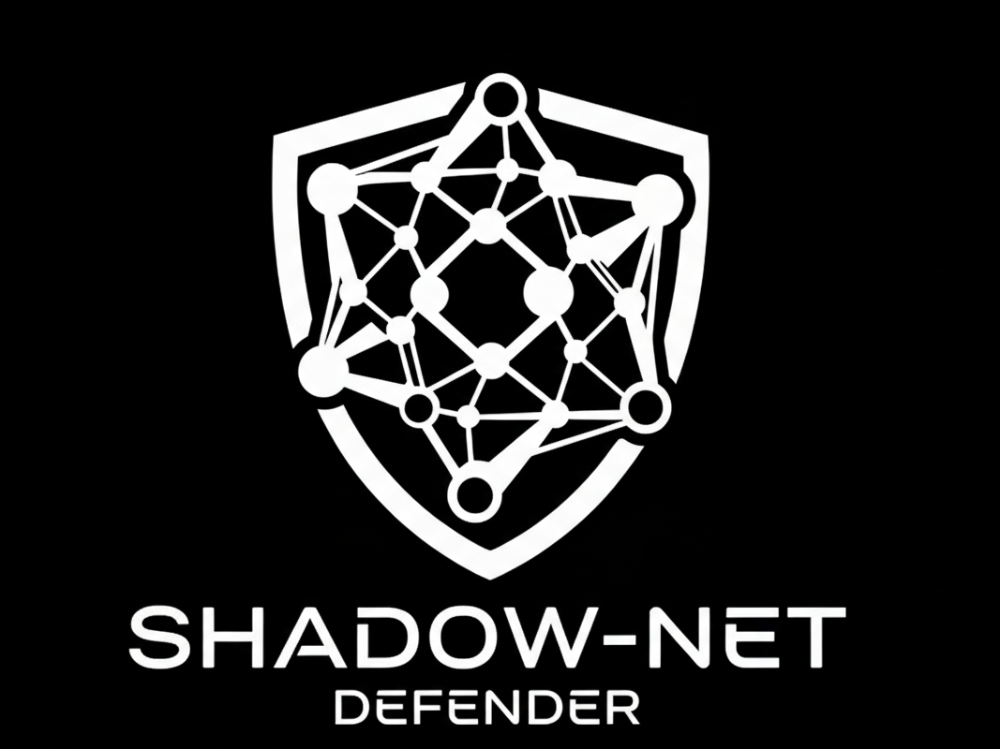

## 1. Project Title

🛡️ **ShadowNet Defender (SND)**  
Sistema avanzado de detección de malware mediante aprendizaje profundo y explicación asistida por LLM.

<div align="center">




</div>

> **"Un enfoque científico para la detección proactiva de amenazas cibernéticas, cerrando la brecha entre la teoría académica y la defensa práctica."**

### 1.1 Licencia Privada – Proyecto Académico Investigativo

- Licencia privada de investigación.  
- Proyecto en desarrollo como primer producto oficial de **SHADOW-NET**.  
- Autores: **Ivan Velasco (IVAINX_18)** y **Santiago Cubillos (VANkLEis)**.  
- Este software **no es open‑source**.  
- Uso permitido únicamente para fines académicos e investigativos; no se permite distribución, sublicenciamiento ni uso comercial sin autorización expresa y escrita de los autores.

---

## Table of Contents

1. [Project Title](#1-project-title)  
2. [Overview](#2-overview)  
3. [Architecture](#3-architecture)  
4. [Features](#4-features)  
5. [Project Structure](#5-project-structure)  
6. [Installation](#6-installation)  
7. [Configuration](#7-configuration)  
8. [Running the System](#8-running-the-system)  
9. [API Usage](#9-api-usage)  
10. [n8n Integration](#10-n8n-integration)  
11. [Malware Analysis Pipeline](#11-malware-analysis-pipeline)  
12. [Example Workflow](#12-example-workflow)  
13. [Future Improvements](#13-future-improvements)  
14. [References](#14-references)  
15. [Authors](#15-authors)

---

## 2. Overview

ShadowNet Defender es un sistema de **detección estática de malware** basado en:

- Un vector de **2381 características** extraídas de ejecutables PE (Windows).  
- Un modelo de **Deep Learning** exportado a ONNX para inferencia ligera.  
- Una capa de **explicación asistida por LLM (Ollama)** que produce análisis en JSON estructurado.  
- Una capa de **automatización con n8n** para generar alertas, reportes y flujos SOC.

### 2.1 Problema

Los motores clásicos basados en firmas (hashes, reglas YARA puras) son **reactivos** y frágiles ante:

- Polimorfismo y metamorfismo.  
- Empaquetado y cifrado de binarios.  
- Ataques zero‑day y técnicas _Living off the Land_.

### 2.2 Enfoque de ShadowNet Defender

ShadowNet pasa de **“quién es”** el malware (hash) a **“cómo se ve y se comporta en disco”**:

- Extrae propiedades estadísticas, estructurales y semánticas del binario.  
- Generaliza patrones de familias de malware, incluso para variantes nunca vistas.  
- Mantiene un enfoque **científico y reproducible**, alineado con SOREL‑20M y la literatura actual.

---

## 3. Architecture

### 3.1 Flujo de Alto Nivel

```mermaid
flowchart LR
  A[Cliente / CLI / SOC] --> B[FastAPI]
  B --> C[Motor ShadowNet (core/engine.py)]
  C --> D[Extractor PE (extractors/*)]
  D --> E[Vector 2381 dims]
  E --> F[Scaler Z-Score (scaler.pkl)]
  F --> G[Modelo ONNX (best_model.onnx)]
  G --> H[scan_result JSON]
  H --> I[LLM (Ollama) vía ExplanationService]
  I --> J[Respuesta JSON estructurada]
  J --> K[n8n vía webhooks (ngrok)]
```

### 3.2 Componentes Clave

- **FastAPI (`api_server.py`, `main.py`)**  
  Expone endpoints de escaneo, explicación y automatización.

- **Motor de escaneo (`core/engine.py`)**  
  Orquesta extracción de características, normalización y modelo ONNX.

- **Extractores (`extractors/*`)**  
  Implementan la ingeniería de características sobre el formato PE.

- **Modelo ONNX y scaler (`models/`)**  
  Red neuronal entrenada y normalizador Z‑Score pre‑calculado.

- **Capa LLM (`core/llm/*`, `llm_agent_bridge.py`)**  
  Construye prompts robustos y llama a Ollama (API OpenAI‑compatible) para producir explicaciones.

- **Integración n8n (`core/integrations/n8n_client.py`)**  
  Normaliza eventos y los envía a n8n por webhooks expuestos con ngrok.

---

## 4. Features

- **Detección estática** con vector de **2381 dimensiones**.  
- **Inferencia ligera** basada en ONNX Runtime (sin PyTorch en producción).  
- **Explicación asistida por LLM (Ollama)** con salida JSON estructurada:
  - `analysis`
  - `threat_level` (`low|medium|high|critical`)
  - `behavior_summary`
  - `recommended_actions[]`
- **API REST y CLI** para integración en pipelines y uso interactivo.  
- **Automatización con n8n** vía webhooks configurables.  
- **Arquitectura modular** (Clean Architecture, SOLID).  
- **Suite de tests y scripts de verificación** para extractor, modelo, LLM y n8n.

---

## 5. Project Structure

### 5.1 Bloques Principales

La organización conceptual del proyecto se estructura en cuatro bloques:

- **`app/` – Lógica del sistema**  
  Núcleo de negocio y runtime de análisis: motor de escaneo, extractores, modelo ONNX, capa LLM, API y CLI.

- **`docs/` – Documentación**  
  Guías técnicas, flujos operativos, documentación de uso y demo.

- **`scripts/` – Utilidades**  
  Scripts auxiliares para evaluación, mantenimiento y operaciones (por ejemplo `evaluate_model_metrics.py`, `verify_readiness.py`, `fix-ollama.sh`).

- **`docker/` – Infraestructura**  
  Espacio reservado para archivos de despliegue contenedorizado.

### 5.2 Árbol Actual del Proyecto (Alto Nivel)

```text
Shadownet_Defender_Extractor_V2/
├── core/
│   ├── llm/
│   ├── integrations/
│   └── automation/
├── extractors/
├── models/
├── security/
├── utils/
├── tests/
├── requirements/
├── docs/
├── configs/
├── evaluation/
├── samples/
├── logs/
├── ui/
├── ui_future/
├── LogoDefender/
└── (scripts en raíz: cli.py, api_server.py, fix-ollama.sh, etc.)
```

### 5.3 Mapeo a los Cuatro Bloques

- **`app/` (lógica del sistema)**  
  - `core/`: motor de escaneo (`engine.py`), capa LLM (`core/llm/*`), integraciones (`core/integrations/*`), automatización (`core/automation/*`).  
  - `extractors/`: ingeniería de características PE.  
  - `models/`: artefactos de inferencia (`best_model.onnx`, `scaler.pkl`).  
  - `security/`, `utils/`, `configs/`, `evaluation/`, `samples/`, `logs/`, `ui/`, `ui_future/`.

- **`docs/` (documentación)**  
  - `docs/`: documentación operativa y técnica.

- **`scripts/` (utilidades)**  
  Scripts actualmente en raíz que conceptualmente pertenecen aquí:
  - `cli.py`, `api_server.py`, `evaluate_model_metrics.py`, `explain_global_model.py`,  
    `explain_prediction.py`, `generate_mock_dataset.py`, `test_robustness.py`,  
    `verify_readiness.py`, `updater.py`, `fix_scaler.py`, `fix-ollama.sh`.

- **`docker/` (infraestructura)**  
  - Preparado para futuros `Dockerfile` y configuración de despliegue contenedorizado.

---

## 6. Installation

### 6.1 Requisitos Previos

| Requisito             | Versión mínima                                | Notas                                        |
| :-------------------- | :-------------------------------------------- | :------------------------------------------- |
| Sistema Operativo     | Linux Ubuntu 22.04+, Windows 10/11, macOS 12+| Linux recomendado para producción.           |
| Python                | 3.11.x                                        | Política oficial: `>=3.11,<3.12`.            |
| RAM                   | 4 GB mínimo                                   | 8 GB recomendado.                            |
| Disco                 | 500 MB libres                                 | Para entorno virtual y modelos.              |
| Internet              | Solo para instalación                         | El análisis funciona completamente offline.  |

### 6.2 Instalación Paso a Paso

**1) Clonar el repositorio**

```bash
git clone https://github.com/IVAINX18/Shadownet_Defender_Extractor_V2.git
cd Shadownet_Defender_Extractor_V2
```

**2) Crear y activar entorno virtual**

```bash
python3.11 -m venv .venv

# Linux/macOS
source .venv/bin/activate

# Windows (PowerShell)
# .venv\Scripts\Activate.ps1
```

**3) Instalar dependencias**

```bash
pip install --upgrade pip
pip install -r requirements.txt
```

**4) Ejecutar tests**

```bash
pytest tests/ -v
```

---

## 7. Configuration

### 7.1 Variables para LLM (Ollama)

- `OLLAMA_BASE_URL` – URL del endpoint OpenAI‑compatible de Ollama.  
  - Local: `http://127.0.0.1:11434/v1`  
  - Remoto: cualquier URL HTTPS compatible (por ejemplo, expuesta mediante ngrok).

- `OLLAMA_MODEL` – Modelo por defecto (ejemplos: `llama3.2:3b`, `phi3:mini`, `llama3.2:1b`).

### 7.2 Variables para n8n

- `N8N_ENABLED=true|false`  
- `ENVIRONMENT=dev|prod`  
- `N8N_WEBHOOK_TEST=https://.../webhook-test/...`  
- `N8N_WEBHOOK_PROD=https://.../webhook/...`  
- `N8N_TIMEOUT_SECONDS=8`

---

## 8. Running the System

### 8.1 CLI

Escanear un archivo:

```bash
python cli.py scan samples/procexp64.exe
```

Escanear y obtener explicación LLM:

```bash
python cli.py scan samples/procexp64.exe --explain --provider ollama --model llama3.2:3b
```

### 8.2 API FastAPI

Levantar la API:

```bash
uvicorn main:app --host 0.0.0.0 --port 8000
```

Healthcheck:

```bash
curl http://127.0.0.1:8000/health
```

---

## 9. API Usage

### 9.1 Endpoints Disponibles

- `GET /health` – Estado general.  
- `GET /verify-model` – Verificación de artefactos (`model_manifest.json`).  
- `GET /scan-file?file_path=...` – Escaneo de archivo existente en disco.  
- `POST /scan-batch` – Escaneo de lista de rutas.  
- `POST /scan/upload-explain` – Sube bytes (`application/octet-stream`) y devuelve escaneo + explicación.  
- `POST /llm/explain` – Explicación LLM de un `scan_result`.  
- `POST /scan?mode=test|prod` – Envía `{hash, filename, source}` al webhook de n8n.  
- `GET /automation/health` – Estado de la integración con n8n.  
- `POST /automation/test` – Evento de prueba hacia n8n.

### 9.2 Ejemplos Rápidos

Escaneo por ruta:

```bash
curl "http://127.0.0.1:8000/scan-file?file_path=samples/procexp64.exe"
```

Explicación LLM:

```bash
curl -X POST "http://127.0.0.1:8000/llm/explain" \
  -H "Content-Type: application/json" \
  -d '{
    "provider": "ollama",
    "model": "llama3.2:3b",
    "scan_result": {
      "label": "MALWARE",
      "score": 0.91,
      "confidence": "High",
      "details": {
        "entropy": 7.2
      }
    }
  }'
```

---

## 10. n8n Integration

La integración con **n8n** permite automatizar alertas, generación de reportes y flujos SOC a partir de los resultados de ShadowNet Defender.

### 10.1 Webhook `/scan` vía ngrok

- Endpoint: `POST /scan?mode=test|prod`  
- Selección de webhook:
  - `mode=test` → webhook de prueba (TEST)  
  - `mode=prod` → webhook de producción (PROD)
- Payload enviado:

```json
{
  "hash": "...",
  "filename": "...",
  "source": "shadownet-api"
}
```

### 10.2 Detecciones Enriquecidas

`core/integrations/n8n_client.py` normaliza y envía eventos que incluyen:

- `file_name`, `file_hash`, `file_path`  
- `ml_score`, `risk_level`, `model_version`  
- `llm_report` (JSON con análisis, resumen y acciones recomendadas)  
- Metadatos de entorno (`hostname`, `os`, `user`)

---

## 11. Malware Analysis Pipeline

Esta sección resume la parte científica del proyecto, preservando la información clave del README original sobre ingeniería de características, dataset y entrenamiento.

### 11.1 Ingeniería de Características (2381 Dimensiones)

El extractor convierte un archivo PE en un vector $\mathbf{x} \in \mathbb{R}^{2381}$ concatenando varios bloques:

- Histograma de bytes (256 d).  
- Entropía de bytes (256 d).  
- Strings e IoCs (104 d).  
- Metadatos generales y cabeceras (72 d).  
- Análisis de secciones (255 d).  
- Imports / Exports con feature hashing (1280 + 128 d).

Estos bloques capturan:

- Distribución global de bytes y regiones de alta entropía.  
- Strings relevantes (URLs, rutas, claves de registro, artefactos de packers, indicadores de C2).  
- Anomalías estructurales en cabeceras y secciones PE (timestomping, secciones RWX, discrepancias VirtualSize/RawSize).  
- Firma de APIs usadas (IAT) mediante hashing determinista.

### 11.2 Dataset SOREL‑20M

El modelo se entrena principalmente sobre **SOREL‑20M**:

- ~20 millones de muestras (mitad benignas, mitad maliciosas).  
- Etiquetado multi‑motor y metadatos ricos.  
- Cobertura moderna del ecosistema de malware (hasta 2020).

### 11.3 Pipeline de Machine Learning

1. **Preprocesamiento y Normalización Z‑Score**  
   - Uso de `models/scaler.pkl` con medias y desviaciones calculadas sobre millones de muestras.  
2. **Entrenamiento DNN (PyTorch)**  
   - Arquitectura tipo MLP con BatchNorm, Dropout y función de pérdida BCE.  
3. **Exportación a ONNX**  
   - Grafo optimizado para inferencia CPU (`onnxruntime`), con soporte para batch variable.

### 11.4 Testing y Benchmarks

La suite de pruebas valida:

- Correctitud dimensional del vector (2381 dimensiones exactas).  
- Rangos válidos para histogramas y entropía.  
- Ausencia de `NaN`/`Inf` en el pipeline.  
- Latencias típicas de ~400 ms end‑to‑end en hardware de desarrollo estándar.

---

## 12. Example Workflow

Ejemplo de flujo completo (laboratorio):

1. Clonar repo, crear entorno virtual e instalar dependencias.  
2. Verificar integridad de artefactos:

   ```bash
   python cli.py verify-model --manifest model_manifest.json
   ```

3. Levantar la API:

   ```bash
   uvicorn main:app --host 0.0.0.0 --port 8000
   ```

4. Escanear un archivo y obtener explicación LLM:

   ```bash
   curl -sS -X POST "http://127.0.0.1:8000/scan/upload-explain?filename=procexp64.exe&provider=ollama&model=llama3.2:3b" \
     -H "Content-Type: application/octet-stream" \
     --data-binary "@samples/procexp64.exe" | jq .
   ```

5. Revisar en n8n la recepción de eventos (si la integración está habilitada).

---

## 13. Future Improvements

Líneas de trabajo previstas (resumen del roadmap original):

- Optimizar el extractor (posible reimplementación en Rust) para reducir la latencia de análisis.  
- Explorar análisis dinámico ligero para complementar el análisis estático.  
- Profundizar la integración con LLMs para explicaciones aún más ricas y dashboards dedicados.  
- Integrar con plataformas de inteligencia de amenazas (MISP, TheHive/Cortex).

---

## 14. References

1. Harang, R., & Rudd, E. M. (2020). _SOREL‑20M: A Large Scale Benchmark Dataset for Malicious PE Detection._ arXiv:2012.07633.  
2. Anderson, H. S., & Roth, P. (2018). _EMBER: An Open Dataset for Training Static PE Malware Machine Learning Models._ arXiv:1804.04637.  
3. Raff, E. et al. (2017). _Malware Detection by Eating a Whole EXE._ arXiv:1710.09435.  
4. Weinberger, K. et al. (2009). _Feature Hashing for Large Scale Multitask Learning._ ICML.  
5. Saxe, J., & Berlin, K. (2015). _Deep Neural Network Based Malware Detection Using Two Dimensional Binary Program Features._ MALWARE 2015.  
6. Lundberg, S. M., & Lee, S.‑I. (2017). _A Unified Approach to Interpreting Model Predictions._ NeurIPS.  
7. Ye, Y. et al. (2017). _A Survey on Malware Detection Using Data Mining Techniques._ ACM Computing Surveys.

---

## 15. Authors

<div align="center">

**Desarrollado con ❤️ y ☕ por el equipo de investigación de INNOVASIC**

[INNOVASIC Research Lab](https://innovasicucc.wordpress.com/pagina/) — Universidad Cooperativa de Colombia — 2026  
_Ivan Velasco (IVAINX_18) · Santiago Cubillos (VANkLEis)_

</div>

