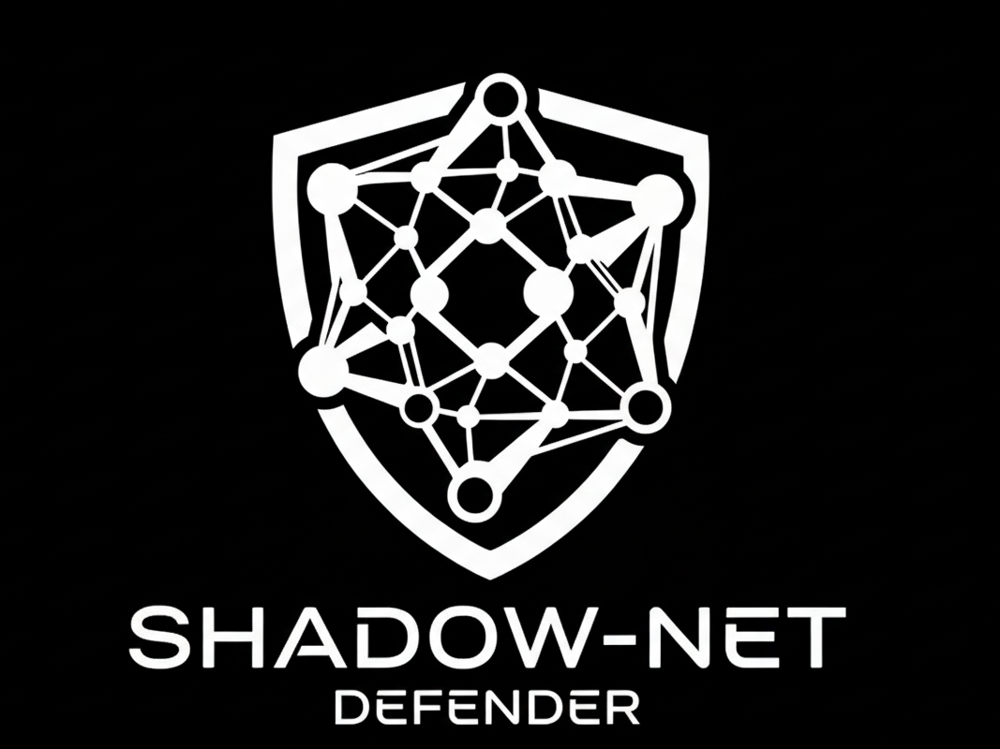
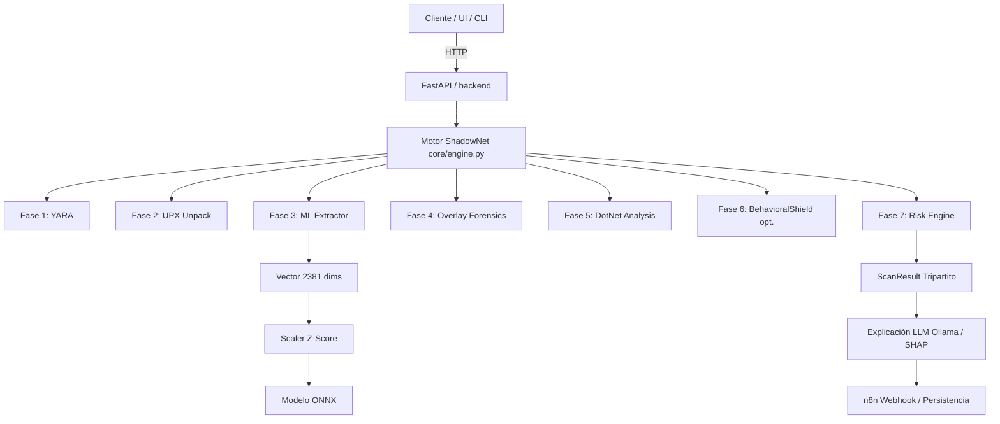

# Shadow-Net: Defender

**A Hybrid multi-layer system for malware detection using deep learning, advanced static analysis, and explainable heuristic correlation**

<div align="center">




</div>

> **"Un enfoque científico para la detección proactiva de amenazas cibernéticas, cerrando la brecha entre la teoría académica y la defensa práctica."**

### Licencia Privada – Proyecto Académico Investigativo

- Licencia privada de investigación.  
- Proyecto en desarrollo como primer producto oficial de **SHADOW-NET**.  
- Autores: **Ivan Velasco (IVAINX_21)** y **Santiago Cubillos (VANkLEis)**.  
- Este software **no es open‑source**.  
- Uso permitido únicamente para fines académicos e investigativos; no se permite distribución, sublicenciamiento ni uso comercial sin autorización expresa y escrita de los autores.

---

## Índice

1. [Introducción](#1-introducción)
2. [Descripción del Proyecto](#2-descripción-del-proyecto)
3. [Objetivos](#3-objetivos)
4. [Problema que Resuelve](#4-problema-que-resuelve)
5. [Características Principales](#5-características-principales)
6. [Arquitectura General](#6-arquitectura-general)
7. [Flujo de Funcionamiento](#7-flujo-de-funcionamiento)
8. [Componentes del Sistema](#8-componentes-del-sistema)
9. [Tecnologías Utilizadas](#9-tecnologías-utilizadas)
10. [Requisitos del Sistema](#10-requisitos-del-sistema)
11. [Estructura del Proyecto](#11-estructura-del-proyecto)
12. [Instalación](#12-instalación)
13. [Configuración del Entorno](#13-configuración-del-entorno)
14. [Variables de Entorno](#14-variables-de-entorno)
15. [Ejecución del Proyecto](#15-ejecución-del-proyecto)
16. [Uso del Sistema](#16-uso-del-sistema)
17. [API y Endpoints](#17-api-y-endpoints)
18. [Inteligencia Artificial / Machine Learning](#18-inteligencia-artificial--machine-learning)
19. [Sistema de Detección Multicapa](#19-sistema-de-detección-multicapa)
20. [Procesamiento y Extracción de Características](#20-procesamiento-y-extracción-de-características)
21. [Integraciones Externas](#21-integraciones-externas)
22. [Base de Datos](#22-base-de-datos)
23. [Automatizaciones](#23-automatizaciones)
24. [Pruebas](#24-pruebas)
25. [Métricas y Resultados](#25-métricas-y-resultados)
26. [Casos de Análisis](#26-casos-de-análisis)
27. [Seguridad](#27-seguridad)
28. [Limitaciones](#28-limitaciones)
29. [Trabajo Futuro](#29-trabajo-futuro)
30. [Documentación Adicional](#30-documentación-adicional)
31. [Autores](#31-autores)
32. [Licencia](#32-licencia)

---

## 1. Introducción

**ShadowNet Defender (SND)** es un sistema de ciberseguridad orientado a la **detección estática de malware** en ejecutables Windows (formato PE — _Portable Executable_). Convierte cada binario en un vector matemático de 2,381 dimensiones, lo normaliza estadísticamente y lo clasifica mediante una **red neuronal profunda (DNN)** exportada a ONNX.

Acompañando a esta clasificación por ML, el sistema emplea un **pipeline heurístico multicapa** que inspecciona overlays, secciones empaquetadas, coincidencias YARA y comportamientos .NET, integrando finalmente los resultados con **modelos de lenguaje (LLM)** locales como Ollama para explicar la decisión.

---

## 2. Descripción del Proyecto

El sistema se presenta como una suite completa de ciberseguridad compuesta por:
- **Motor de análisis:** orquestador híbrido con fases (YARA, UPX, ML, Forense de Overlays, DotNet).
- **Extractor de características:** implementación alineada a EMBER 2.0 / SOREL-20M.
- **Backend API:** escrito en FastAPI, expone endpoints de análisis, explicabilidad y flujos SOC.
- **Frontend / Desktop (Electron):** interfaz para usuarios finales y SOC.
- **Capa de automatización:** notificaciones vía n8n webhooks.

---

## 3. Objetivos

**Objetivo General:** Desarrollar un sistema de detección de malware capaz de operar offline, analizar de manera profunda los ejecutables Windows (estática, heurística, ML y conductual ligera) y proporcionar explicabilidad total (LLM, SHAP).

**Objetivos Específicos Logrados:**
- Extractor de 2,381 dimensiones compatible con EMBER 2.0.
- Entrenamiento de modelo sobre dataset masivo (SOREL-20M + in-the-wild).
- Pipeline híbrido para evadir ataques adversarios y técnicas de empaquetamiento.
- Explicaciones generativas (Ollama) locales sin dependencia cloud.
- Autenticación y sincronización con Supabase (offline-first).

---

## 4. Problema que Resuelve

Los antivirus clásicos operan bajo un ciclo reactivo basado en firmas. Las firmas detectan "quién es" el malware, fallando ante polimorfismo, metamorfismo, payloads en overlays, malware zero-day o técnicas _Living off the Land_ (LotL).

ShadowNet Defender aplica **Machine Learning sobre análisis estático** y **Heurística Avanzada** para aprender patrones discriminantes, detectando amenazas nunca vistas por su estructura o comportamiento, en lugar de por su hash.

---

## 5. Características Principales

- **Vector ML 2,381 dims:** Extrae histogramas de bytes, entropía, strings/IoCs, metadata general, cabeceras, y feature hashing de Imports/Exports.
- **Motor Híbrido Multicapa:** Reglas YARA, desempaquetado UPX, análisis profundo de Overlays (frecuentemente usado en evasión ML).
- **Risk Engine:** Sistema heurístico basado en puntaje que eleva el estado a `DANGEROUS` o `CRITICAL` sin depender ciegamente del ML.
- **Inferencia CPU Ligera:** Exportación a ONNX y normalización Z-Score estática (tiempo < 50ms inferencia pura).
- **BehavioralShield:** Capa dinámica (Fase 8) para monitorizar procesos vivos y detectar inyecciones, networking, persistencia (registro).
- **SHAP Explainer:** Interpretación de ML con explicabilidad formal matemática.
- **Explicación LLM GenAI:** Generación estructurada JSON a través de Ollama.
- **Hardening Extractor:** Fallback por tamaño, muestreo distribuido, tolerancia a PE corruptos.

---

## 6. Arquitectura General

El sistema sigue una arquitectura por capas basada en Clean Architecture.


```mermaid
flowchart TD
  A[Cliente / UI / CLI] -->|HTTP| B[FastAPI / backend]
  B --> C[Motor ShadowNet core/engine.py]
  C --> D[Fase 1: YARA]
  C --> E[Fase 2: UPX Unpack]
  C --> F[Fase 3: ML Extractor]
  F --> F1[Vector 2381 dims]
  F1 --> F2[Scaler Z-Score]
  F2 --> F3[Modelo ONNX]
  C --> G[Fase 4: Overlay Forensics]
  C --> H[Fase 5: DotNet Analysis]
  C --> I[Fase 6: BehavioralShield opt.]
  C --> J[Fase 7: Risk Engine]
  J --> K[ScanResult Tripartito]
  K --> L[Explicación LLM Ollama / SHAP]
  L --> M[n8n Webhook / Persistencia]
```

Para conocer el análisis completo de esta arquitectura, consulte:
[Documentación de arquitectura](docs/academico/02_arquitectura_general.md) y [Sistema Híbrido Multicapa](docs/academico/04_sistema_hibrido_multicapa.md).

---

## 7. Flujo de Funcionamiento

1. **Recepción:** El binario PE llega a través de API, CLI o subida directa.
2. **Determinismo (Fase 1):** `YaraScanner` verifica si hay coincidencias exactas conocidas.
3. **Desempaquetado (Fase 2):** Detecta y aplica UPX si el archivo está compactado.
4. **Machine Learning (Fase 3):** Se procesa el binario, el `PEFeatureExtractor` genera el vector, se escala y pasa por el clasificador ML.
5. **Overlay y Heurística (Fase 4 y 5):** Si el binario oculta carga útil (overlay), se detecta con heurística (tamaño vs PE size) y análisis de strings/entropía.
6. **Risk Engine (Fase 7):** Asigna un score combinando todos los módulos (ML + Overlay + YARA) logrando un veredicto consolidado (`CLEAN`, `SUSPICIOUS`, `DANGEROUS`).
7. **Explicabilidad:** Opcionalmente SHAP values u Ollama LLM describen el porqué de la decisión.
8. **Automatización:** n8n recibe eventos `DANGEROUS` o `SUSPICIOUS` configurados para orquestación SOC.

---

## 8. Componentes del Sistema

- **`core/`**: El corazón del sistema (`engine.py`, extractores dinámicos, `llm`, integraciones, y heurísticas).
- **`extractors/`**: Ingeniería tabular de características, módulos separados por bloques (bytes, entropy, imports, exports, headers, strings).
- **`backend/app/`**: API FastAPI para exponer la lógica.
- **`frontend/ui/`**: Interfaz de escritorio.
- **`models/`**: Contiene `best_model.onnx` y `scaler.pkl`.
- **`tests/`**: Suite exhaustiva (Unitarios, Integración, Hypothesis/Properties).

---

## 9. Tecnologías Utilizadas

### Backend y Core ML
- **Python 3.11:** Lenguaje principal del motor y backend.
- **FastAPI / Uvicorn:** Framework asíncrono robusto para APIs REST.
- **ONNX Runtime:** Inferencia de alta velocidad sin dependencias masivas (PyTorch).
- **Pefile / Yara-Python:** Análisis forense PE estático e inspección de firmas.
- **Numpy / Scikit-Learn:** Operaciones matriciales rápidas y transformadores (scaler).

### Inteligencia Artificial
- **PyTorch:** Usado offline para entrenamiento de la Red Neuronal (MLP).
- **Ollama / Llama3.2:** LLM local, usado para resúmenes de análisis estático sin depender de cloud.
- **SHAP:** XAI (Explicabilidad de IA) para atribución de características en inferencia de modelos ONNX.

### Automatización y Base de Datos
- **Supabase (PostgreSQL / Auth):** Persistencia en nube / local para historial de escaneos.
- **n8n:** Orquestador de flujos basado en webhooks SOC.

---

## 10. Requisitos del Sistema

| Requisito             | Especificación mínima                          |
| :-------------------- | :--------------------------------------------- |
| **SO**                | Linux Ubuntu 22.04+ (Recomendado), Windows 11  |
| **Python**            | `>= 3.11, < 3.12`                              |
| **RAM**               | 4 GB (8 GB recomendado)                        |
| **Almacenamiento**    | 500 MB libres para entorno; Modelos adicionales LLM requieren más.|

---

## 11. Estructura del Proyecto

```text
Shadownet_Defender_Extractor_V2/
├── backend/          # Backend de la API FastAPI
├── configs/          # Configuraciones y whitelists (settings.py, YARA)
├── core/             # Engine híbrido, LLM, Risk, Automation
├── docs/             # Documentación técnica organizada por módulos:
│   ├── academico/    # Artículos, tesis y secciones de investigación
│   ├── arquitectura/ # Documentación técnica integral, PRD y Deep Learning
│   ├── auditorias/   # Auditorías (n8n/Supabase), progreso y roadmap
│   ├── database/     # Esquemas y migraciones SQL
│   ├── frontend/     # Guías de desarrollo UI y especificaciones
│   └── pruebas_y_reportes/ # Guías E2E, test flow y reportes demo
├── extractors/       # Bloques de extracción EMBER 2.0
├── models/           # ONNX y scaler estadístico
├── samples/          # Ejemplos de malware (para testing y análisis)
├── scripts/          # Herramientas de despliegue, update y verificación
├── security/         # Reglas YARA y cuarentena
├── tests/            # Test suite (Unit, Integration, Properties)
├── ui/               # Interfaz Frontend (Electron/React)
├── utils/            # Funciones auxiliares genéricas
├── api_server.py     # Entrypoint alternativo de API
├── cli.py            # CLI Tool
└── requirements.txt  # Dependencias generales
```

Para detalles exactos de diseño de nuevas características y tareas completadas, consulte la carpeta `.kiro/specs/` y el archivo `docs/arquitectura/DOCUMENTACION_TECNICA_INTEGRAL.md`.

---

## 12. Instalación

Sigue estos pasos para un entorno local funcional. Se recomienda encarecidamente utilizar un entorno virtual (venv).

**1. Clonar el repositorio**
```bash
git clone https://github.com/IVAINX18/Shadownet_Defender_Extractor_V2.git
cd Shadownet_Defender_Extractor_V2
```

**2. Crear y activar el entorno virtual**
```bash
# Requiere Python 3.11 exacto
python3.11 -m venv .venv
source .venv/bin/activate
```

**3. Instalar dependencias**
```bash
pip install --upgrade pip
pip install -r requirements.txt
```
*(Nota: Para inferencia pura, PyTorch no es requerido, está removido de dependencias por defecto para entornos prod-only).*

---

## 13. Configuración del Entorno

La aplicación lee configuraciones de un archivo `.env` o del sistema.
Crea un archivo `.env` en la raíz del proyecto basándote en un template (o usa las siguientes variables).

Para configurar **Supabase**, necesitas el URL y el Key (anon):
```bash
SUPABASE_URL="https://tu-proyecto.supabase.co"
SUPABASE_JWT_SECRET="tu-secret"
```

Para **Ollama** (LLM Explicador):
Debes instalar Ollama localmente (https://ollama.com/) y tener un modelo (ej. `llama3.2:3b` o `phi3`) descargado.
```bash
OLLAMA_BASE_URL="http://127.0.0.1:11434/v1"
OLLAMA_MODEL="llama3.2:3b"
```

Para integración **n8n** SOC:
```bash
N8N_ENABLED=true
ENVIRONMENT=dev
N8N_WEBHOOK_TEST=https://tu-ngrok.app/webhook-test/...
N8N_WEBHOOK_PROD=https://tu-ngrok.app/webhook/...
```

---

## 14. Variables de Entorno

- `MAX_UPLOAD_MB`: Límite de subida en API.
- `CORS_ORIGINS`: Permitidos orígenes CORS (ej. `http://localhost:3000`).
- `EXTRACTOR_TIMEOUT_SECONDS`: (Default 15s) Fallback para archivos gigantes.
- `N8N_ALERT_ON_STATUS`: Estados operativos que lanzan webhook (ej. `DANGEROUS,SUSPICIOUS`).
- `QUARANTINE_KEY`: Llave Fernet para cuarentena cifrada (si aplica).

---

## 15. Ejecución del Proyecto

### Iniciar el API de Backend
El servidor API expone toda la funcionalidad del core (ML + Heurística + LLM).
```bash
uvicorn backend.app.main:app --host 0.0.0.0 --port 8000 --reload
```

Puedes verificar que el sistema levantó accediendo a: `http://127.0.0.1:8000/health` y validando que el archivo manifest (`/verify-model`) devuelve correcto.

### Verificación del Entorno
Antes de usarlo, puedes ejecutar un script que valida si tienes todo configurado correctamente:
```bash
python verify_readiness.py
```

---

## 16. Uso del Sistema

### Mediante la CLI (Interfaz de Línea de Comandos)

Escanear un archivo rápido sin IA:
```bash
python cli.py scan samples/procexp64.exe
```

Escanear, explicar con Ollama y forzar modelo:
```bash
python cli.py scan samples/procexp64.exe --explain --provider ollama --model llama3.2:3b
```

Validar el hash de los modelos ONNX:
```bash
python cli.py verify-model --manifest models/model_manifest.json
```

---

## 17. API y Endpoints

Principales endpoints de FastAPI (disponibles en `/docs` vía Swagger UI):

- `GET /health` : Verificación rápida.
- `GET /verify-model` : Valida artefactos contra el manifest.
- `GET /scan-file?file_path=...` : Analiza archivo local.
- `POST /scan/upload-explain` : 
  - **Body**: Archivo binario (formato form-data u octet-stream).
  - **Query Params**: `provider`, `model`.
  - **Retorno**: JSON con análisis multicapa detallado y string de LLM.
- `POST /scan?mode=test|prod` : Envía payload manualmente a Webhook SOC n8n.
- `GET /explain/shap` : Explicación de características XAI con KernelExplainer.

Ejemplo de escaneo rápido con CURL:
```bash
curl "http://127.0.0.1:8000/scan-file?file_path=samples/sample1.exe"
```

---

## 18. Inteligencia Artificial / Machine Learning

El enfoque principal del sistema es reemplazar firmas con una detección estadística probabilística mediante Deep Learning.

### Modelos utilizados
- **Arquitectura:** Perceptrón Multicapa (MLP). (4 Capas Ocultas con Dropout + BatchNorm).
- **Inferencia:** Convertido de `.pth` a `.onnx`. Esto permite ejecutar una sesión en CPU súper rápida (`onnxruntime`) y desacoplar de PyTorch.

### Datos y Datasets
- **SOREL-20M**: (Sophos-ReversingLabs). Aproximadamente 5 millones de registros estratificados, combinados con una colección in-the-wild (ShadowNet original) de 100K muestras frescas. Total: ~5.1 Millones de registros.
- **Normalización**: Escalamiento `StandardScaler` (Z-Score) serializado en `scaler.pkl`.

Para detalles profundos, revisar [Arquitectura Deep Learning](docs/arquitectura/ARQUITECTURA_DEEP_LEARNING.md).

---

## 19. Sistema de Detección Multicapa

Para contrarrestar limitaciones puras de ML tabular (adversariales), el motor `ShadowNetEngine` ejecuta múltiples analizadores independientes.

### Análisis estático y YARA
Se lanzan firmas base YARA desde `security/rules/` al binario para detección determinista de familias conocidas (ej. Keyloggers) con Whitelists para evitar Falsos Positivos.

### Análisis heurístico (Overlay Forensics)
Se descubrió que malware avanzado agrega gigabytes de carga maliciosa (payload) fuera del "PE declarado" (Overlay). 
ShadowNet extrae el ratio de tamaño del overlay, la entropía del mismo y los strings; bloqueando efectivamente _Droppers_ y empaquetados personalizados.

### Análisis de comportamiento (BehavioralShield)
Fase 8, dinámica (opcional `enable_behavioral=True`). Vigila PIDs activos para interceptar Handles Remotos (Inyecciones), Networking anómalo y registros de Persistencia.

### Motor de Riesgo (Risk Engine)
Agrega todos los inputs y calcula indicadores. Ejemplo: Si ML dice `BENIGN (score: 0.0)` pero _Overlay Forensics_ informa "98% del tamaño del archivo oculto en overlay cifrado (entropía 7.9)", el Risk Engine aplica un Override heurístico y escala el estado a `DANGEROUS` o `CRITICAL`.

Consulte [Hallazgo Multicapa](docs/academico/05_hallazgo_multicapa.md).

---

## 20. Procesamiento y Extracción de Características

Se genera un vector tabular (Hand-Crafted Features) de **2381 dimensiones**:
- **0 - 255**: Histograma de Bytes (relativo).
- **256 - 511**: Entropía de Shannon deslizante (Histograma 256 bins).
- **512 - 615**: Strings y Tokens IoCs, IPs, URLs, claves registro, proporciones de mayúsculas/minúsculas.
- **616 - 625**: Metadatos generales (Tamaño virtual vs físico).
- **626 - 687**: Cabeceras COFF / PE y Data Directories.
- **688 - 942**: Información de secciones (.text, .rsrc, etc., RWX flags).
- **943 - 2222**: Hashing de Funciones Importadas (IAT) (SHA256 mod 1280).
- **2223 - 2350**: Hashing de Funciones Exportadas (EAT) (SHA256 mod 128).

**Mejoras de Robustez Anti-Evasión:**
- _Billion Strings Attack Protection:_ Limitado a 5,000 strings híbridos.
- _Distributed Sampling:_ Para binarios grandes (>10MB), se muestrea proporcionalmente el inicio, centro y final, protegiéndose de Padding Extremo (Evasión OOM).
- _PE_FASTLOAD & RAW_FALLBACK:_ Tolera cabeceras corruptas devolviendo bloques parciales para no fallar jamás.

---

## 21. Integraciones Externas

### 22. Base de Datos
- Integración nativa con **Supabase**, utilizando JWT en endpoints autenticados y base de datos relacional para persistencia de Historial de Escaneo y Cuarentena. Sistema diseñado para caer elegantemente de forma offline.

### 23. Automatizaciones
- Los eventos `DANGEROUS` o `SUSPICIOUS` envían payloads JSON de telemetría e incidencias al gestor de flujos **n8n**, lo que permite construir respuestas automatizadas de remediación en un entorno de Centro de Operaciones de Seguridad (SOC).

---

## 24. Pruebas

Pruebas masivas y property-based test con **Hypothesis**:

```bash
pytest tests/ -v
```

Actualmente, ShadowNet cuenta con **más de 150 pruebas formales** (Tasa de éxito 98.1%), validando:
- Invarianza de las 2,381 dimensiones.
- Robustez contra NaN/Inf.
- Degradación controlada con `RAW_FALLBACK` y Timeout del Extractor.
- Integración E2E para webhooks y LLMs simulados.

Para más detalle: [Pruebas Unitarias](docs/academico/09_pruebas_unitarias.md) y [Integración](docs/academico/10_pruebas_integracion.md).

---

## 25. Métricas y Resultados

Resultados del entrenamiento sobre test-set de campo:
- **Accuracy:** 98.15%
- **F1-Score:** 98.45%
- **Precision:** 98.70%
- **Recall (TPR):** 98.20%
- **AUC-ROC declarado:** 0.985
- **Inferencia CPU Total E2E:** ~400ms – 500ms (Depende del muestreo de disco). Inferencia ONNX pura = ~15ms.

_Ver: [Métricas y resultados](docs/academico/07_metricas_y_resultados.md)_.

---

## 26. Casos de Análisis

Se cuenta con forense validado en la carpeta académica:
Ejemplo `sample1.exe`:
- **Condición:** Malware ofuscado en un overlay enorme.
- **Detección ML Puro:** `BENIGN` (0.0 score). El PE header fue engañado.
- **Heurística Multicapa:** `CRITICAL (score: 105)`. Se detectó 98.7% overlay con entropía 7.99 (cifrado). El motor multicaracterística identificó y frenó la amenaza a pesar del falso negativo del ML.
- Leer más: [Análisis sample1](docs/academico/11_analisis_sample1.md).

---

## 27. Seguridad

El sistema previene accesos inseguros:
- Fail-Secure en JWT (si no hay secret o expiró, siempre devuelve 401).
- Cuarentena cifrada criptográficamente en disco (Fernet), impidiendo ejecuciones accidentales.

---

## 28. Limitaciones

1. Archivos no compatibles nativamente no-PE (PDF, ELF, ELF64), caen en métrica general pero pierden features PE.
2. Posibles colisiones de Feature Hashing a largo plazo por el espacio de imports acotado a 1280.
3. El LLM Explicador no reevalúa el veredicto ML, solo explica las _features_ top presentadas.
Para mitigaciones previstas: [Limitaciones](docs/academico/13_limitaciones.md).

---

## 29. Trabajo Futuro

(Basado en `docs/academico/TaskV4.md` y `14_trabajo_futuro.md`)
- Módulo EDR loop interactivo que automatiza cuarentena y terminación.
- Detección Fileless a través de Volatility sobre RAM inyectada.
- Generación automática de firmas YARA desde hashes detectados.
- Soporte total para formatos binarios de Unix (ELF).

---

## 30. Documentación Adicional

### 📌 Índice Principal
- [Índice General de Documentación](docs/README.md)

### 🏗️ Arquitectura y Especificaciones
- [Documentación Técnica Integral](docs/arquitectura/DOCUMENTACION_TECNICA_INTEGRAL.md)
- [Arquitectura Deep Learning](docs/arquitectura/ARQUITECTURA_DEEP_LEARNING.md)
- [PRD (Requerimientos del Producto)](docs/arquitectura/PRD.md)

### 🗄️ Base de Datos (Supabase)
- [Esquema Base SQL](docs/database/supabase_schema.sql)
- [Migración e Índices SQL](docs/database/supabase_migration.sql)

### 🔍 Auditorías y Seguimiento
- [Auditoría n8n -> Supabase (Alertas Malware)](docs/auditorias/auditoria_n8n_supabase/AUDITORIA_MIGRACION_N8N_SUPABASE.md)
- [Auditoría del Sistema](docs/auditorias/Auditoria.md)
- [Tareas de Prioridad Crítica Realizadas](docs/auditorias/TareasPrioridadCriticaRealizadas.md)
- [Progreso del Proyecto (PROGRESS)](docs/auditorias/PROGRESS.md)
- [Pendientes y Roadmap (ToDo)](docs/auditorias/ToDo.md)

### 🎨 Frontend y UI
- [Guía del Frontend](docs/frontend/FrontendGuide.md)
- [Especificación Frontend V2](docs/frontend/Frontv2.md)

### 🧪 Pruebas y Reportes
- [Guía de Pruebas E2E](docs/pruebas_y_reportes/TEST_E2E.md)
- [Flujo de Pruebas (Test Flow)](docs/pruebas_y_reportes/test-flow.md)
- [Reporte de Demostración](docs/pruebas_y_reportes/demo-reporte.md)

### 🎓 Investigación Académica & Científica
- [Resumen Ejecutivo](docs/academico/01_resumen_ejecutivo.md)
- [Dataset SOREL-20M](docs/academico/03_modelo_sorel20m.md)
- [XAI y Explicabilidad LLM](docs/academico/06_xai_explicabilidad.md)
- [Comparación ML vs Híbrido](docs/academico/08_comparacion_ml_vs_hibrido.md)
- [Limitaciones y Evasión](docs/academico/13_limitaciones.md)
- [Trabajo Futuro (Roadmap)](docs/academico/14_trabajo_futuro.md)
- [Explicabilidad e Integración Ollama](docs/academico/15_ollama.md)
- [Task V4 (Hardening y Ajustes)](docs/academico/TaskV4.md)
- [Artículo Base y Tesis](docs/academico/articulo_base.md)

### 📋 Especificaciones de Tareas (.kiro/specs)
- **Mejoras de Auditoría:** [.kiro/specs/shadownet-audit-improvements/design.md](.kiro/specs/shadownet-audit-improvements/design.md)
- **Tareas V4 (F1):** [.kiro/specs/shadownet-taskv4-f1/design.md](.kiro/specs/shadownet-taskv4-f1/design.md)
- **Tareas V4 (F2):** [.kiro/specs/shadownet-taskv4-f2/design.md](.kiro/specs/shadownet-taskv4-f2/design.md)
- **Tareas V4 (F3):** [.kiro/specs/shadownet-taskv4-f3/design.md](.kiro/specs/shadownet-taskv4-f3/design.md)

---

## 31. Autores

<div align="center">

**Desarrollado con ❤️ y ☕ por el equipo de investigación de INNOVASIC**

[INNOVASIC Research Lab](https://innovasicucc.wordpress.com/pagina/) — Universidad Cooperativa de Colombia — 2026  
_Ivan Velasco (IVAINX_18) · Santiago Cubillos (VANkLEis)_

</div>

---

## 32. Licencia

Proyecto sujeto a la Licencia Propiedad Académica Privada descrita en la sección inicial. No es open-source comercial.

---
